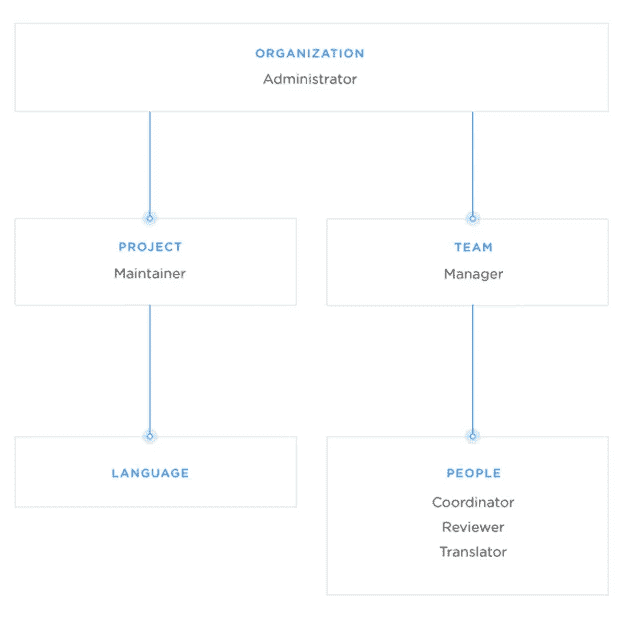
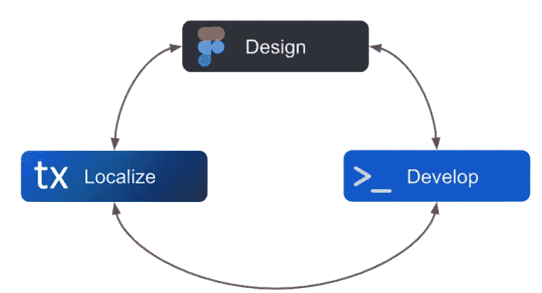
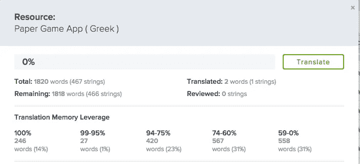
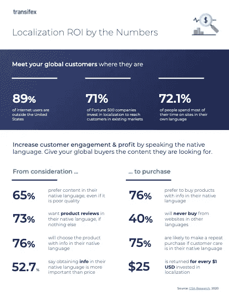
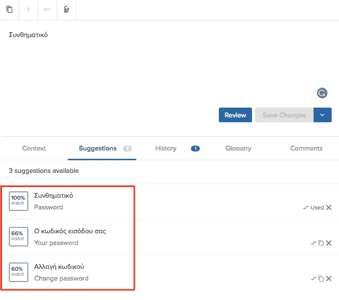
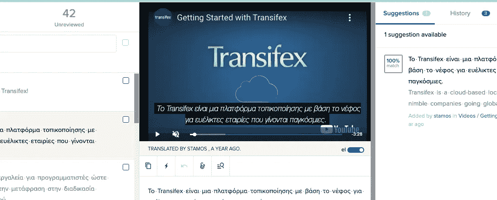

# 什么是本地化？你只需要知道

> 原文：<https://medium.com/codex/what-is-localization-all-you-need-to-know-9c6a61abf2d7?source=collection_archive---------1----------------------->

什么是本地化？翻译管理系统呢？或者软件本地化、自动化本地化、全球化、国际化等。

我们谈论的是一个有着大量复杂问题而没有很多答案的行业。所以，让我们澄清一些事情。这就是本地化的意义所在！

# 什么是本地化？

简而言之，**本地化(l10n)的定义就是当你获取一段原始形式的内容，然后将其转换为更适合另一个国家、观众或城市的内容**。这一切都是为了让你的内容易于访问，吸引当地人。

但是你应该注意不要混淆翻译和本地化。因为毕竟翻译内容只是本地化的一小部分。

更准确地说，本地化一段内容很可能需要您关注:

*   翻译
*   内容的基调
*   媒体
*   货币
*   测量单位

可能还有其他的，取决于地点。例如，一些地区在他们的文化中作为问候使用的挥手手势实际上被希腊人认为是无礼的，又名，有点像向某人伸出中指。

这意味着为希腊本地化你的内容的一部分至少要确保你不会无意中冒犯你的观众。当然，这同样适用于所有其他国家。

另一方面，简单的翻译仅仅是为了正确地将内容从一种语言翻译成另一种语言。

不用说，本地化的很大一部分仍然是翻译。

# 本地化中的不同角色

本地化是一项团队工作，需要多名专业人员共同努力才能完成。

员工的确切人数及其角色可能因组织而异。但是[这些是本地化团队中的典型角色](https://docs.transifex.com/teams/understanding-user-roles):

1.  管理员
2.  项目维护人员
3.  团队经理
4.  语言协调员
5.  评论家
6.  翻译者

当然，您也有需要在本地化过程之前、之中和之后处理代码的工程师。除非你用的是 [Transifex Native](https://www.transifex.com/native/) 或者 [Transifex Live](https://docs.transifex.com/live/introduction) 之类的软件。诸如此类的工具可以帮助您最小化工程师和本地化团队的工作量。

说到这里，甚至我们的基础平台也为上述每个本地化角色提供了本地支持。您可以根据不同人员的职责为他们分配不同的角色，这样可以调整他们对项目的访问级别。

更多信息，请参考本页或本文底部。

# 传统的本地化流程

具体的本地化过程因公司而异，这取决于团队和项目经理认为什么是理想的工作流程。这就是传统本地化流程的样子:

1.  将源语言文档发送给翻译人员
2.  通过定期检查翻译来跟踪整体进度
3.  将完成的翻译发回给审阅者以保证质量
4.  让营销团队进一步改进以获得最佳效果
5.  将笔记发回给翻译人员，让他们进行必要的修改
6.  一旦内容方面的一切都准备好了，工程师就会介入，让内容在网站、应用程序、书籍或任何你的产品上直播

这是一个简单的解释，几乎没有展示本地化的复杂性。更不用说，如果你考虑到过去十年应用程序甚至游戏的内容发生了多大的变化，事情会变得更加艰难。

这就是翻译管理系统(TMS)的用武之地！

# 什么是翻译管理系统？

翻译管理系统是一个平台，您可以使用它来更轻松、更快速地本地化您的内容和产品，同时降低成本。

这个过程非常简单，我们可以用三个步骤来描述:

1.  上传您的内容
2.  邀请你的合作者(翻译、经理、项目维护人员等)
3.  开始本地化

这是一种将所有人和所有事都集中到一个地方的方式，这样您就可以轻松地管理您的本地化项目。由于这一点，您将不再需要浪费时间在团队之间来回发送文档，或者浪费时间跟踪您的进度。

此外，在一定程度上，一个好的 TMS 还提供了大量的工具用于持续的本地化，甚至是自动化。

# 什么是持续本地化？

曾几何时，你所要做的就是创造内容，翻译内容，然后发布。现在这个工作流程的问题是很多内容都是千变万化的。所以，如果你试图用传统的解决方案来解决现代问题，那很难有好结果——这就是[持续本地化](https://www.transifex.com/blog/2020/how-continuous-localization-is-helping-dev-overcome-modern-translation-challenges/)来拯救世界的地方。

看，如果你用传统的方法本地化一个 SaaS 应用程序，除了重复做同样的事情，别无选择。下载最新的文件，编辑它们，相应地调整代码，然后重新上传。

另一方面，持续本地化为您提供了持续本地化的选项。这一切都是为了拥有一个和你的产品一样敏捷的平台。

不断变化的内容包括:

1.  SaaS 应用
2.  法律文件
3.  营销材料
4.  产品操作指南/文档
5.  更多

作为一个平台，Transifex 为实现理想的持续本地化工作流提供了大量的解决方案。尤其是 Transifex Native，是我们在创建一个尽可能敏捷和无缝的平台方面的最新努力。

有关这方面的更多信息，请随意参考本文的最后几节。

# 什么是本地化中的自动化？

自动化任何像本地化这样复杂的事情看起来都是不可能完成的任务。然而，事实并非如此。

当然，你不能只按一个按钮就指望机器自动为你处理一切。但是我们的自动化工具仍然是部分或全部摆脱重复性任务的好方法。

例如，[翻译记忆(TM)软件](https://www.transifex.com/blog/2021/translation-memory-software/)可以自动检测实际人类已经翻译的相同或相似的短语。一旦你有了一个精确翻译的数据库，你就可以自动填充数百个，甚至在某些情况下，数千个单词。

然而，这不仅仅是翻译内容。我们的武库中还有许多其他强大的工具可以用来实现自动化:

*   与其他平台(Slack、GitHub、Figma 等)的集成。)
*   上传和下载翻译
*   无缝更新

别忘了机器翻译，它可以自动完成翻译，无需任何人工干预。然而，唯一的缺点是它远不如翻译记忆准确。

关于软件工具和自动化过程的更多信息。

# 本地化在商业战略中的重要性

本地化您的内容可以帮助您接触到世界上更多的人。因此，尽管随之而来的是迫在眉睫的挑战，本地化是增加收入的一个很好的方法。

更不用说如果你把事情做对了，你可以得到:

*   更好的投资回报(ROI)
*   由于在更多地区提供内容和服务，SEO 排名更好
*   由于我们的自动化工具，降低了翻译成本
*   由于我们的平台提高了效率，缩短了周转时间
*   更多

不要相信我们的话。[看看我们的案例研究](https://www.transifex.com/case-studies/)，了解众多公司如何将其业务提升到新水平的真实成功故事！

[HubSpot](https://www.transifex.com/case-studies/hubspot/) 、 [MSI](https://www.transifex.com/case-studies/msi/) 、[养蜂人](https://www.transifex.com/case-studies/beekeeper/)、[太空猿](https://www.transifex.com/case-studies/spaceapegames/)、[特雷罗](https://www.transifex.com/case-studies/trello/)、 [deezer](https://www.transifex.com/case-studies/deezer-continuous-localization/) 以及数百家其他公司正在使用我们的服务来接触更多的人并获得更多的商业机会。这么多人不可能错。

# 笔译和口译

本地化是一个过程，伴随着您必须执行的大量操作，因此，您还必须了解大量术语，如国际化、全球化、翻译、口译等。

既然你们中的许多人似乎想知道最后两者之间的区别，现在让我们把注意力集中在翻译和口译上。

## 翻译与口译

首先，让我们澄清一下，在本地化中通常不会看到口译。

这主要是因为口译需要快速完成。这基本上是一个简单的翻译，通常是口头翻译。

另一方面，在翻译时，你最好考虑到每一个语境。你的目标是尽可能准确地将原始内容翻译成另一种语言——即使这需要许多修改。

所以，简单来说:

*   **口译:**尽快翻译，通常是口头翻译，质量是次要考虑因素
*   **翻译:**考虑更多的上下文，目的是尽可能准确地再现源内容

需要记住的一点是，当我们提到本地化时，最终的翻译可能与源内容略有不同。毕竟，本地化就是为特定的地区定制内容和含义。

有时候，你只需要再现与原文不同的原文内容。所以，这就是老派翻译和本地化之间的界限变得有点模糊的地方。

# 国际化和全球化

你可能认为国际化和全球化是一回事。毕竟，“全球”和“国际”的含义是一样的。

然而，在商业世界中，这两个术语几乎没有相似之处。这里大概是你需要知道的关于他们的全部内容！

## 什么是国际化？

国际化(i18n)是你在软件和设计方面必须调整的一切，以准备你的网站或应用程序的全球发布。

例如，不同语言中的相同单词和句子可能有不同的长度。如果你不相应地调整你的网站的设计，一些翻译可能最终会破坏它。

因此，在这种情况下，国际化的一部分是让您的工程师确保本地化团队可以使用不同的句子长度，而不会破坏网站的设计。

说到这里，请记住，您可以使用我们编辑器内置的字符串描述工具来处理这类事情。这有助于让你的团队了解他们可以在翻译中插入多少字符，或者甚至可以给他们提供可视化的上下文，让他们更好地理解他们正在翻译的内容。

这就是你需要知道的关于表面上的国际化的全部内容。如果您是工程师或本地化经理，并且您想了解更多相关信息，请随时[查看此页面](https://www.transifex.com/blog/2020/how-developers-can-effectively-internationalize-code-to-set-up-for-localization-success/)。

## 什么是全球化？

全球化(g11n)与国际化非常相似，都是为了让您的内容和产品在全球范围内可用。不同的是，现在我们谈论的是内容和/产品本身，而不是它们背后的工程。

想想真正在全球范围内运营的公司，例如[电子商务平台](https://www.transifex.com/blog/2015/global-ecommerce-strategies/)，流媒体服务和社交媒体平台。我们指的是亚马逊、易贝、脸书、推特、网飞等平台。

全球化包括但不限于:

*   翻译内容
*   为个别地区定制(基本上是本地化)
*   调整媒体以更好地适应不同地区
*   遵循进入不同市场的必要流程(法律、经济、房地产管理、设备等)
*   等等，这取决于你想让什么在全球范围内可用

尽管面临本地化和全球化的所有挑战，这些公司仍在尽最大努力覆盖世界各地。由于这一点，他们获得了更高的收入，更多的顾客得到了他们想要的东西，这也为世界各地带来了更多的工作机会。

对大家来说都是双赢。

# 不同种类的本地化

本地化不仅仅是翻译网站和数字内容。在当今时代，我们正在处理各种复杂的平台:应用程序、游戏、网络应用程序等等。

下面是一些使用 Transifex 可以本地化的例子。

## 应用本地化

顾名思义， [app 本地化](https://www.transifex.com/blog/2018/how-to-localize-mobile-app/)就是你把一个 app 的内容本地化。这一切都是为了让它尽可能地对当地社区友好。

直到大约十年前，应用程序还只是一个噱头。现在大多数人都无法想象没有它们的生活。这就是我们认真对待应用程序本地化的原因，我们建议您也这样做。

在这种情况下，使用一个专门为无缝、连续的应用程序本地化而设计的工具，比如 [TX Native](https://www.transifex.com/native/) ，将会极大地改变你的工作流程。

## Web 应用程序本地化

[网络应用](https://www.transifex.com/resources/web-app-localization-webinar/)基本上是运行在服务器上的应用。本地化 web 应用程序的目的与本地化任何其他产品或内容的目的是一样的。你所要做的就是使它的翻译更适合某些地区。

Transifex 是 web 应用程序的一个很好的例子，因为它在技术上是一个应用程序，但你不必安装它。

事情是，网络应用需要被更像实际应用而不是网站一样对待——这就是你可能再次能够利用诸如 [TX Native](https://www.transifex.com/native/) 之类的东西的地方。

## 网站本地化

网站本地化是使网站适应当地环境的过程；简单明了。

网站本地化的伟大之处在于，你不必再用老式的方式下载和上传文件。相反，您可以利用持续的本地化工具，例如 [Transifex Live](https://docs.transifex.com/live/introduction) 。

使用像 Transifex Live 这样的工具本地化网站有利有弊。例如，虽然你得到了更多的视觉环境，并且你不必为文件而烦恼，但是你也不能在使用插件时与我们的大多数工具进行交互。

如果你想了解更多关于 TX Live 或 TX Native 的信息，请随意参考上面或博客底部的链接。

## 移动应用本地化

[移动应用本地化](https://www.transifex.com/blog/2021/mobile-app-localization-guide/)与应用本地化基本相同，只是我们严格指的是应用的移动版本。

全球有超过 49.3 亿应用程序用户，将移动应用程序本地化排除在外不是一个好主意。

应用程序本地化的棘手之处在于，您通常会在不同的操作系统中拥有完全相同的应用程序的多个变体。想想 Windows，Android，iOS，macOS 等。

因此，由于这个原因，你可能经常发现自己一次又一次地翻译相同的内容。这是一个有问题的工作流程。出乎所有人意料的是，我们碰巧也有这个问题的部分解决方案。

使用类似[翻译记忆库](https://www.transifex.com/blog/2021/translation-memory-software/)的东西可以帮助你自动完成你已经在一个应用和平台上完成的翻译。当在另一个平台上翻译相同的应用程序时，TM 应该填充您已经完成的工作。

## 游戏本地化

游戏本地化可能是最大的挑战。你基本上必须本地化:

*   一个应用程序
*   一本书
*   视频/对话
*   类似网站的界面
*   有时更多，这取决于游戏的性质

但是，至少，与网站和应用程序不同，大多数游戏不是一成不变的。持续本地化并不是什么大事。除非我们说的是拒绝死亡的多人游戏称号，比如 CS: GO。

然而，你将需要大量的视觉环境和所有你能得到的工具。像 Transifex 这样的翻译管理系统真的可以成为救命稻草。

# 软件本地化和 Transifex 的本地化工具

翻译管理系统一直是一个非常强大的工具，使本地化更容易、更快、更便宜。除此之外，我们还碰巧拥有大量其他内置工具，可以让一切变得更好。

以下是其中最值得注意的几个！

# 自动化工具

## 翻译记忆库

[翻译记忆库(TM)](https://www.transifex.com/blog/2021/translation-memory-software/) 是一个持续存储您所有翻译的数据库。当它检测到你有一个已经在其他地方完成的相同翻译时，它会自动为你填充那个翻译。

这有助于节省大量时间，在许多情况下，甚至是金钱。毕竟，自动完成翻译意味着翻译人员可以用更少的时间处理更少的短语。从长远来看，这最终会降低你的成本。

值得记住的是，在 TM 中，您还会发现许多其他工具，例如:

*   质量保证
*   装满
*   上下文匹配
*   建议
*   杠杆作用
*   和组

还会有更多。[查看这份详尽的指南](https://www.transifex.com/blog/2021/translation-memory-software/)了解更多信息。

不要混淆翻译记忆和机器翻译。他们两人几乎没有什么关系。

简而言之，机器翻译在很大程度上依赖于人工智能，而翻译记忆则是与人类译者创建的数据库而不是机器一起工作。

## 机器翻译

机器翻译(MT)指的是 Google Translate、DeepL、Amazon Translate 等工具，以及任何类似的东西。

翻译机可以自动翻译你扔给它的几乎所有东西。然而，这并不意味着他们做得很好-这就是为什么我们的大多数客户通常更喜欢使用翻译记忆而不是机器翻译。

部分原因是机器翻译异常复杂。像谷歌翻译这样的工具不仅仅依赖大规模的数据库来完成翻译，还依赖人工智能。

有些人仍然喜欢用 MT 作为起点。然而，它绝不是您可以可靠地用于完全自动化本地化的东西。如果是的话，我们就不用雇翻译了。

## 团队管理和协作

[团队管理](https://www.transifex.com/features/team-management/)是我们的核心工具之一，您可以使用它来有效地与以下人员合作:

*   管理员
*   项目维护人员
*   团队经理
*   语言协调员
*   评论家
*   和翻译

每个**角色**都有不同级别的访问和编辑权限。但是也有不同层次的责任和要完成的任务。

## 审查和校对

即使是最好的翻译也会出错——这就是[为什么审校对于有效的工作流程是必不可少的。这是我们在 Transifex 中考虑的因素，这也是我们提供内置工具来审核和校对翻译的原因。](https://docs.transifex.com/translation/reviewing-strings)

## 编辑锁定

有些翻译最好保持原样。如果你想锁定它们，你可以选择这样做，这要感谢[编辑锁定](https://docs.transifex.com/projects/preventing-resource-edits)。

# 翻译工具

## 风格指南

正如我们已经提到的，本地化不仅仅是翻译内容。这也是为了让它对当地人更有吸引力——这就是为什么创建一个翻译人员可以遵循的[风格指南](https://docs.transifex.com/style-guides/style-guides)可能会被证明是一个巨大的帮手。

## 词汇表

如果你的行业用特定的表达方式来处理某些方面，你肯定会想使用[一个内置的术语表工具](https://docs.transifex.com/glossary/glossary)。它可以方便地定义各种术语，并确保您的翻译人员使用适合您所在行业的语气进行翻译。

此外，您还可以将[翻译检查](https://docs.transifex.com/translation-checks/setting-translation-checks)添加到组合中，这样当翻译者没有遵循术语表的指示时，就会得到警告或错误。

## 翻译语境和视觉语境

翻译本身就是一项艰难的工作，本地化并没有让它变得更容易。然而，对于译者来说，有语境是一个巨大的帮助。更不用说评审人员和团队的其他成员了。

使用 Transifex，您可以以[文本和带有截图的视觉上下文](https://docs.transifex.com/translation/translating-with-visual-context)的形式插入上下文。

## 翻译检查

[翻译检查](https://docs.transifex.com/translation-checks/setting-translation-checks)主要是为了确保翻译人员正确地插入一些参数。我们讨论的参数包括:

*   确保将某些字符(如破折号)转移到翻译中
*   HTML 标签
*   新线条
*   源中的数字
*   资源定位符

等等，这取决于文件类型、语言和您想要建立的控制级别。

您可以选择三种级别的翻译检查:

*   **关:**翻译检查对该参数不做任何事情
*   **警告:**翻译者得到一个警告，但是仍然可以选择保存翻译
*   **错误:**使用这个将“迫使”译者在保存翻译之前解决问题

最后，但同样重要的是，不要忘记您还可以添加自定义变量，以确保您的应用程序的任何自定义逻辑得到维护。

## 视频字幕

当您不仅可以看到每次翻译的时间戳，还可以看到实际的视频时，翻译视频就变得更加容易了。

这是你可以通过[视频字幕](https://docs.transifex.com/translation/video-subtitles)工具，在 Transifex 的设置下启用“启用视频编辑器”来轻松完成的。

## HTML 和变量占位符

[处理原始 HTML 文件](https://docs.transifex.com/translation/html-files)并不是一件愉快的任务，因为你必须确保不要接触变量和标签——这正是这个特性的意义所在。Transifex 自动在变量标签的位置插入占位符。

这反过来又使你更容易专注于你需要翻译的内容，同时也防止了意外的变化。

# 其他服务

## 翻译供应商

如果您没有自己的翻译团队，请随时[通过下订单联系我们的合作供应商](https://www.transifex.com/translation-vendors/)。

请注意，Transifex 本身不提供任何翻译服务。我们只提供一个平台，让你从一个地方和我们合作的几个翻译机构管理一切。

## 众包模式/社区翻译

[众包模式](https://docs.transifex.com/projects/enabling-crowdsourcing-mode)允许你的社区提出翻译建议，同时投票选出他们认为最好的。但是，请记住，启用众包模式将从之前审阅的翻译中删除“已审阅”状态。即使你后来禁用了这个功能，它也不会恢复。

## 见解和报告

Transifex 的主页会给你所有你需要的关于[洞察和报道的信息。](https://www.transifex.com/features/reporting/)我们讨论的是你拥有的源词、合作者的数量、这些合作者在性能方面提供了什么，等等。

您也可以将这些统计数据下载到一个 CSV 文件中，计算出您需要支付给翻译人员的费用。

所以，所有这些都不在话下，这里有几个现实生活中的例子，告诉你如何使用 TMS 来本地化你的内容！

# 使用 Transifex Live 进行网站本地化

与老派的本地化工作流程相比，Transifex 是一个巨大的飞跃。但这并不是说它不能变得更好。这就是我们开发 [Transifex Live](https://docs.transifex.com/live/introduction) 和 [Transifex Native](https://www.transifex.com/native/) 的原因！

可以把 Transifex Live 想象成一种网络插件，你可以把它作为侧边栏直接安装在你的网站上。初始安装后，您可以在查看它时对其进行实时本地化，而无需下载或上传文档。

TX Live 的唯一缺点是，你可以在网站上使用它，但不能与其他文档和应用程序一起使用。你也不会得到我们“普通”平台上的所有其他工具。

这基本上就是你如何使用 Transifex 进行 web 本地化的方法。

# 使用 Transifex Native 进行软件本地化

我们已经提到了什么是应用程序/软件本地化。但是没有提到的是，我们有一个独特的工具，可以比翻译管理系统更快更有效地本地化软件。

当使用 Transifex 或任何其他翻译管理系统进行本地化时，就此而言，您通常必须上传和下载文档，同时还要使您的代码适应它们。虽然这无疑是本地化经理所习惯的，但 Transifex Native 可以提供更高效的工作流。

Transifex Native 是一个软件本地化解决方案，您可以使用它从您的应用程序中自动推送和提取内容。而且不仅仅是空中下载(OTA)更新。本机直接集成到您的代码中。因此，简而言之，对于工程师、翻译和本地化经理来说，本地化变得更加容易。

这是软件本地化如何在 Transifex 上工作的一个很好的例子。如果你想了解更多，请点击[本页](https://www.transifex.com/native/)。

# 包扎

这就是你需要尽快了解的关于本地化的全部内容。我们很快会添加更多有用的文章和操作指南，敬请关注！

这个帖子是[最初发表在这个](https://www.transifex.com/blog/2021/what-is-localization/)页面上的。