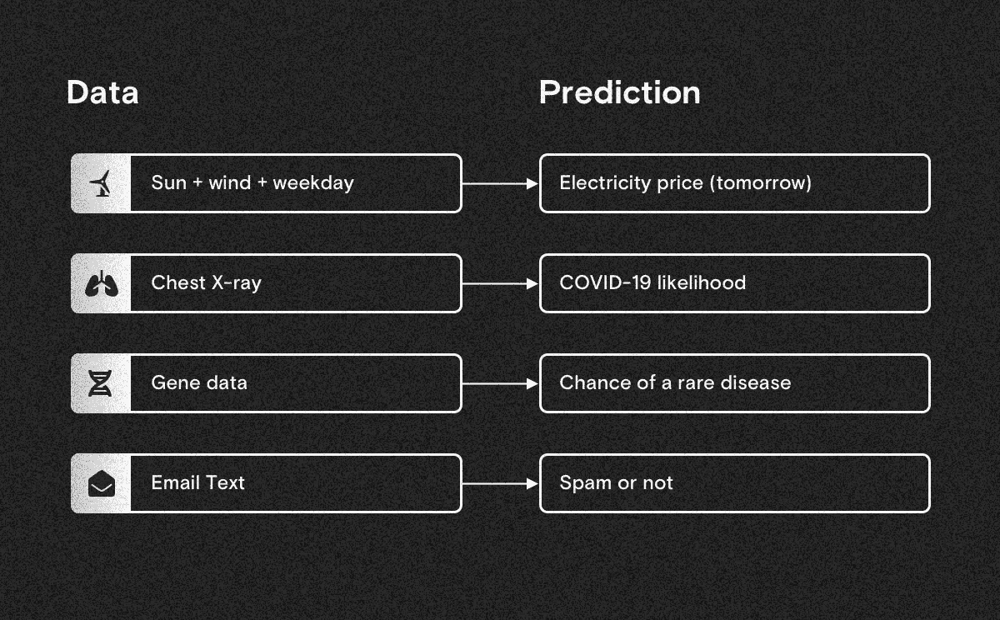

# 什么是机器学习？

> 原文：<https://medium.com/codex/what-is-machine-learning-daeac9a2ceca?source=collection_archive---------13----------------------->

这个世界充满了数据。很多很多数据。从图片、音乐、文字、电子表格、视频等等。看起来不会很快放缓。机器学习带来了从所有这些数据中获取意义的希望。

在这个系列中，我想带你在人工智能的世界中进行一次冒险，探索艺术、科学和机器学习工具。在这个过程中，我们将看到创造惊人的经历和产生有价值的见解是多么容易。

[来源](https://unsplash.com/photos/fItRJ7AHak8)

# 1.介绍

**机器学习**是人工智能(AI)的一个子领域，它为**系统**提供自动****学习****并从**经验** **中改进**的能力，而无需**被**显式**编程。**

**在**学习**(模型拟合)的过程中，我们需要一些**观察值**或**数据**(也称为*样本*或*样本*)以便探索**潜在的** **潜在的** **模式**，隐藏在我们的数据中。这些**学到的** **模式**都是**没有的**比一些**功能**或**决定** **界限**。**

> **这些模式由系统(计算机系统)自动学习，无需人工干预或输入。**

# **2.机器学习在数据中寻找模式**

**简单地说，机器学习在数据中找到模式，并使用它们进行预测。**

**每当你有大量数据并且想要**自动化智能预测**时，机器学习可能是使用的正确工具。**

****

**机器学习的示例应用:将数据转化为预测。**

# **3.机器学习已经无处不在**

**在我们今天使用的产品中，我们看到机器学习在我们周围，但对我们来说，机器学习并不总是显而易见的。虽然标记图片中的对象和人物显然是机器学习，但你可能没有意识到，像视频推荐系统这样的功能通常也是由机器学习驱动的。**

****

**当然，也许最大的例子是谷歌搜索。每次你使用谷歌搜索，你都在使用一个以许多机器学习系统为核心的系统，从理解你的查询文本到根据你的个人兴趣调整结果。当你搜索“Java”时，机器学习决定先显示哪些结果，这取决于它认为你是咖啡专家还是开发者。也许你们两个都是！**

**今天，机器学习的直接应用已经相当广泛，包括[图像识别](https://cloud.google.com/vision/)、[欺诈检测](https://cloud.google.com/blog/big-data/2017/08/how-wepay-uses-stream-analytics-for-real-time-fraud-detection-using-gcp-and-apache-kafka)、[推荐引擎](https://cloud.google.com/solutions/recommendations-using-machine-learning-on-compute-engine)，以及[文本](https://cloud.google.com/natural-language/)和[语音](https://deepmind.com/blog/wavenet-generative-model-raw-audio/)系统。这些强大的功能可以应用于广泛的领域，从[糖尿病视网膜病变](https://blog.google/topics/machine-learning/detecting-diabetic-eye-disease-machine-learning/)和[皮肤癌检测](http://cs.stanford.edu/people/esteva/nature/)到零售，当然还有运输，形式为自动停车和[自动驾驶车辆](https://waymo.com/)。**

# **4.机器学习的类型**

****

**照片由 [moren hsu](https://unsplash.com/@moren?utm_source=unsplash&utm_medium=referral&utm_content=creditCopyText) 在 [Unsplash](https://unsplash.com/s/photos/maths-board?utm_source=unsplash&utm_medium=referral&utm_content=creditCopyText) 上拍摄**

**根据我们想要解决的问题和我们已经获得的数据，我们还需要确保选择一个合适的学习算法。机器学习有许多学习类型，可以在不同的环境中使用，根据需要提供不同性质的答案。这些是:**

*   ****监督** **学习**:在监督学习中，数据集包括**标记的例子**。换句话说，该集合包含每个示例的正确响应(称为目标)。目标是开发一个模型，该模型将特征向量作为输入，并输出预测的目标变量。**
*   ****无监督** **学习**:另一方面，在无监督学习中，数据集是一组**未标记的例子**。这种学习类型在我们想要执行聚类、降维或离群点检测时最有用。**
*   ****半监督** **学习**:当数据集包含**有标签和无标签的例子**时，我们可能需要应用半监督学习算法。**
*   ****强化**在强化学习中，当预测的答案是错误的时，算法通常会得到指示，但不会被告知如何纠正它。**

# **5.机器学习成功的必要条件是什么？**

**近年来，机器学习和“大数据”变得越来越广为人知，并引发了大量报道。因此，许多个人和组织正在考虑如何以及是否可能适用于他们的具体情况，以及是否有从中获得的价值。**

**然而，为成功的机器学习建立内部能力(或利用外部专业知识)可能成本高昂。在接受这一挑战之前，明智的做法是评估是否存在合适的条件，使组织有机会取得成功。这里的主要考虑与数据和人类洞察力有关。**

**有效的机器学习有三个重要的数据要求。通常，并非所有这些要求都能令人满意地得到满足，一个方面的缺点有时会被另一个或两个方面抵消。这些要求是:**

*   ****数量:**机器学习算法需要大量的例子，才能提供最可靠的结果。大多数监督学习的训练集将涉及数千或数万个示例。**
*   ****可变性:**机器学习旨在观察数据的异同。如果数据过于相似(或过于随机)，它将无法有效地从中学习。例如，在分类学习中，训练数据中每个类别的样本数量对成功的几率至关重要。**
*   ****维度:**机器学习问题往往在多维空间中运行，每个维度都与某个输入变量相关联。数据中丢失的信息量越大，阻碍学习的空白空间就越大。因此，数据的完整程度是学习过程成功的一个重要因素。**

# **最后的想法**

**在今天的文章中，我们介绍了机器学习，它无疑是过去几年中取得巨大进步的计算机科学领域之一。最后，我们讨论了机器如何能够学习以及存在的不同学习类型。请继续关注本系列的后续文章。**

# **如果你喜欢这篇文章，那么看看我在这个系列中的其他文章**

## **1.[机器学习有哪些类型？](/codex/what-are-the-types-of-machine-learning-53360b7db8b4)**

## **2.[一元线性回归](/codex/linear-regression-on-single-variable-f35e6a73dab6)**

## **3.[多元线性回归](/@jagajith23/linear-regression-on-multiple-variables-1893e4d940b1)**

## **4.[逻辑回归](/@jagajith23/logistic-regression-eee2fd028ffd)**

## **5.[什么是神经网络？](/@jagajith23/what-are-neural-networks-3a0965e2ebfb)**

## **6.[使用神经网络的数字分类器](/@jagajith23/digit-classifier-using-neural-networks-ad17749a8f00)**

## **7.[利用 K 均值聚类进行图像压缩](/@jagajith23/image-compression-with-k-means-clustering-48e989055729)**

## **8.[使用 PCA 对人脸进行降维](/@jagajith23/dimensionality-reduction-on-face-using-pca-e3fec3bb4cee)**

## **9.[使用异常检测来检测网络上的故障服务器](https://jagajith23.medium.com/detect-failing-servers-on-a-network-using-anomaly-detection-1c447bc8a46a)**

# **最后做的事**

**如果你喜欢我的文章，请鼓掌👏一个追随者会很棒，而且媒体宣传这篇文章是有帮助的，这样其他人也可以阅读它。我是 Jagajith，我会在下一个里抓住你。**