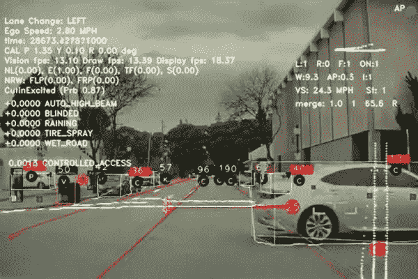

# 什么是机器学习？

> 原文：<https://medium.com/codex/what-is-machine-learning-e51a2200ed20?source=collection_archive---------21----------------------->

## [法典](http://medium.com/codex)

## 你好世界，

首先，我想为我在过去的一个月里如此不活跃而道歉，那是因为我的考试，但是在这里我再次发帖。希望你喜欢它。

如今，每个人都想学习机器学习，但你应该首先了解你将学习和你将面临的问题。所以让我们开始吧。

机器学习导论

> M ***机器学习—*** *对通过经验和使用数据自动改进的计算机算法的研究。*

为了更好地理解我，让我们举个例子。有没有想过一个孩子是如何学会他/她的第一个单词的？你会看到，如果一个孩子出生并成长在印度家庭，他的第一句话是印地语，如果在美国家庭，他的第一句话是英语，如果在西班牙，那么西班牙语等等。但这不是专门教他/她学习的。那么原因是什么。让我们看看

这是因为语言习得——孩子一遍又一遍地听到这个声音，因此慢慢地一步一步地意识到单词，正如所说的“熟能生巧”也意味着这一点。

同样的概念也用于机器学习。事情是这样的——数据被提供给算法，算法对数据进行复杂的计算，或者说是数学运算，以形成关系。一般情况下，第一种结果是最糟糕的。随着我们不断输入越来越多的数据，并一次又一次地运行算法(即更多的练习)，它会随着时间的推移不断改进自己，并在一段时间后提供良好的结果。

# 机器学习的类型:

## 1.监督学习

—在这种情况下，数据作为算法(函数)的输入，然后算法对数据进行运算，以提供有用的结果。例如，预测结果(你房子的估计售价)，识别(是一本书还是一辆车？)

## 2.无监督学习

—在这种情况下，算法会尝试从未标记/未分类(原始)数据中学习或识别模式。例如，客户细分(公司用来了解他们的客户)，推荐系统(网飞向你推荐电影)

# 谁用机器学习？

许多最大的公司使用机器学习。其中包括谷歌、苹果、网飞、Spotify、特斯拉等等。

今天有许多机器学习算法，我们可以单独使用或组合它们来形成一些令人敬畏的系统/应用程序，如**线性回归、逻辑回归、SVM、决策树、降维等。**

特斯拉的机器学习

所以现在你知道什么是机器学习了。我希望你喜欢这篇文章。随着时间的推移，我会上传更多的机器学习帖子。因此，要阅读它们，请遵循。

我最新的项目: [Covid Track](https://wecovidtrack.netlify.app)

查看我的项目: [Github](https://github.com/SatvikVirmani)