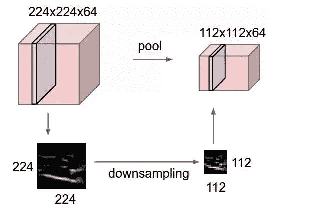
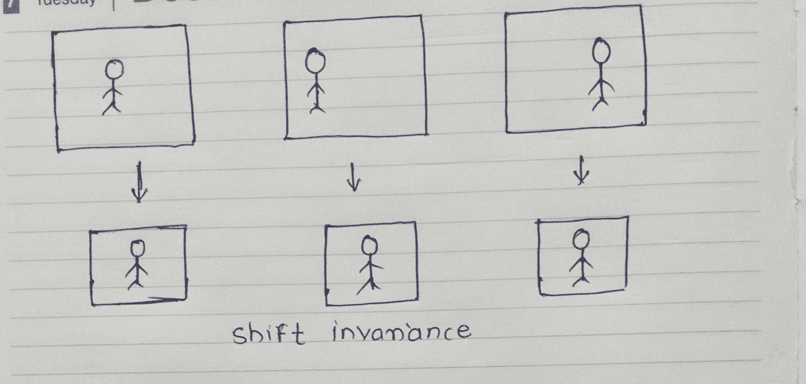
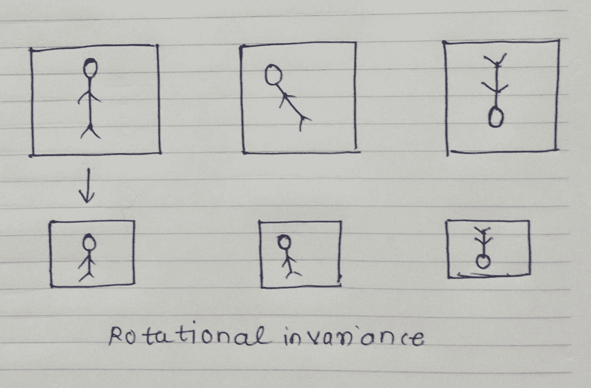
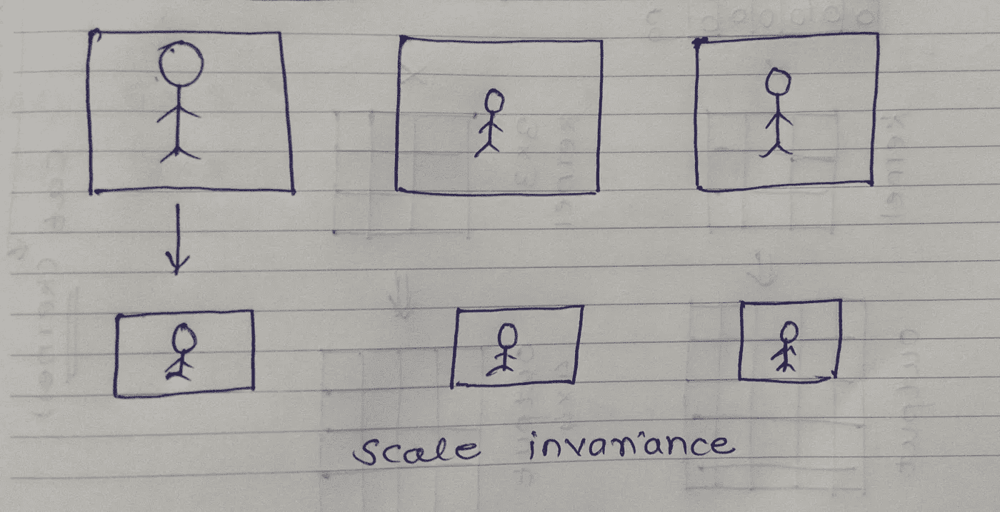

# CNN 的 Max pooling 是什么？用起来有用吗？

> 原文：<https://medium.com/codex/what-is-max-polling-in-cnn-is-it-useful-to-use-6f2d6ff44c6?source=collection_archive---------8----------------------->

> 注意:如果你不熟悉[内核](/codex/kernels-filters-in-convolutional-neural-network-cnn-lets-talk-about-them-ee4e94f3319?source=your_stories_page-------------------------------------)、[填充](/codex/why-padding-is-important-in-convolutional-neural-network-cnn-8cf7e9e38ca8?source=your_stories_page-------------------------------------)和[通道](/analytics-vidhya/difference-between-channels-and-kernels-in-deep-learning-6db818038a11?source=your_stories_page-------------------------------------)，那么看看我以前的博客。

现在让我们创建一个可以使用 Maxpooling 的场景。

假设你的图片尺寸是 224×224；这个尺寸要大得多，你需要把它转换成更小尺寸的图像，也不想失去重要的功能。你从一个 3×3 的内核开始，在第一次迭代中，它的维数将是 222×222，在 111 次迭代之后，它的输出大小将是 2×2。

111 迭代使用大量的计算能力和时间，它也不是解决问题的最佳方法。

这就是 max-pooling 的用武之地，在 max pooling 的第一次迭代中，224 x 224 大小的图像将被缩减为 112x 112 大小的输出卷积。

max-pooling 的第一次迭代(图片来源:google images)

## 它是如何发生的？

在 max-pooling 中，我们使用一个 **2 x 2 大小的内核**(这样我们就不会丢失重要的特性)，步长**等于 2** 。(在博客的最后了解更多关于大步的信息。)所以每次 2×2 大小的内核移动 2 次，将图像的大小减少一半。

## **我们会失去重要的特征吗？**

CNN 用于图像处理，因此在处理图像时，我们首先应用填充，然后 3×3 大小的内核提取重要特征，当我们进行到一半时，我们使用最大池。使用内核，CNN 算法已经提取了重要的特征，现在使用 max-pooling，我们只是将这些特征汇集在一起，这样可以加快计算时间。

总有一种可能性，我们可能没有所有的功能，但我们已经有了重要的功能。

# 其优点:

有不同的池算法，但最大池有自己的优势。

## **1。移位不变性:**

平移不变性是指一个物体在不断地移动它的位置。

假设您训练了一个模型，其中对象位于相同的位置，并且其所有特征都可见，但是在测试时，您意识到您的对象位置正在移动，并且并非所有特征都正确可见。这一次你的模型将无法预测正确的对象。

但是如果你在训练时使用 max-pooling，那么它将从图像中汇集所有重要的特征，而在测试时，你的对象位于哪里并不重要。

物体位置的移动

## 2.旋转不变性:

表示图像旋转的变化。

假设您的测试图像旋转了一定角度或 180 度，该算法将无法预测正确的输出。Max-pooling 有助于理解具有一定程度旋转的图像，但它对于 180 度是无效的。

物体位置的旋转

## 3.比例不变性:

图像比例或大小的变化。

假设在测试中，你的猫/狗分类器模型失败了，因为你给出了大小不同的输入图像。要解决这个问题，你可以使用 max-pooling，它会尝试将所有的图像缩放到相同的大小。

图像比例的变化

# 步幅:

步幅指的是图像矩阵中像素内核移动的数量。

在 max-pooling 的情况下，步幅是 2。

2 大踏步图片(图片来源:谷歌)

继续学习。