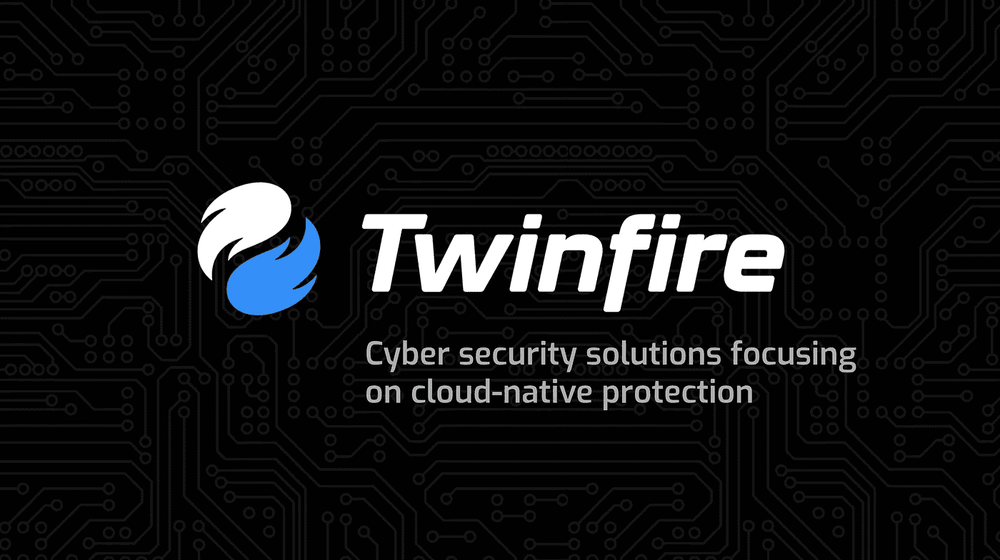

# 安全中的“左移”是什么意思？

> 原文：<https://medium.com/codex/what-is-meant-by-shifting-left-in-security-e92e2401b646?source=collection_archive---------23----------------------->

*首席执行官 Anand ve muri&运营经理 Veronica Decker*

# **软件开发生命周期**

“左移”是我们在谈论软件开发生命周期(SDLC)时使用的一个术语。SDLC 是企业用来创建和部署软件的业务流程(从左到右)。

这一切都始于一个想法:一个公司得到一个软件设计的想法。在设计评审过程中，工程师和技术负责人讨论设计。达成一致后，它就进入了“构建阶段”，在这个阶段，工程师们根据设计构建一个软件系统。

在构建阶段之后，设计进入测试阶段，最后是部署，将软件放在一个实时网站的 URL 上，或者可能是一个云环境，将其暴露在互联网上。现在，世界其他地方都可以访问它。

在这些阶段中的每一个阶段，安全性都可能出错。我们想要做的是将安全机制落实到位，以便从最初的设计开始，我们就将安全性融入到流程中，与正在发生的一切保持一致。

# **太少，太迟**

这一领域当前的挑战是，在软件开发生命周期中，对安全性的关注上升得太“右”了。换句话说，要经济有效地解决安全问题，在游戏中往往为时已晚。

当我们在 SDLC 中向右移动时，纠正安全缺陷的成本呈指数级增长。如果安全顾问出现在设计评审阶段，她可以及早发现不安全的设计，并有希望通过从一开始就帮助修改它来缓解问题。但是，如果一个设计在没有任何安全输入的情况下被发送到部署，现在您已经有客户在使用它了；您必须联系他们，暂停生产，制定迁移计划，以便维护当前或新的服务器—这是一个大难题。

“左移”是一个创造出来的术语，目的是希望将安全思维驱动到开发生命周期的最开始:我们越早考虑安全问题，组织修复潜在问题并改善其安全状况的成本就越低。

当然，这种思维方式也有局限性:您可能有一个非常安全的项目，但是到了实现阶段，可能会有特定于代码的东西——开发人员使用的库，等等。—这允许代码执行漏洞。现在攻击者可以执行任意命令，而且没有办法在设计阶段就被发现，因为它甚至与过程的这一部分无关；这与其说是一个理论上的设计问题，不如说是一个明显的漏洞。

但最终，将软件安全性作为一个整体嵌入 SDLC 会给组织带来巨大的好处，因为它允许组织更全面地覆盖可能出现的不同类型的安全问题。

# **可预防的漏洞**

随着 SDLC 从左向右移动，安全架构师会发现几个常见的漏洞。

*1)糟糕的设计架构:*换句话说，软件设计本身存在不可逆的安全问题，需要完全的重新架构。例如，如果认证架构——也就是你为某些客户存储秘密的方式——有缺陷或者不可扩展，那么就没有快速解决方案；这将需要大量的工作&代码重写来纠正。但是，如果团队中有一名安全工程师，所有这些都很可能在设计审查中被阻止。

*2)典型的构建阶段漏洞:*一家公司可能有一个伟大的设计，但一名工程师使用了 MySQL 库，从而允许对数据库进行 SQL 注入；或者也许工程师开发了不安全的代码——毕竟，软件是一种语言，有许多不同的方式来表达相同的期望结果，不可避免地会有某些不安全的方式来表达数据库查询。如果工程师陷入了这些陷阱，即使在纸上有一个很好的设计，实际的“房子”本身在设计时也会有一些实质性的问题。

*3)在部署方面:*当软件处于运行时环境中并实际提供给客户时，不会发生太多事情，因为代码的执行速度非常快——这与典型的物理安全环境非常不同。当你谈论安全保护和生产时，你主要寻找的是一个真正伟大的安全架构，以确保你限制各种爆炸半径。例如，如果你在网络上的某个地方发现了恶意软件，这种情况有多严重？你必须开始假设攻击者会在某个时候出现在你的网络中，在这种情况下，他们能走多远？为了保护我们最有特权的资产，我们还有一定的深度。然后，我们是否有取证日志记录和审核日志记录，以确保在发生攻击时，我们可以将其与日志进行交叉关联？

*4)* 第四步也是最后一步更为重要的是*补救:*事件响应管道、通信、流程——确保一切就绪，但正如我们所说的，如果您需要在凌晨 3 点让 SWAT 团队处理勒索攻击，那将是非常可怕的情况，也是最昂贵的情况。

# **总之**

“左移”是将组织中安全漏洞的发现转移到设计阶段，这样我们就不必在生产中更严重的环境中为此付出代价。

要了解更多网络安全最佳实践，请发送电子邮件至 info@mytwinfire.com 的 ***。***