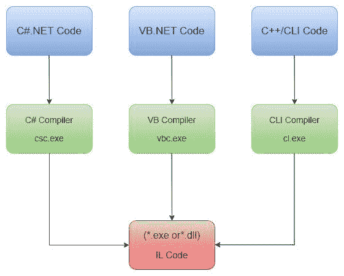

# MSIL 在哪里？NET 框架？

> 原文：<https://medium.com/codex/what-is-msil-in-net-framework-78f9f1e7e502?source=collection_archive---------6----------------------->

为了构造程序，the.NET 框架为不同的编程语言如 C#提供了单独的编译器。

编译完源代码后，each.NET 编译器生成一个中间代码，每个环境都使用这个中间代码，称为微软中间语言(MSIL)。

在这篇文章中，我们将详细了解什么是 MSIL，包括它的作用和必要性。

**目录**

1.  什么是 MSIL？
2.  公共语言运行时(CLR)中的执行进程
3.  MSIL 在. NET 环境中的角色
4.  先决条件
5.  MSIL 内部
6.  最后的话

# 什么是 MSIL 编程？

微软中间语言(MSIL)也被称为通用中间语言(CIL)。它通常是由特定于语言的编译器根据源代码创建的一组平台无关的指令。

它是由各种编译器(C#、VB、.NET 等等)。the.NET 框架 SDK(FrameworkSDKBinildasm.exe)中包含的 ILDasm(中间语言反汇编程序)软件允许用户以人类可读的格式查看 MSIL 代码。我们可以使用这个应用程序查看 any.NET 可执行文件(EXE 或 DLL)中的 MSIL 代码。

MSIL 是机器不可知的，可以很快被转换成本机代码。CLR 中包含一个实时(JIT)编译器，它将 MSIL 代码转换成本机代码。因此，MSIL 在 CPU 上执行之前必须由 JIT 编译器进行翻译。对于每种支持的机器体系结构，JIT 编译器都是可用的。任何受支持的机器都将运行相同的 MSIL。

# 公共语言运行时(CLR)中的执行进程

下面是执行过程，包括 MSIL 的产生和 JIT 编译器将 MSIL 转换成机器码:

*   在 CLR 编译时，特定于语言的编译器将源代码转换为 MSIL。除了 MSIL，编译期间还会生成元数据。元数据包括代码中类型的定义和签名等元素，以及运行时信息。
*   MSIL 被组装到公共语言基础结构(CLI)程序集中。该程序集是用于安全、部署、版本控制和其他目的的内置代码库。分为进程汇编(EXE)和库汇编(LIB) (DLL)两种。
*   JIT 编译器然后将微软中间语言(MSIL)翻译成与其执行的计算机环境相关的机器代码。MSIL 在逐个需求的基础上被转换成机器码，这意味着 JIT 编译器只编译必要的 MSIL，而不是整个 MSIL。
*   JIT 编译器生成机器码，随后由计算机的 CPU 执行。

# MSIL 在. NET 环境中的角色

以下是 MSIL 在电影中的角色。网络环境:-

1.  **平台独立性:-** 平台独立性是指相同的字节码指令文件可以放在任何平台上；编译的最后阶段可以在运行时简单地完成，这样代码就可以在那个平台上执行。换句话说，MSIL 定义了一组不依赖于特定 CPU 的可移植指令。
2.  **性能提升:-**JIT 编译器只是根据需要编译每一段代码，而不是一次构建整个应用程序。当代码编译一次后，生成的本机可执行文件将一直保存到应用程序创建完毕，因此下次运行该部分代码时不必重新编译。这种方法比从头开始编译完整的程序代码要快。它还演示了运行 MSIL 代码几乎和运行本机代码一样快。
3.  **语言互用性:-** 语言互用性得益于 MSIL 的使用。一个人可以从一种语言编译到 MSIL，结果代码与另一种语言的代码(编译到 MSIL)兼容。换句话说，MSIL 设计允许框架是语言不可知的。语言选择不再由开发人员控制。甚至在一个程序中可以使用多种语言。
4.  减少维护上的麻烦:-CLR 可以检查 MSIL 代码，看看它是否符合类型安全之类的标准。缓冲区溢出和不安全的强制转换可以在构建时被识别出来，大大减少了维护上的麻烦。

# 先决条件

因为 CIL 开发人员直接面对 CLR 的内置语法，所以用 CIL 编程可能会很困难。使用操作码，而不是更用户友好的语言，如 C#、F#和 VB.NET(它们使用更像英语的语言语法)。直接对 CIL 编程时，建议您安装以下工具。

*   Visual Studio IDE 2010 或更高版本
*   。NET Framework 4.0 或更高版本
*   伊尔达斯姆。ILASM.EXE 公用事业公司
*   记事本++
*   SharpDevelop(可选)
*   Xamarin Studio(可选)

虽然 CIL 代码可以在简单的记事本编辑器中编写，但建议您使用像 SharpDevelop 这样的全功能编辑器来开发 CIL 代码。

# MSIL 内部

CIL 代码在概念上类似于 Java 字节码，因为除非绝对必要，否则它不会被编译成特定于平台的指令。对于每个面向运行时的 CPU，the.NET CLR 使用一个针对底层平台优化的 JIT 编译器。元数据 in.NET 二进制文件描述了二进制文件中包含的每种类型的特征。

元数据(正式名称为清单)包含有关程序集当前版本的信息，以及所有外部链接程序集和区域性数据的列表。

每一个 the.Net 许可的编程源代码最终都被编译成 CIL，而不是直接编译成特定的指令集。正因为如此，所有的。NET 支持的语言可以相互通信。此外，CIL 代码提供了 Java 程序员所期望的优势。

each.NET 支持的编程语言中的关键字被映射到 CIL 助记符。将字符串变量加载到内存中时，可以使用操作码“ldstr”来代替 StringLoading。

# 最后的话

every.NET 会议的基础是 MSIL 法典。你对 MSIL 指令集了解得越多，你就能更好地理解 advanced.NET 应用开发。

*原载于*[*https://www . partech . nl*](https://www.partech.nl/nl/publicaties/2021/09/what-is-msil)*。*