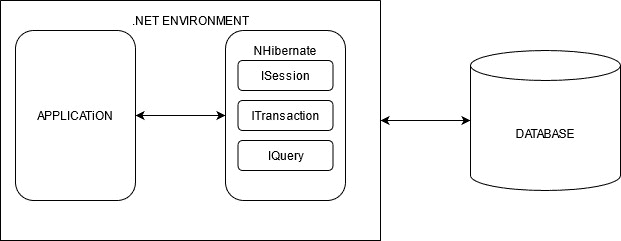

# 什么是 NHibernate，它与实体框架有什么不同

> 原文：<https://medium.com/codex/what-is-nhibernate-and-how-is-it-different-from-entity-framework-29edf365fc50?source=collection_archive---------7----------------------->

在开发任何软件或产品时，对数据库的无缝访问起着非常关键的作用。因此，精心制作连接至关重要。这是 ORM(对象关系映射)派上用场，因为它可以帮助他们轻松地访问数据。使用 ORM 库有助于提高应用程序开发的速度。同时，它简化并巩固了实现。

中使用了许多流行的 ORM 库。NET 世界如实体框架、NHibernate、Dapper、LLBLGen Pro、RepoDB 等。由于有多种选择，所以选择最有效但最合适的 ORM 至关重要，其中之一就是 NHibernate。

在这篇文章中，我们将介绍 NHibernate 以及它与实体框架的不同之处。

**目录**

1.  什么是 NHibernate？
2.  NHibernate 建筑
3.  使用 NHibernate 的优势
4.  NHibernate 项目的组成
5.  NHibernate 和实体框架的区别
6.  结论

# 什么是 NHibernate？

它被吹捧为 Java 到 the.NET 框架的 Hibernate 核心的一个端口。它管理普通文件的传输。NET 对象与关系数据库之间的相互转换。NHibernate 基于实体和关系的 XML 描述创建 SQL 来加载和存储对象。

简单来说，NHibernate 可以被认为是一个数据库管理系统。它是-

*   ORM 框架
*   开源
*   专为用作。基于对象关系映射技术的. Net 框架。

它使用代码来构建数据库对象的“虚拟表示”。使用这种技术解决了类和关系数据库和表之间的阻抗不匹配。

# NHibernate 建筑

现在许多系统都是用分层体系结构开发的；NHibernate 也不例外，可以完美地使用它。分层体系结构将系统分成几个组，每个组包含解决特定问题领域的代码。这些组被称为层。大多数企业级应用都有一个三层的高级应用架构:

*   表示层
*   业务层
*   持久层

上图显示了一个简单的 NHibernate 架构以及 NHibernate 应用程序的高级视图。为了持久化，应用程序代码使用了 NHibernate ISession 和 IQuery APIs。它只需要管理数据库事务，这应该使用 NHibernate ITransaction API 来完成。

# 使用 NHibernate 的优势

*   对象保存在关系数据库中，在那里它可以用于所有的 CRUD 活动。
*   所有数据库工作都由 NHibernate 处理。
*   不再需要 SQL 语句或创建已保存的查询。
*   所有的数据访问逻辑都可以包含在应用程序中。
*   由于数据制图，我们的查询不仅有效，而且还会被编译器验证。因此，如果底层表的结构发生变化，编译器会通知我们需要修改查询！
*   不需要为任何创建、检索、更新或删除(CRUD)操作编写 SQL 查询。

# NHibernate 项目的组成

NHibernate 项目由多个元素组成，例如:

1.  XML 映射文件(hbm.xml)。
2.  Hibernate 配置文件:hibernate.cfg
3.  普通旧 CLR 对象(POCOs)。
4.  Web.config(一个 XML 文件)。
5.  带有数据访问对象(DAO)的数据库。
6.  网页/ WebForm / MVC:视图(Razor)。

另一方面，一个简单的 NHibernate 项目由下面列出的四个关键部分组成

**Hibernate 映射文件:将数据映射到 POCOs**

*   指导 NHibernate 如何建立或不建立数据库。
*   要通知 NHibernate 您想要获取或存储到数据库中的数据，请使用数据访问方法。
*   你需要一个 POCO 来处理数据。尽管 XML 映射文件经常在 NHibernate 项目中使用，但它们并不是将数据映射到 POCOs 的唯一方法。

**Hibernate 配置文件:hibernate.cfg**

*   提供有关数据库连接配置、SQL 查询方言、会话工厂类等的详细信息。
*   “sessionFactory”是每个应用程序生命周期创建一次的线程安全对象，它是 NHibernate 的基础。
*   一个 Hibernate 映射文件，根据配置控制数据库表如何映射到 C#对象。换句话说，哪个属性对应于哪个数据库表列。
*   hibernate 映射 XML 文件。

**普通旧 CLR 对象(POCO)**

*   在 C#或 VB.NET 中，构建一个类。
*   一个类中只能有一个属性被指定为虚拟的(它帮助 hibernate 创建一个代理)。
*   它可以选择拥有一个默认的函数对象(){[本机代码] }。

**aspx 中的主类/视图页面:-**

*   使用会话，以获取数据并将其设置到会话中，以便将其保存到数据库中。
*   使用进程从数据库中获取数据，并将其显示在 ASPX 页面或视图页面上。

# NHibernate 和实体框架的区别

以下是使用 NHibernate 优于 Entity Framework 的一些区别和优势。

*   实体框架需要额外的连接来处理 MSSQL 之外的数据库，这是 nHibernate 提供的。
*   在数据加载、SQL 生成、自定义列类型、自定义集合等方面，NHibernate 都可以修改。然而，实体框架的扩展点有限。
*   实体框架不支持 BLOB 和 CLOB 等标量属性的延迟加载，但是 nHibernate 支持。
*   只有在 NHibernate 中支持以级联方式删除行。
*   NHibernate 中还提供了预加载、后加载、更新和删除功能。
*   NHibernate 提供二级缓存支持。
*   唯一的缺点是——由于元数据的准备，nHibernate 比实体框架需要更长的启动时间。

# 结论

NHibernate 是一个用于 the.NET 框架的开源对象关系映射器，它不断发展，功能丰富。数以千计的成功项目采用了它，并在这些年里取得了成功。

*原载于*[*https://www . partech . nl*](https://www.partech.nl/en/publications/2021/08/what-is-nhibernate-and-how-is-it-different-from-entity-framework)*。*