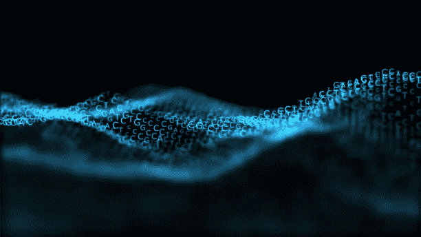

# 什么是非负矩阵分解(NMF)？

> 原文：<https://medium.com/codex/what-is-non-negative-matrix-factorization-nmf-32663fb4d65?source=collection_archive---------1----------------------->

非负矩阵因式分解或 NMF 是一种用于将非负矩阵 X 因式分解为两个较低秩矩阵 A 和 B 的乘积的方法，使得 AB 近似于 X 的最优解。这是一种无监督学习算法，用于将数据维数降低到较低维空间。这种技术主要用于推荐系统、文本挖掘和图像分析应用。NMF 是一种最先进的特征提取算法，当有许多模糊且预测能力较弱的特征时非常有用。它可以产生有意义的模式、话题和主题。



从 istockphoto.com 取回

NMF 使用的方法来自多元分析和线性代数。该算法迭代地改变 A 和 B 的值，使得它们的乘积接近 x。该方法保持原始数据的结构不变，并确保基和权重都是非负的。当逼近误差收敛或达到一定的迭代次数时，NMF 停止。它必须用种子初始化，以引用迭代的起始点。这是由于处理空间的高维数和没有全局最小化算法的事实。因此，适当的初始化对于获得有意义的输出至关重要。在分类、聚类、回归等任务中，非负矩阵分解(NMF)通常被用作降维的预处理步骤。实际上，它可以应用于输入数据矩阵没有负元素的任何情况。

奇异值分解是矩阵分解的另一种替代方法，用于寻找低秩近似。NMF 更好，因为它以小步骤显示表示，产生稀疏的结果，比奇异值分解更容易理解和使用。

让我们看一个 NMF 使用 scikit-learn 的代码示例。此代码单元格显示了在玩具数据集中实现 NMF 的基本步骤

```
**>>> import** **numpy** **as** **np**
**>>>** X = np.array([[1, 2], [2, 2], [3, 1.2], [4, 1], [5, 0.8], [6, 1]])
**>>> from** **sklearn.decomposition** **import** NMF
**>>>** model = NMF(n_components=2, init='random', random_state=0)
**>>>** W = model.fit_transform(X)
**>>>** H = model.components_
```

在上面的代码中，fit(X)学习输入 X 的 NMF 模型。transform(X)根据拟合的 NMF 模型转换数据 X。`fit_transform` (X)，一起学习输入 X 的 NMF 模型并返回变换的数据。

NMF 经常用于自然语言处理任务，比如主题建模。当应用于新闻文章时，它能够产生文章的不同主题。这可以用来推荐在线新闻门户网站上的类似文章，以迎合每个读者。有可能媒体正在将 NMF 应用于你过去的阅读数据，并根据你过去的兴趣向你推荐这个博客！【哈哈，我不知道，问他们 xd！！！！！]

今天到此为止。我希望你喜欢我的博客。在我的下一篇博客中，我们将看到一些与数据科学、机器学习和人工智能相关的真实而令人兴奋的话题。如果你喜欢我的文章，请不要忘记评论，鼓掌并关注我！你鼓励的话语和有见地的评论激励我写更多。非常感谢您的阅读:)