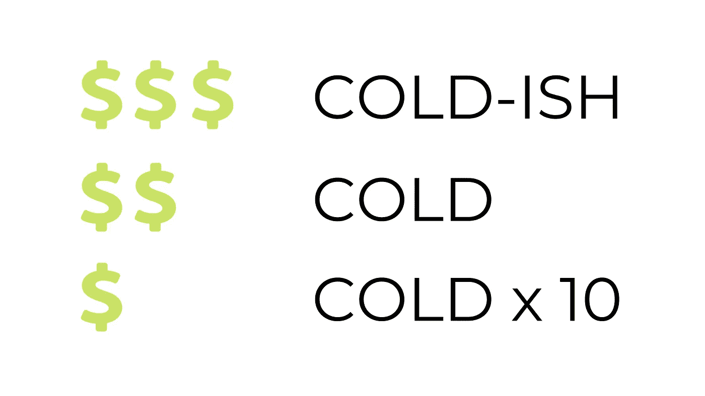

# 什么是对象存储？用简单的术语解释对象存储

> 原文：<https://medium.com/codex/what-is-object-storage-object-storage-explained-in-simple-terms-19e9ffebb32c?source=collection_archive---------8----------------------->

# 介绍

当我们考虑相对较新的对象存储层时，我们的目标是以相对较低的成本实现相对较低性能的存储，以满足互联网工作负载的需求。

因此，当我说互联网工作负载时，我指的是 Web 应用程序。我指的是网站，网站托管，通过互联网提供材料，以及为我们过去存储在磁带上的所有数据找到新家的方法。

我们需要一种机制来获取大量数据，将其写下来，并将其放在一个安全、可靠的地方，并且由于法规原因、法律原因以及其他需要我们长期保留数据的需要，我们可以在那里长期维护这些数据。

所以，首先也是最重要的，“什么是物体？”为什么我们称之为“对象存储”？

## 对象存储

因此，对象存储背后的思想是你有一个项目。该对象现在可以是任何类型的文件。

没有文件限制或诸如此类的东西。有些功能真的很重要。

然而，作为一般规则，任何类型的文件都可以被认为是对象。所以，我们现在扔一个物体进去。该对象有五个基本组件，使其在计算意义上可用。

对象存储—组件

首先，每个对象都必须有一个 ID，某种形式的唯一标识，告诉我们什么时候可以得到它。这是第一部分。

第二个需要是你有一些数据。如果没有数据，拥有一个文件和所有这些信息有什么用呢？

因此，这可能是一个 Excel 文件或视频文件。它可以是音频文件或任何其他类型的文件。但是，你必须有确切的数据。

元数据是第三个重要组成部分。那么，元数据到底是什么？关于这个文件及其包含的数据，您只需要知道元数据。

谁发明的？它是什么时候制造的？它的目的是什么？文件格式是什么？它有多大？元数据允许你出去找到它，搜索它，索引它，这样你就可以在任何需要的时候找到它并使用它。

因为，再一次，所有被呈现的都是 ID。身份证其实没什么用。

然后就是你的品质，必须要有。属性现在链接到元数据。他们不是一回事，但他们很接近。

属性可以包括诸如“是否允许某些用户覆盖它？”“允许某些用户下载吗？”以及“允许某些用户删除它吗？”

因此，属性是关于对象而不是数据的。

第六个组成部分是数据可访问性。不管是对公还是对私。

但是，同样，前四个组成部分是至关重要的。这是你做东西的时候用的。所以你的目标就在这里。在那之后你打算用它做什么？

## 使用您的对象

在非结构化对象存储的世界中，您将所有项目放在一个桶中。所以，就这么办吧。所以，假设我有一个桶，为什么没有一个把手呢？

所以我要把所有这些东西放进我的桶里，这是最酷的部分:这些桶可以像你需要的那样大。

它们有能力容纳数十亿的东西。现在，把数十亿个物体放进去通常不是一个好主意，但是它们可以扩展到那个数量级。

然后，因为我们希望能够将它用于冷存储，我们需要将永远不会被删除的东西放在那里，对象存储真正酷的是，你，用户，将通过 API 与它交互。

所以你不会在这里单独与桶交互。我们会把你扔进去。这就是了。

你在利用对象存储。太棒了。所以你要去拿你的东西。你要把它们扔在这里。现在，在后端，对象存储魔术是你的对象。它也被称为“水桶”或“BUK”

它将从这个桶中复制出来，这是一个虚拟的构造，但我们会拿着它说，好吧，我有三个物理隔离的设备。

我将为您的对象制作一份拷贝，并将其复制到所有这三个位置，我将它们复制到所有这三个位置的目标是数据完整性和数据安全性。因此，如果这里是物理设备，每个存储桶都将位于一个物理设备上。因此，我们称之为 BUK1、BUK2 和 BUK3。

对象存储—复制

因此，我们将复制它，您的对象将位于三个不同的物理设备上，因此，如果 BUK1 中出现硬件问题、网络中断或任何其他问题，那都没问题。BUK2 和 BUK3 中仍有副本，因此您可以访问您需要的信息。

当我们进入对象存储的细节时，你会开始想，伙计，这太复杂了。对吗？因此，我不仅有项目桶，而且它的定价、计量和制造方式也略有不同。人们问我有多少“获取”,有多少“放置”,有多少存储空间。

说到对象存储计量和计费，每个销售人员都有自己的一套衡量标准。但以下是需要记住的要点。

## 对象存储的计费

第一个问题是，你的反应能力或反应时间是多少？没错。因此，从价格的角度来看，你期望的性能越高，对任何云存储来说都是如此，它的成本就越高。

如果您有一些数据，您的组织在过去 20 年中一直将这些数据打包并写入磁带，然后将磁带发送到保险库，并将其放入保险库中，在那里很可能永远不会再看到这些数据。

可以到达最冷的层，对吗？这将是价格最低的选择。因此，我们称之为“冷十倍”那是最冷的一天。

对象存储—计费

从那里开始，你需要时不时地去找它，但不需要经常去找，那将是一个两美元的符号，对吗？我们会多收一点钱。这将被称为“冷”

也许这是您需要每六个月左右访问一次的数据。

然而，假设你正在建立一个网站，并使用这些对象存储桶来存放网站的所有资产。显然，这将花费一点额外的费用，因为你是定期发送数据。

这就是我们放三个美元符号的地方。这个我要贴上“有点冷”的标签它不是很温暖，因为温暖的概念不存在于一个对象商店中，但它有点冷。

这是视频、图像、物理文件，让对象存储变得非常酷的是在后端，通过魔法——因为请记住，你是通过 API 进行通信，而不是直接与这些东西进行通信——你可以为它做各种有趣的前端事情。

## 对象存储的优势

这是对象存储非常酷的一面，也是它的好处之一。那么，我们谈谈其中的一些怎么样？为互联网流媒体托管视频。

对象存储的完美用例，因为正如我前面所说的，我们可以复制这些项目。没错。因此，不要简单地将你的视频流复制到三个都在同一个位置的桶中，让我们在全球范围内复制它。

让我们复制它，使这些视频不仅托管在其主要位置，而且托管在全球七个不同国家的三个不同位置，从而为您的消费者减少延迟并改善他们的流媒体体验。

让我们来看看另一个有用的应用:文件共享。假设您在一家公司工作，在那里您可以使用电子表格、PowerPoint 和其他类似工具进行协作，并且您的协作者来自世界各地。

出于版本控制的原因，只要这些属性允许，您可以有许多版本来替换以前的版本。因此，如果我在伦敦工作的朋友 Eric 可以生成一个文件，我就可以获得它的副本，对它进行修改，然后再上传回来。我还有第二版。这就是元数据。

然后，我可能会让新加坡的同事 Sam 下载该文件，对其进行一些进一步的修改，并将其发布回版本 3，再次增加元数据。

然而，这使得在单一文件格式上的跨全球协作成为可能，这使得每个人的生活更加轻松。但我们这样做的成本非常低，远低于试图通过电子邮件发送数据，因为电子邮件必须保存在一个更昂贵的存储层，比联邦快递的拇指驱动器低得多。

同样，这可以以安全的方式完成，因为我们可以控制谁可以查看和访问这些项目。

当然，其他虚拟主机也很重要。我们已经讨论了监管数据和冷藏。假设您正在与一所大学或图书馆合作一个数字存档项目，并且您正在拍摄手稿文档的数字图像。你想把这些展示给全世界看。

# 结论

对象存储是保存这类数据的好地方，因为如前所述，它很少被访问。

它只需写一次，就可以多次读取，并且可以安全地托管。所以，我希望你喜欢这个。这是对对象存储的极好总结。

如果你能跟上并为我鼓掌，那将对我意义重大。