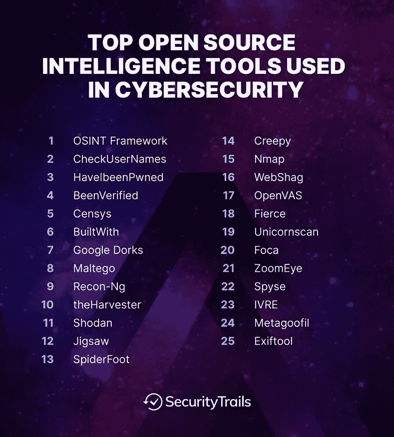
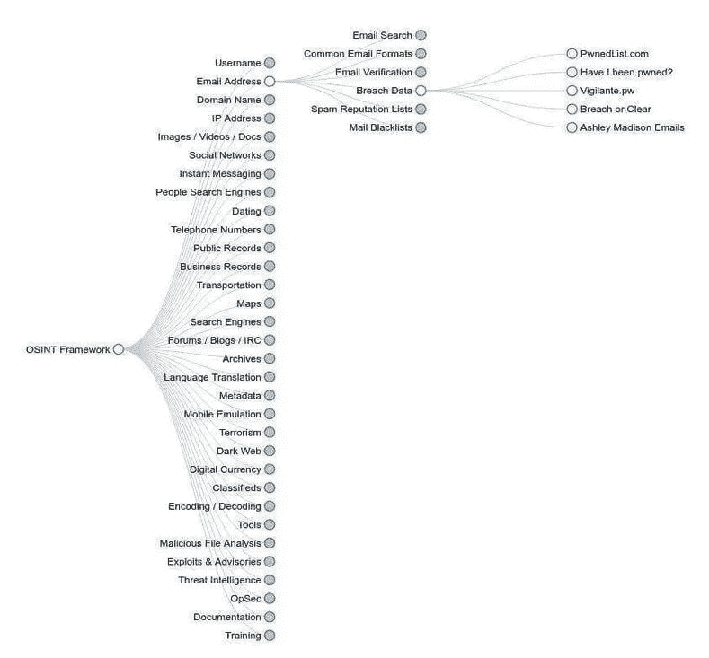
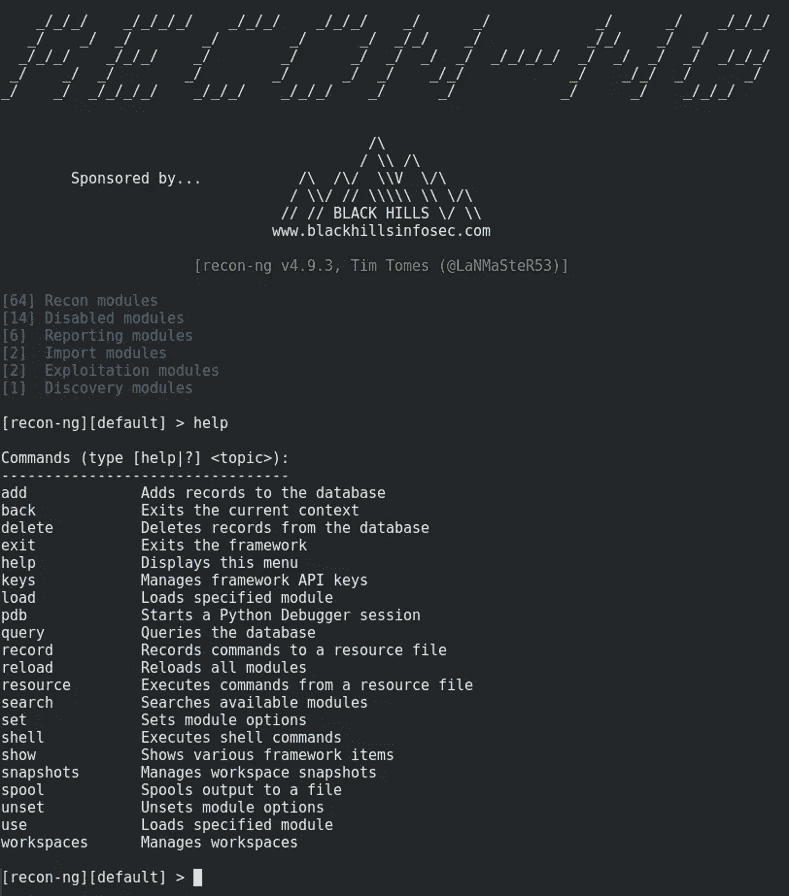
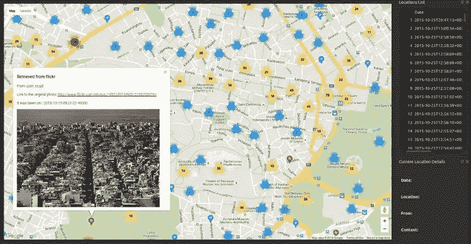
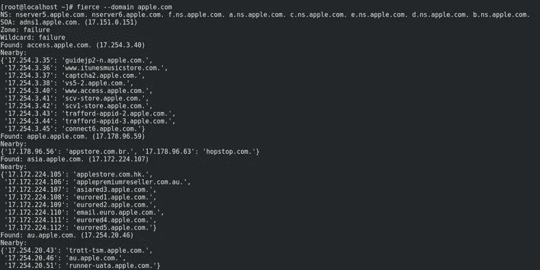

# 什么是开源智能？(OSINT)

> 原文：<https://medium.com/codex/what-is-open-source-intelligence-osint-43e56eb113b4?source=collection_archive---------6----------------------->

在我们研究开源智能的常见来源和应用之前，理解它实际上是什么是很重要的。

根据美国公法，开源情报:

*   是从公开信息中产生的
*   及时收集、分析并传播给适当的受众
*   满足特定的智能要求

这里需要重点关注的重要短语是“公开可用”

术语“开源”特指可供公众消费的信息。如果访问一条信息需要任何专业技能、工具或技术，那么它就不能被合理地认为是开源的。

至关重要的是，开源信息并不局限于你可以使用主要搜索引擎找到的内容。使用谷歌可以找到的网页和其他资源当然构成了大量的开源信息来源，但它们远不是唯一的来源。

## 不同类型的 OSINT

OSINT 包括所有可公开获取的信息来源，这些信息可以在网上或网下找到，也可以在广播和纸面上找到。您可以从以下来源收集信息:互联网，包括论坛、博客、社交网站、视频共享网站，如维基百科、注册域名的 Whois 记录、元数据和数字文件、暗网资源、地理位置数据、IP 地址、搜索引擎以及任何可以在网上找到的信息。传统大众媒体，包括电视、广播、报纸、书籍、杂志、专业期刊、学术出版物、论文、会议记录、公司简介、年度报告、公司新闻、员工简介和简历。照片和视频中的元数据以及来自地图和商业图像的地理空间信息。信息几乎可以从任何地方收集，甚至最不可能的地方也能为你的调查主题提供有价值的情报。

## 专业组织的类型

许多专业组织提供专门的信息技术服务，其中一些是政府机构，另一些是向客户提供服务的私人公司，通常是政府机构和商业公司。以下是最为公众所熟知的 OSINT 收集组织:

政府组织——开源中心(https://fas.org/irp/dni/osc/index.html)就是这样一个组织，由美国政府控制和运营。BBC Monitoring(https://monitoring.bbc.co.uk/)是另一个，英国广播公司(BBC)内部的一个部门，负责监控全球的外国媒体。他们通过向商业和官方机构等感兴趣的团体订阅来提供服务。

私营部门——简氏信息集团(https://www.janes.com/)是一家成立于 1898 年的英国公司，是 OSINT 的领先提供商，专注于军事、恐怖主义、国家稳定、严重和有组织犯罪、扩散和采购情报、航空航天和运输主题。经济学人智库(https://www.eiu.com/home.aspx)是英国经济学人集团的商业情报、研究和分析部门。与前两家相比，牛津分析公司(http://www.oxan.com)是一家相对较小的公司，它专门研究地缘政治和宏观经济问题。

## 不同种类的聚会

通过使用被动、半被动和主动三种主要方法中的一种来完成信息收集。使用哪一种取决于场景和您感兴趣的智能类型。

被动收集—这是收集 OSINT 情报时最常用的类型，默认情况下，大多数 OSINT 收集方法应该使用被动收集，因为 OSINT 收集的主要目的是通过公开可用的资源收集有关目标的信息。

半被动—本质上更具技术性，这种类型的收集向目标服务器发送互联网流量，以获取有关它们的一般信息。这种流量应该类似于典型的互联网流量，以避免引起任何对您的侦察活动的注意。这样，你就不是在对目标的线上资源实施深度调查，而只是在你调查的群体内不发起任何警报的轻调查。

主动收集—在这种类型中，您直接与系统交互以收集有关它的情报，但目标可以了解侦察过程，因为收集信息的个人/实体将使用高级技术来收集有关目标 it 基础架构的技术数据，如访问开放端口、扫描漏洞(未打补丁的 Windows 系统)、扫描 web 服务器应用程序等。这种流量看起来像是可疑行为，很可能会在目标的入侵检测系统(IDS)或入侵防御系统(IPS)上留下痕迹。

# 信息安全专家使用的 25 种最佳信息工具

***重要提示*** *在我们开始之前:请记住，未经事先授权，您永远不要在外部网络/系统上使用这些工具。这里介绍这些 OSINT 工具是为了在信息收集的第一阶段帮助 IT 安全研究人员和私人/公共信息安全调查人员，这是网络安全调查最重要的部分之一。*

# 1.OSINT 框架

虽然 OSINT Framework 不是一个在你的服务器上运行的工具，但它是一个非常有用的方法，可以通过查询互联网上公开可用的免费搜索引擎、资源和工具来获取有价值的信息。他们专注于为有价值的 OSINT 数据源带来最佳链接。

虽然这个 web 应用程序最初是专注于 IT 安全的，但随着时间的推移，它已经发展到今天，您也可以从其他行业获得其他类型的信息。它用来查询信息的大多数网站都是免费的，但有些可能需要支付很低的费用。

# 2.检查用户名

[CheckUserNames](http://checkusernames.com/) 是一款在线工具，可以帮助你在 170 多个社交网络中查找用户名。如果您正在进行一项调查，以确定同一用户名在不同社交网络上的使用情况，这尤其有用。

它还可以用来检查品牌公司名称，而不仅仅是个人。

# 3.HaveIbeenPwned

[havebeenpwned](https://haveibeenpwned.com/About)可以帮你检查你的账户过去是否被攻破过。这个网站是由 Troy Hunt 开发的，他是这个市场上最受尊敬的 IT 安全专家之一，多年来一直提供准确的报告。

如果您怀疑您的帐户已被破坏，或者想要验证外部帐户的第三方破坏，这是一个完美的工具。它可以从 Gmail、Hotmail、Yahoo 帐户以及 LastFM、Kickstarter、Wordpress.com、Linkedin 和许多其他流行网站等许多来源追踪网络漏洞。

一旦你介绍了你的电子邮件地址，结果就会显示出来，类似于:

# 4.已验证

[BeenVerified](https://www.beenverified.com/) 是另一个类似的工具，当你需要在公共互联网记录上搜索人们时使用。当你在进行 It 安全调查，而目标是一个未知的人时，获得关于世界上任何人的更有价值的信息是非常有用的。

完成后，结果页面将显示与该人姓名匹配的所有人，以及他们的详细信息、地理位置、电话号码等。一旦找到，您就可以创建自己的报告。

BeenVerified 的惊人之处在于，它还包括犯罪记录信息和官方政府信息。

BeenVerified 背景报告可能包括来自多个数据库的信息、破产记录、职业历史、社交媒体档案甚至在线照片。

# 5.Censys

Censys 是一个很棒的搜索引擎，用来获取任何连接到互联网的设备的最新和最准确的信息，可以是服务器或域名。

您将能够找到关于任何服务器上运行的 80 和 443 端口的完整地理和技术细节，以及 HTTP/S 正文内容&获得目标网站的响应、Chrome TLS 握手、完整的 SSL 证书链信息和 WHOIS 信息。

# 6.建筑

[BuiltWith](https://builtwith.com/) 是一种很酷的方法，可以检测互联网上的任何网站使用了哪些技术。

它包括关于 CMS 的完整详细信息，如 Wordpress、Joomla、Drupal 等，以及完整深度的 Javascript 和 CSS 库，如 jquery、bootstrap/foundation、外部字体、web 服务器类型(Nginx、Apache、IIS 等)、SSL 提供商以及所使用的 web 托管提供商。

BuiltWith 还可以让您找到哪些是目前最流行的技术，或者哪些正在成为趋势。

毫无疑问，它是一个非常好的开源智能工具，可以收集关于任何网站的所有可能的技术细节。

# 7.谷歌呆子

在调查个人或公司时，许多 IT 安全新手忘记了使用传统搜索引擎进行侦察和收集情报的重要性。

在这种情况下，[谷歌呆子](https://securitytrails.com/blog/google-hacking-techniques)可以成为你最好的朋友。他们从 2002 年就在那里了，可以在你的情报侦察中帮你很多。

谷歌呆子是简单的方式来查询谷歌对你的安全调查可能有用的某些信息。

搜索引擎索引了互联网上几乎任何东西的大量信息，包括个人、公司及其数据。

一些受欢迎的运营商过去常常使用 Google Dorking:

*   Filetype:你可以用这个工具找到任何类型的文件。
*   Ext:可以帮助你找到带有特定扩展名的文件(例如。txt，。日志等)。
*   可以执行查询，帮助搜索任何页面中的特定文本。
*   Intitle:它将搜索页面标题中的任何特定单词。
*   Inurl:会在任何网站的 url 中寻找提到的单词。

日志文件不应该被搜索引擎索引，但是，他们可以，你可以从这些谷歌呆子那里得到有价值的信息，如下所示:

现在，让我们来关注一下最受尊敬的信息安全专业人士使用的其他更实用的工具:

# 8.马尔特戈

是一个了不起的工具，跟踪任何目标的足迹，你需要匹配。这个软件是由 Paterva 开发的，它是 Kali Linux 发行版的一部分。

使用 [Maltego](https://www.paterva.com/web7/downloads.php) 将允许你对特定目标进行侦察测试。

这个软件包含的最好的东西之一是他们所谓的“转换”。在某些情况下，转换是免费的，而在其他情况下，您只能找到商业版本。它们将帮助您运行不同类型的测试以及与外部应用程序的数据集成。

为了使用 Maltego，你需要在他们的网站上开一个免费账户，之后，你可以启动一台新机器或者在现有机器上运行转换。一旦你选择了你的转换，Maltego 应用程序将开始从 Maltego 服务器运行所有的转换。

最后，Maltego 将向您显示指定目标的结果，如 IP、域、数字等等。

如果您需要探索更多 Kali Linux 实用程序，请查看这篇文章:[25 大 Kali Linux 工具](https://securitytrails.com/blog/kali-linux-penetration-testing-tools)

# 9.侦察

[侦察](https://github.com/lanmaster53/recon-ng)已经内置在 Kali Linux 发行版中，是另一个用于对远程目标进行快速彻底侦察的伟大工具。

这个网络侦察框架是用 Python 编写的，包括许多模块、便利功能和交互式帮助来指导您如何正确使用它。

简单的基于命令的界面允许您运行常见操作，如与数据库交互、运行 web 请求、管理 API 密钥或标准化输出内容。

获取任何目标的信息都非常容易，安装后几秒钟内就可以完成。它包括一些有趣的模块，比如 google_site_web 和 bing_domain_web，可以用来查找关于目标域名的有价值的信息。

虽然一些侦察模块非常被动，因为它们从不攻击目标网络，但其他模块可以直接针对远程主机发射有趣的东西。

# 10.theHarvester

对于获取任何公司/网站的任何子域名、虚拟主机、开放端口和电子邮件地址的有价值信息，Harvester 是另一个很好的选择。

当您处于针对您自己的本地网络或第三方授权网络的渗透测试的第一步时，这尤其有用。和以前的工具一样，Harvester 包含在 [Kali Linux](https://www.kali.org/) 发行版中。

Harvester 使用许多资源来获取数据，如 PGP 密钥服务器、Bing、百度、雅虎和谷歌搜索引擎，以及 Linkedin、Twitter 和 Google Plus 等社交网络。

它还可以用于启动主动渗透测试，如基于字典攻击的 DNS 蛮力、 [rDNS 查找](https://securitytrails.com/blog/reverse-dns)和使用字典蛮力枚举的 DNS TLD 扩展。

# 11.肖丹

[Shodan](https://www.shodan.io/) 是一家专注于深度网络&物联网的网络安全监测和搜索引擎。它是由约翰·马瑟利在 2009 年创建的，用于跟踪任何网络中可公开访问的计算机。

它通常被称为“黑客搜索引擎”，因为它可以让您找到并探索连接到网络的不同类型的设备，如服务器、路由器、网络摄像头等。

Shodan 很像 Google，但它不会向您显示花哨的图像和丰富的内容/信息网站，而是向您显示与 it 安全研究人员更感兴趣的内容，如 SSH、FTP、SNMP、Telnet、RTSP、IMAP 和 HTTP 服务器横幅和公共信息。结果将按国家、操作系统、网络和端口排序显示。

Shodan 用户不仅能够访问服务器、网络摄像头和路由器。它可以用来扫描几乎所有连接到互联网的东西，包括但不限于交通灯系统、家庭供暖系统、水上公园控制面板、水厂、核电站等等。

# 12.《电锯惊魂 8：竖锯》

[Jigsaw](https://www.jigsawsecurityenterprise.com/) 用于收集任何公司员工的信息。这个工具非常适合像谷歌、Linkedin 或微软这样的公司，我们只需选择他们的一个域名(如 google.com)，然后收集他们不同公司部门所有员工的电子邮件。

唯一的缺点是，这些查询是针对位于 jigsaw.com 的 Jigsaw 数据库发起的，因此，我们完全依赖于他们允许我们在他们的数据库中探索什么信息。你将能够找到关于大公司的信息，但是如果你正在探索一个不那么著名的创业公司，那么你可能就不走运了。

# 13.蜘蛛脚

如果你想自动化 OSINT 并快速获得侦察、威胁情报和周边监控的结果，SpiderFoot 是最好的侦察工具之一。

这是我们的朋友史蒂夫·米卡莱夫写的，他在构建这个应用程序和为 Splunk 编写 [SecurityTrails 插件方面做得非常好](https://securitytrails.com/blog/add-on-for-splunk)

这个 recon 工具可以帮助您查询 100 多个公共数据源，以收集关于通用名称、域名、电子邮件地址和 IP 地址的情报。

使用 Spiderfoot 非常简单，只需指定目标，选择您想要运行的模块，Spiderfoot 将为您完成从模块中收集所有英特尔数据的艰巨工作。

# 14.令人毛骨悚然的

Creepy 是一款为信息安全专业人士设计的地理定位工具。它能够通过查询 Twitter、Flickr、脸书等社交网络平台，从任何个人那里获得完整的地理位置数据。

如果任何人上传一张图片到任何一个激活了地理定位功能的社交网络，那么你将能够看到这个人去过的所有活跃的 mal。

您将能够根据确切的位置，甚至是日期进行过滤。之后，您可以导出 CSV 或 KML 格式的结果。

# 15.Nmap

[Nmap](https://github.com/wereallfeds/webshag) 是最流行、使用最广泛的安全审计工具之一，它的名字意为“网络映射器”。是一个免费的开源工具，用于本地和远程主机的安全审计和网络探索。

一些主要功能包括:

*   主机检测:Nmap 能够识别任何网络中打开某些端口的主机，或者能够发送对 ICMP 和 TCP 数据包的响应的主机。
*   IP 和 DNS 信息检测:包括设备类型、Mac 地址甚至反向 DNS 名称。
*   端口检测:Nmap 可以检测目标网络上打开的任何端口，并让您知道其上可能正在运行的服务。
*   操作系统检测:获得所有连接主机的完整操作系统版本检测和硬件规格。
*   版本检测:Nmap 也能够获得应用程序名称和版本号。

# 16.WebShag

[WebShag](https://github.com/wereallfeds/webshag) 是一个伟大的服务器审计工具，用于扫描 HTTP 和 HTTPS 协议。和其他工具一样，它是 Kali Linux 的一部分，可以在你的 it 安全研究&渗透测试中帮你很多。

您将能够启动简单的扫描，或使用高级方法，如通过代理，或通过 HTTP 认证。

用 Python 编写，在审计系统时，它可能是您最好的助手之一。

主要功能包括:

*   [端口扫描](https://securitytrails.com/blog/best-port-scanners)
*   URL 扫描
*   文件模糊
*   网站抓取

为了避免被远程服务器安全系统阻止，它使用了一个智能 IDS 规避系统，通过对每个 HTTP 代理服务器发起随机请求，因此您可以在不被禁止的情况下继续审计服务器。

# 17.OpenVAS

OpenVAS(开放漏洞评估系统)是一个安全框架，包括为信息安全专业人员提供的特定服务和工具。

这是一个开源的漏洞扫描器&安全管理器，是在著名的 Nessus 从开源转到私有后建立的。然后，Nessus 漏洞扫描器的原始开发人员决定派生原始项目并创建 OpenVAS。

虽然它的设置比旧的 Nessus 稍微困难一点，但是使用它来分析远程主机的安全性是非常有效的。

OpenVAS 中包含的主要工具是 OpenVAS Scanner，它是一个高效的代理，可以在目标机器上执行所有的网络漏洞测试。

另一方面，另一个主要组件称为 OpenVAS Manager，它基本上是一个漏洞管理解决方案，允许您将扫描的数据存储到 SQLite 数据库中，这样您就可以以一种奇特而简单的方式搜索、过滤和排序扫描结果。

# 18.凶猛的

[凶](https://github.com/mschwager/fierce)是一款用 PERL 编写的 IP 和 DNS recon 工具，因帮助 IT sec 专业人员寻找与域名相关的目标 IP 而闻名。

它最初是由 RSnake 和旧 http://ha.ckers.org/.[的其他成员一起写的](http://ha.ckers.org/.)，它主要用于针对本地和远程企业网络。

一旦您定义了您的目标网络，它将启动对选定域的几次扫描，然后它将试图找到错误配置的网络和易受攻击的点，这些点以后可能会泄漏私人和有价值的数据。

结果将在几分钟内准备好，比你使用类似工具如 Nessus、[、Nikto](https://securitytrails.com/blog/nikto-website-vulnerability-scanner) 、Unicornscan 等执行任何其他扫描时多一点。

# 19.独角兽扫描

[Unicornscan](https://github.com/dneufeld/unicornscan) 是英特尔顶级安全研究收集工具之一。它还有一个内置的关联引擎，旨在同时实现高效、灵活和可伸缩性。

主要功能包括:

*   完整的 TCP/IP 设备/网络扫描。
*   异步无状态 TCP 扫描(包括所有 TCP 标志变体)。
*   异步 TCP 横幅检测。
*   UDP 协议扫描。
*   应付帐款操作系统标识。
*   应用和组件检测。
*   支持 SQL 关系输出

# 20.福卡

[FOCA](https://www.elevenpaths.com/labstools/foca/index.html) (收集档案的指纹组织)是 ElevenPaths 编写的工具，可用于扫描、分析、提取和分类来自远程 web 服务器的信息及其隐藏信息。

Foca 能够从 MS Office 套件、OpenOffice、PDF 以及 Adobe InDesign、SVG 和 GIF 文件中分析和收集有价值的数据。这个安全工具还可以与 Google、Bing 和 DuckDuckGo 搜索引擎一起工作，从这些文件中收集额外的数据。一旦有了完整的文件列表，它就开始提取信息，试图从文件中识别更有价值的数据。

# 21.佐梅耶

在网络安全领域，我们研究人员已经习惯了 Shodan 或 Censys 等流行的物联网搜索引擎。然而，有一段时间，一个强大的新物联网搜索引擎迅速赢得了追随者。我们说的是 ZoomEye。

ZoomEye 是一个中国物联网搜索引擎，允许用户从暴露的设备和网络服务中获取公共数据。为了建立数据库，它使用 Wmap 和 Xmap，然后对找到的所有信息进行广泛的指纹识别，最终以过滤和精选的方式呈现给用户，以便于可视化。

用 ZoomEye 能找到什么信息？

*   IPs 与网络和主机交互
*   远程服务器上的开放端口
*   托管网站总数
*   找到的设备总数
*   用户使用不同设备的交互式地图
*   漏洞报告

还有更多。公共版本提供了对大量数据的访问——但如果你想看看它到底能做什么，我们建议你注册一个免费账户。这样，您就可以测试这个 OSINT 工具的真正威力了。

# 22.瓦帕里斯

[Wappalyzer](https://www.wappalyzer.com/) 是一项非常有用的服务，可以让安全研究人员快速识别网站上的技术。有了它，您可以找到在任何网站上运行的任何技术堆栈的完整详细信息列表。它还允许你建立使用特定技术的网站列表，让你添加电话号码和电子邮件地址。

他们的免费计划包括即时结果和每月 50 次免费查询。它非常适合跟踪网站技术，发现旧的/易受攻击的软件，找到关于竞争对手的有机数据，最后但并非最不重要的是，可以通过他们的 Chrome/Firefox 扩展从 web 浏览器快速触发。

如果这还不够，他们还提供了一个方便的 API 来自动查找技术，你甚至可以设置网站提醒来监控你的竞争对手。

# 23.IVRE

这个 infosec 工具经常被忽视，但它在促进您的 infosec 发现和分析过程方面具有巨大的潜力。 [IVRE](https://doc.ivre.rocks/en/latest/) 是一个开源工具，构建在 Nmap、Masscan、ZDNS 和 ZGrab2 等流行项目的基础上。

它的框架使用这些流行的工具来收集任何主机上的网络情报，然后使用 MongoDB 数据库来存储数据。

它基于网络的界面使初级和高级 infosec 用户都可以轻松地执行以下操作:

*   通过流量分析进行被动侦察(来自 Zeek、Argus 或 nfdump)
*   使用 Zmap 和 Nmap 进行主动侦察
*   指纹分析
*   从其他第三方 infosec 应用程序(如 Masscan/Nmap)导入数据

IVRE 可以通过从官方的 Github repo 或第三方仓库(如 Kali Linux repo)获取源代码来安装。

# 24.Metagoofil

[Metagoofil](https://tools.kali.org/information-gathering/metagoofil) 是另一款出色的英特尔侦察工具，旨在帮助 infosec 研究人员、IT 经理和 red 团队从不同类型的文件中提取元数据，例如:

*   文件
*   docx
*   可移植文档格式文件的扩展名（portable document format 的缩写）
*   xls
*   xlsx
*   ppt
*   pptx

它是如何工作的？该应用程序在谷歌等搜索引擎上执行深度搜索，重点是这些类型的文件。一旦它检测到这样一个文件，它会将它下载到您的本地存储，然后提取其所有有价值的数据。

提取完成后，您将看到一份完整的报告，其中包含用户名、软件横幅、应用程序版本、主机名等，这是您侦察阶段的宝贵资源。

除了许多其他有用的功能之外，Metagoofil 还包括许多选项，可以帮助您过滤要搜索的文件类型，优化结果和调整输出。

# 25.Exiftool

虽然很多 OSINT 工具关注的是 PDF 等公共文件中的数据。DOC，HTML，。SQL 等。，还有其他工具专门用于从图像、视频和音频文件中提取关键的开源情报数据。

[Exiftool](https://exiftool.org/) 从以下类型的文件中读取、写入和提取元数据:

*   EXIF
*   IPTC
*   全球（卫星）定位系统
*   XMP
*   JFIF
*   [和许多其他的](https://exiftool.org/#supported?rel=nofollow,noopener,noreferrer&target=_blank)

它还支持来自各种相机的本机文件，如:佳能、卡西欧、富士、柯达、索尼等。它还可以方便地在多个平台上使用，包括 Linux、Windows 和 MacOS。

如你所见，有很多侦察和情报收集工具。在这篇特别的文章中，我们只提到了 20 个最流行的 OSINT 工具，但是还有更多有待发现。开始挖掘和测试其他有用的信息安全工具。

来源:
[渗透测试 25 大 OSINT 工具(securitytrails.com)](https://securitytrails.com/blog/osint-tools)
[开源情报(OSINT)指南(itsec.group)](https://itsec.group/blog-post-osint-guide-part-1.html)
[什么是开源情报，如何使用？(recordedfuture.com)](https://www.recordedfuture.com/open-source-intelligence-definition/)