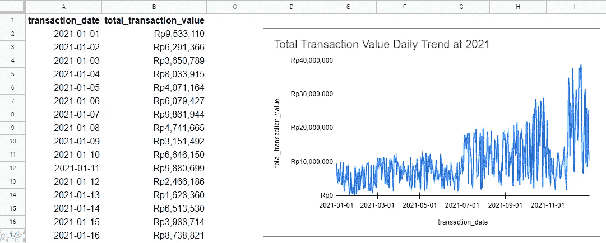
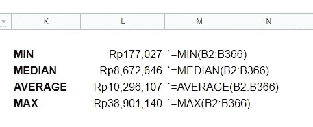
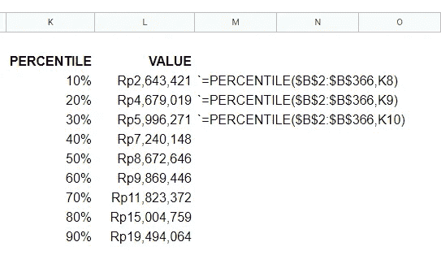
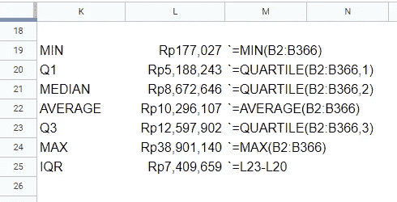
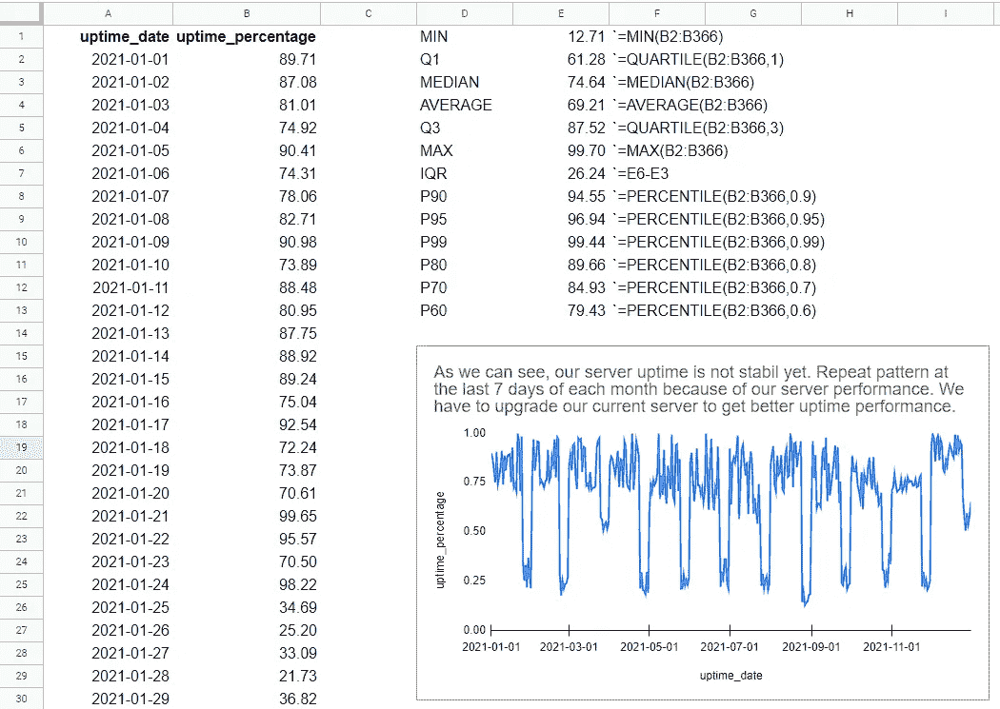
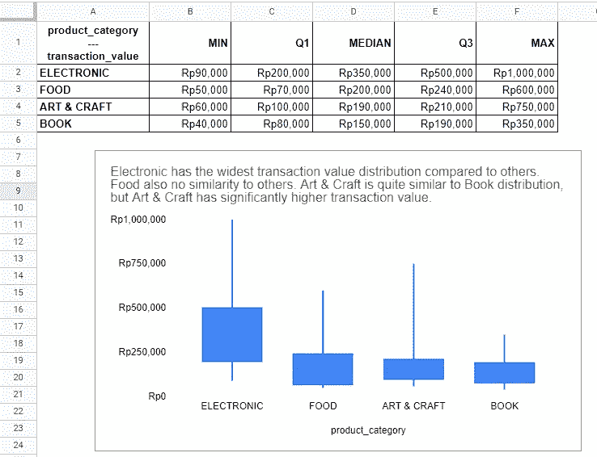
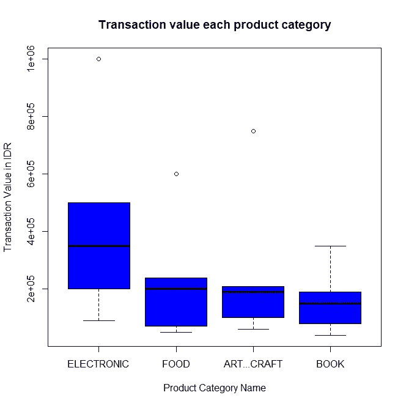

# 什么是百分位数？什么时候用，怎么用？

> 原文：<https://medium.com/codex/what-is-percentile-when-and-how-to-use-it-c115a205273a?source=collection_archive---------3----------------------->

大家好，欢迎回来！这一次我想分享一下百分位数，这是统计学中的一个基本概念，但我想我们中的一些人会觉得很难理解，当然，我会尽最大努力用最简单的方式来解释它。希望你觉得有用！:D

# 什么是百分位数？

在牛津词典中，Percent 的意思是“每一百个中或每一百个中的特定数量”(副词)和*“百分之一”*(名词)。因此，假设百分位数有 100 个部分是安全的，从第 1 个百分位数到第 100 个百分位数。在韦氏词典词典中，百分位数的意思是*“一个 100 分的数值，表示等于或低于它的分布的***”。让我们通过下面的例子来理解上面的定义:**

**

***表 1** 。这里使用的样本数据是。*

*假设我们在 IDR 数据中有一个 2021 年全年的日交易值。我们想通过了解什么是常见的日交易值来总结这种表现。*

**

***表 2** 。汇总值。*

*正如我们在上表中看到的，我们有四个测量值。MIN 是“最小”的意思，我们 2021 年在 IDR 的最低交易值是 177K 卢比。MAX 的意思是“最大”，我们 2021 年在 IDR 的最高交易额是 38.9 rpio，AVERAGE 的意思是我们 2021 年在 IDR 的平均交易额是 10.2 rpio .**中位数怎么样？我们的中值意味着 2021 年我们在印度卢比的交易价值有 50%的时间等于和/或低于 860 万卢比。***

> ***为什么是 50%？因为中位数只是第 50 百分位的另一种说法。哇，震撼！:O***

***根据我们上面对中值的定义，我们可以用它来概括我们对百分位数的定义。下面我们来看下一个例子！***

******

*****表 3** 。百分位表。***

***这就是我们如何创建一个公式来计算谷歌工作表的百分比。我们也可以看到，50%的百分比等于我们之前的中值。神奇！我是说，数学！:D***

***所以，我们知道了公式，但是我们还没有讨论如何正确地计算它，对吗？和计算中位数是一样的(你可以参考我之前关于均值中位数模式的帖子[这里](https://ichkautzar.medium.com/basic-data-analysis-knowledge-you-have-to-understand-measures-of-central-tendencies-mct-4d4195a6859)，不同的是我们需要替换我们想要寻找的 50%到 n%。***

***让我们用上表的三个例子来学习如何阅读上表。***

1.  ***在 2021 年的 10%时间里，我们在 IDR 的交易价值等于和/或低于 260 万卢比。其余时间高于该价值。***
2.  ***2021 年 30%的时间，我们在 IDR 的交易价值等于和/或低于 Rp5.9Mio。其余时间高于该价值。***
3.  ***2021 年，70%的时间，我们在 IDR 的交易价值等于和/或低于 1180 万卢比。其余时间高于该价值。***

***相当简单明了，对吧？我们已经知道第 50 百分位与中位数相同。我们还有其他与百分位数相关的术语吗？是的，我们有！***

> ***第 25 个百分位数等于第一个四分位数(Q1)，第 50 个百分位数等于第二个四分位数(Q2)或中位数，第 75 个百分位数等于第三个四分位数(Q3)。最后但同样重要的是，Q1 和 Q3 之间的差异被称为四分位距(IQR)。***

***因此，使用我们上面的新术语，我们可以将之前的表格更新到下面的表格中，正如你所看到的，即使我们再次使用四分位数改变公式，我们的中值仍然是相同的。***

******

*****表 4** 。表 2 更新了 Q1 和第三季度。***

# ***何时以及如何使用百分位数？***

***在我们学习了我们需要知道的关于百分位数的一切之后，现在我们将学习什么时候我们必须使用百分位数以及如何使用它。通常，在公司中，当我们试图查看我们的指标时，我们希望知道重要的度量数字，例如平均值、中值、最小值、最大值等等，包括百分比。通常，除了百分位以外的其他人不会给我们数据的全貌，这就是为什么我们也需要检查百分位。***

***在统计学和商业中，通常使用第 90 百分位(P90)、第 95 百分位(P95)和第 99 百分位(P99)来了解数据的汇总情况，但我们必须使用哪一个呢？答案是视情况而定。取决于什么？我们有什么样的数据分布，敏感与否，我们为目标设定了多少，这意味着它可能是客观的，也可能是主观的。***

***假设我们有新网站的每日数据。正常运行时间是服务器运行时间的百分比。例如，在一天 24 小时中，我们的网站在线 23 小时 30 分钟，这意味着我们的服务器正常运行率为 97.92% (1，410 分钟除以 1，440 分钟)。让我们在这里使用样本数据。***

******

***表 5。正常运行时间每日数据的摘要。***

***我们还添加了许多百分位数，以便更清楚地说明我们的数据。假设我们想向投资者提议给我们更多的预算，这样我们就可以升级我们的服务器性能。我们应该使用哪些数字来更好地了解我们的正常运行时间率？在这种情况下:***

1.  *****我们应该使用中位数(P50)而不是平均值**，因为我们有许多小数字的异常值，这就是为什么我们的平均值小于中位数。因此，我们可以说，2021 年 50%的时间里，我们的正常运行率等于或低于 74.64%。***
2.  ***对于下一个问题，我们首先应该知道我们的正常运行率的目标是什么。比方说，我们希望我们的网站在与另一个类似的网站进行基准测试后，每天的正常运行率稳定在 95%。**我们可以使用我们的 P90，说 2021 年 90%的时间我们的正常运行率等于和/或低于 94.55%，这意味着目标远未实现，因为一年中只有 10%的时间实现了目标**。*说服投资者给我们更多预算听起来不错，对吧？:D****

***让我们尝试另一种情况，这样我们就可以知道在不同的情况下，我们应该使用多少百分比。***

1.  *****某电子商务网站的欺诈率**。通常，我们对此不会给出太多的容差，因此我们可能会使用 P99，但如果我们的业务中更有可能发生欺诈案件，因为我们尚未实施适当的欺诈预防程序，我们可能会使用 P95、P90 甚至 P80 来给出我们的欺诈率汇总。***
2.  *****电子商务网站中的交易价值。**这取决于很多事情，例如是否是发薪日周，产品类别是什么(电子产品通常比书籍的价格更高)，是否有异常值数据出现，这可能使数据分布相当偏斜，等等。但一般来说，P90 到 P95 是我们用来得到数据汇总的常用数字。***

# ***使用箱线图或蜡烛图可视化数据***

***就百分位数而言，我们可以使用箱线图来了解数据分布，或者在 Google 电子表格中使用蜡烛图。让我们在这里直接查看我们的样本数据[。](https://docs.google.com/spreadsheets/d/1kxt4G9IiWvb41iJ20C-4kno9X4ZOm7dnLAbGFdfh0uo/edit?usp=sharing)***

******

***烛台图表，以可视化数据分布。***

***烛台图表缺少中线，因为它通常用于可视化价格运动(它只需要 4 个变量，开盘(Q1)，收盘(第三季度)，最低(最小)和最高(最大))。通过使用 5 个变量(最小值、Q1 值、中值、Q3 和最大值)来可视化数据分布的箱线图。让我用 R 编程语言向您展示上面相同数据的箱线图。***

******

***用箱线图来显示数据分布。***

***正如我们所看到的，箱线图中有一条水平线，它告诉我们中值。此外，如果值离分布太远，它不会像使用蜡烛图一样给我们一条直线，而是告诉我们数据被归类为异常值。在这种情况下，我们可以看到电子产品、食品和工艺品有异常值，但图书没有。***

***图表中最低的水平线表示最小值。
方框中最低的水平线表示 Q1 值。
方框中最高的水平线表示 Q3 值。
最后，图表上最高的水平线或最高的圆点表示最大值。***

# ***摘要***

***总结一下我们在这篇文章中学到的东西:***

1.  ***百分位数的定义有 100 个部分，从第 1 个百分位数到第 100 个百分位数。***
2.  ***如何从数据集中读取百分位数？***
3.  ***何时使用百分位数取决于条件，可以是客观的，也可以是主观的。***
4.  ***使用代表相同含义的蜡烛图和箱线图来可视化数据分布。***

> ***我希望通过阅读这篇文章，你可以更多地了解百分位，并在你的现实生活中实现它。如果你认为这篇文章对你的同事有用，别忘了分享它。***