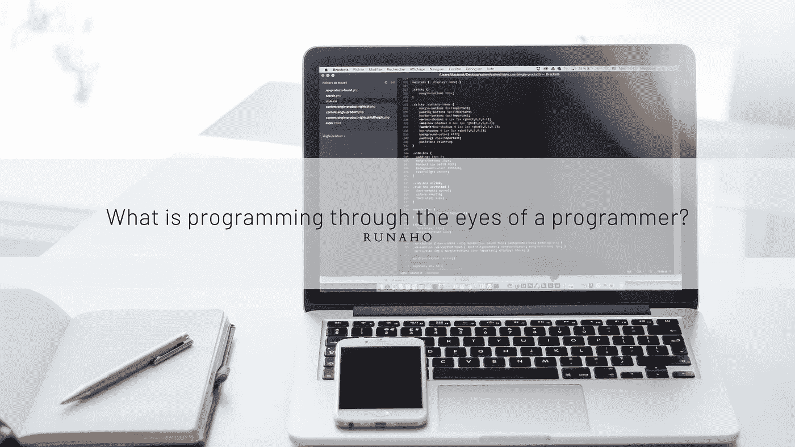

# 对于一个程序员来说编程是什么？

> 原文：<https://medium.com/codex/what-is-programming-for-a-programmer-fa0e79207832?source=collection_archive---------11----------------------->

程序员眼中的编程是什么？

在此之前，我想问你另一个问题。为什么编程有语言，为什么我们把 c#、java 以及类似的语言称为“语言”？

## 什么是适合我的编程？

起初，我把编程语言看作一本字典，并记住了代码的对等物。我已经做了很长时间，开发软件对我来说已经成为一个非常不同的领域。经过一年的体验，我明白了，软件开发就是和一台电脑对话。

当我想在用记忆的逻辑进步的课程和项目之后为自己做点什么的时候，那就是我开始明白一些事情的时候。我自己开发过手机应用、数据库、网络应用、电脑应用等等。服务和桌面应用程序让我觉得我是在和电脑交谈。

可以用很多例子来解释，但是软件其实就像和电脑对话一样。当我明白了为什么它被称为一种语言时，我自我发展的方法也发生了变化。

在写作之初，我就告诉过你，我把语言看做字典，死记硬背。当我参与其中时，我试图记住动作和解决结构，而不是记住字典中的意思。我举个例子，走路这个词在很多语言里有不同的意思，但是每个人都知道走路这个动作。所有人都知道行动，定义变了。

> 我的拙见；不要在定义上浪费时间，学习行动。

在我眼里，编程是一门自由的语言。它允许你和一台机器说话，这台机器可以和你说话而不期望任何回报，并且可以用正确的术语做你想做的所有动作。

人类创造了一台神奇的机器，它根据动作来行动。说了这么多，让我带你看一下。
你早上去上班，对着电脑聊了 1-2 个小时，当你因为阳光打在窗户上而在写代码的时候，你的脸映在屏幕上，即使这是一个令人讨厌的视觉，也不能说你不喜欢。原因是你可以看到一个人的倒影，这个人曾经和一台你自己自由意志的电脑聊过天，和一台懂你的机器聊过天，也许一个人把自己和一台机器联系在一起，并以此为乐。

照顾好自己，记住想跟电脑说多少就说多少，毕竟是机器。