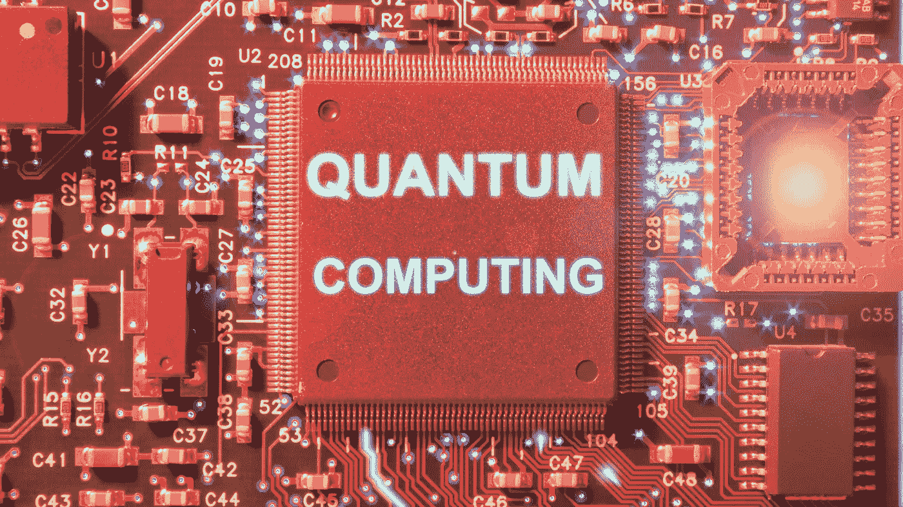

# 什么是量子计算

> 原文：<https://medium.com/codex/what-is-quantum-computing-8e18bdb9cb95?source=collection_archive---------15----------------------->

像 IBM、谷歌这样的科技巨头，甚至世界各地的政府都在量子计算领域投入了数十亿美元。为什么你会问？解决传统计算机无法解决的复杂而紧迫的问题。

量子计算将通过改变组织保护数据、抗击疾病甚至解决气候问题的方式，颠覆每个行业。

谷歌最近宣布，它通过展示其 54 量子位 sycamore 处理器实现了“量子优势”，该处理器能够在 200 秒内执行一系列复杂计算。真正的壮举在于，即使是最好的超级计算机也需要数百年才能解决这样的计算。

那么围绕量子计算的所有噪音都值得吗？让我们深入了解快速塑造当今科技世界的不同量子计算方面，找出答案。

**目录**

1.  什么是量子计算？
2.  什么是量子比特？
3.  量子计算的叠加态是怎样的？
4.  量子计算的概念一般用在哪里？
5.  量子计算的其他用例
6.  结论

# 什么是量子计算？

量子计算是一种新兴的计算范式，它利用量子力学现象来解决一系列领域中的持续问题，如密码学、法医学、人工智能和机器学习，甚至计算化学。这种最先进的计算过程使用了量子力学。这是一个典型的围绕原子和亚原子粒子研究的物理学领域。

虽然在实时情况下，量子计算面临可扩展性和非相干性问题，但它有助于以更快的速度执行同时计算，消除限制当前纳米尺度编程的隧道效应。

现在让我们来理解与量子计算相关的信息的基本单位，它能够完成这样的壮举。

# 什么是量子位？

量子计算使用称为量子位的基本信息单位，而不是传统的比特。一个量子位的主要特征(这使它变得不同寻常)是它可以代表 0 和 1 或者 0 和 1 的任意比例。另一方面，常规位习惯于一次一个值，该值不是 0 就是 1。

量子位具有独特的量子属性，这从它们的处理能力中显而易见——它们的连接组提供了类似数量的二进制位所提供的更多处理能力。

量子位的工作原理是量子力学——很像经典物理学中的波，两个或更多的量子态可以加在一起(即叠加),给出另一个有效的量子态作为最终产物。

这对于分析特定场景的所有可能结果非常方便。因此，量子数可以用于分析大数据变化和其他模拟。

# 量子计算的叠加态是怎样的？

叠加态是量子系统中的一个特征，其中物体同时存在于多个量子态中，直到它被测量。让我们考虑一个简单的例子。你们大多数人可能听说过电子有一个叫做自旋的量子特性。它只不过是它的内蕴角动量。当有磁场时，一个典型的电子以两种自旋态存在，即。向上旋转和向下旋转。在测量之前，每个电子都有有限的机会处于这两种状态中的任何一种。只有当它被测量时，它才在特定的自旋状态下被观察到。

同样，一枚朝上的硬币有一个明确的状态——头或尾。不用看硬币，你就能确定它的价值——无论是正面还是反面。然而，当你把量子经验考虑在内时，情况就不那么明显了，因为在测量到它们的存在之前，事物的物质属性很少存在。由于这些多种多样的属性，它们被用于从更广泛的角度分析数据情况。

# 量子计算的概念一般用在哪里？

量子性质的核心在于决定物质的行为。量子计算的一个有用的用途是它能够在分子水平上模拟物质的行为。

像[戴姆勒和大众](https://www.mckinsey.com/industries/automotive-and-assembly/our-insights/will-quantum-computing-drive-the-automotive-future)这样的汽车制造商正在利用量子计算来分析电动汽车的电池成分，并提高燃料电池成分的性能。量子计算机极其可靠，因为它们运算速度极快。

例如，空中客车公司已经为飞机计算出了最佳的燃料上升和下降路径，节省了燃料和时间。同样，大众汽车也贡献了一份力量，它提供了一项服务，帮助公交车和出租车估计最佳路线，从而避免拥堵。

许多研究人员和技术爱好者声称，量子计算也有助于加速人工智能的进步。

IBM 等公司巨头正在使用量子计算来更好地理解自然的物理过程，以及物质如何在原子和亚原子水平上与粒子相互作用。这可能会在未来几天内导致化学、生物学和纳米技术领域的许多突破。

# 量子计算的其他用例

**密码术** -如果你正在交流顶级机密，那么你应该确保机器中使用的加密应该是量子就绪的。量子计算机能够破解普通的密钥 RSA 算法。有必要为您的系统配备量子计算技术，以分析大量数据湖中的潜在数据泄漏。

**天气报告** —由于量子计算的核心专长在于分析物质的行为，它可以帮助预测环境中的天气状况和气候变化。

**量子模拟** —涉及传热传质、可压缩流动等复杂偏微分问题的模拟，可以通过量子计算进行。分析亚原子水平的材料属性也是可能的，因为它为患者体内的药物相互作用路径或汽车燃料电池的开发提供了优化的解决方案。

**供应链物流** —供应链物流运营可以优化到最高水平，因为量子计算可以处理从寻找最短的交付路线到管理其供应库存的所有事情。

# 结论

尽管 IBM 和微软等科技奇迹正在竞相充分发掘量子计算的潜力，但量子计算的使用在今天并不突出，只有大型跨国公司才有能力利用其潜力。这是因为需要巨额资金来利用量子计算的能力。所以对于创业公司和中型公司来说，使用这种强大的未来技术仍然是一个遥远的梦想。

*原发布于*[*https://www . partech . nl*](https://www.partech.nl/nl/publicaties/2021/09/what-is-quantum-computing)*。*