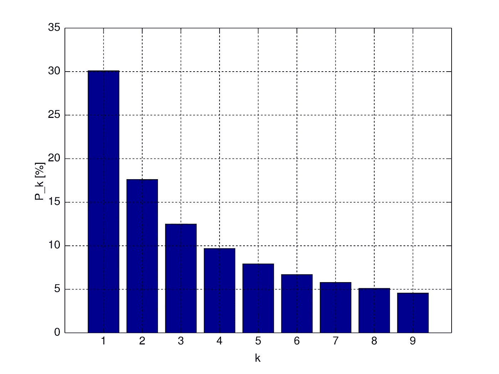

# 什么是随机？

> 原文：<https://medium.com/codex/what-is-random-13ca71764ce1?source=collection_archive---------21----------------------->

*随机*被牛津词典定义为:

> 完成、选择等。没有人预先决定将要发生什么，或者没有任何规律。

根据这个定义，在应用程序中尝试想象一个随机数或生成一个随机数应该很容易，对吗？好吧，我们来看看是不是这样。

## 人的能力

当想到像任意数字这样的随机事物时，人们会认为自己的选择是真正随机的。然而，事实并非如此。*瓦格纳尔(1972)研究了人类的随机性领域，并编写了一份报告，总结了十五项关于该主题的先前研究。该报告发现，记忆、注意力和厌倦感等功能性因素在随机化过程中发挥着重要作用，同样也是识别随机性的重要因素。除了一项研究外，所有的研究都发现参与者天生不擅长随机分组。*

****布鲁格(1997)*** 很好地解释了为什么人类很难实现随机性:*

> *连续选择之间的相互依赖被认为是有机体对干扰的自然敏感性的结果。因此，随机生成是一个复杂的行为，需要完全抑制任何规则控制的行为。*

*用数字举例来进一步说明这一思想，可以看看 [*本福特定律*](https://en.wikipedia.org/wiki/Benford%27s_law) *。*这也被称为*第一位定律。*该法律规定如下:*

> *在许多自然出现的数字集合中，第一位数字可能很小。*

*在观察中，数字 1 有 30%的时间是前导数字。而数字 9 出现的时间不到 5%。这表明了一种自然的偏见，这种偏见也会溢出到随机性的思想中。下图显示了一个数字出现在数字序列中第一个数字的概率:*

**

*根据本福特定律，第一个数字的分布*

*由于这种自然偏差，人们无法满足随机性的要求，特别是“*……没有任何规则模式*”的标准，因为这种偏差在任何一组自然数中都形成一种固有模式。该定律还可以应用于以下应用中，以检测异常情况:会计欺诈、刑事审判、选举数据等。*

*人类通常表现出非随机性。这因人而异，并在很大程度上取决于影响该人的功能因素。。此外，没有明确的方法来训练一个人产生随机性，因为这将间接地创建一个模式，然后这个人将用来产生伪随机性。*

## *计算能力*

*计算中几乎所有的随机性都是基于伪随机系统。随机数生成器的实例在后端使用伪随机数生成器。它们生成一个数字序列，其属性**近似于随机数序列的属性**。这些随机数发生器都依靠一个 [*种子*](https://en.wikipedia.org/wiki/Random_seed) 、来初始化随机数发生器。*

*这意味着，如果您在两个随机数生成器中使用相同的种子，您将在生成时获得相同的一组数。种子通常由计算机的某种状态生成，如系统时钟。这在微软关于[*Random*](https://docs.microsoft.com/en-us/dotnet/api/system.random.-ctor?view=net-5.0#System_Random__ctor)*类的文档中有明确定义，该类使用系统时钟作为种子。伴随而来的是一个警告:**

> **因此，连续创建的不同随机对象…具有相同的默认种子值，因此产生相同的随机数集。**

**这已经用微软的最新框架更新了。NET Core —现在简称为[。网](https://en.wikipedia.org/wiki/.NET)。该框架规定其种子由另一个伪随机数生成器生成，这将避免上述冲突。所以相对于之前的实现来说，它更加随机。**

**当使用密码术时，我们经常需要使用伪随机数发生器来生成加密密钥。如果数字生成器的种子遭到破坏，攻击者可以重新生成加密密钥，从而可以访问用该密钥加密的所有数据。因此需要高 [*熵*](https://en.wikipedia.org/wiki/Entropy_(computing)) 来生成用于生成加密密钥的种子值。**

**高熵源正变得容易获得。系统目前可以使用键盘计时和鼠标移动等资源。目前有一个由 NIST 牵头的项目，该项目致力于成为一个熵即服务(EaaS)提供商。 ***Vassilev A，Staples R. (2006)(NIST)*** 提供了一些关于他们如何计划和目前正在产生这种熵的清晰性。他们指出，应该使用环形振荡器和量子器件来产生恒定和完全的随机性。 [NIST](https://en.wikipedia.org/wiki/National_Institute_of_Standards_and_Technology) 已经设置了这个 EaaS 的测试版，称为 [*Beacon*](https://beacon.nist.gov/home) *。* Beacon 生成“*…全熵位串，并每 60 秒以 512 位的块发布一次*”。此外，还有一个 REST API 可供调用，以查看系统如何工作: [*脉冲*](https://beacon.nist.gov/beacon/2.0/pulse/last)**

**或者， [Cloudflare](https://www.cloudflare.com/) 有一种有趣的方法为他们的密码系统生成熵。他们的总部里有一堵墙，墙上挂着 100 盏熔岩灯，摄像机正对着熔岩灯。摄像机定期拍摄图像，并将图像发送回 Cloudflare 服务器。他们给图像的每个像素分配一个数值，生成一串完全随机的数字。然后，这被用作服务器生成安全密钥的种子。关于该系统的更多信息可在[这里](https://www.cloudflare.com/learning/ssl/lava-lamp-encryption/)找到。**

## **结论**

**说到完全随机，人类和我们的数字对手缺乏产生真正随机的能力。然而，我们正在通过特殊的方法在计算领域取得进展，如环形振荡器和量子发生器，以尽可能接近随机。我们最终找到了在没有随机性的地方产生随机性的方法，比如 Cloudflare 熔岩灯墙。**

**表达的观点仅代表我个人，并不代表我的雇主的观点或意见。**

## **参考**

*   **布鲁格，P. (1997 年)。影响随机序列生成的变量:一个更新。知觉和运动技能，84(2)，627–661。**
*   **西弗吉尼亚州瓦格纳尔(1972 年)。人类受试者随机序列的生成:文献综述。心理学通报，77(1)，65–72。**
*   **熵即服务:释放密码学的全部潜力。计算机(加州长滩)。2016;49(9):98-102.doi:10.1109/MC.2016.275**