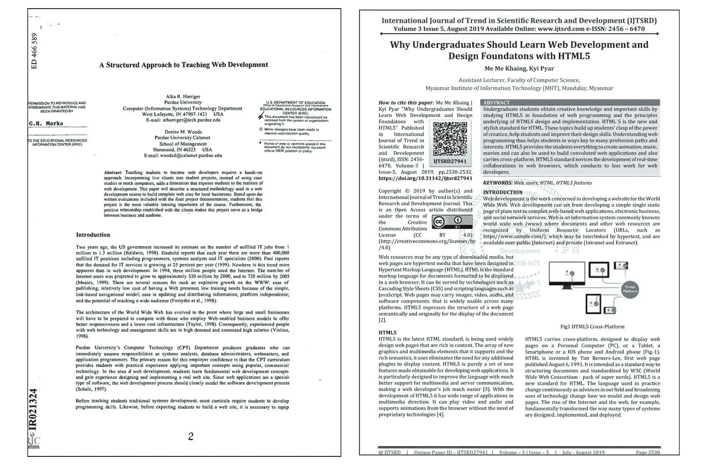
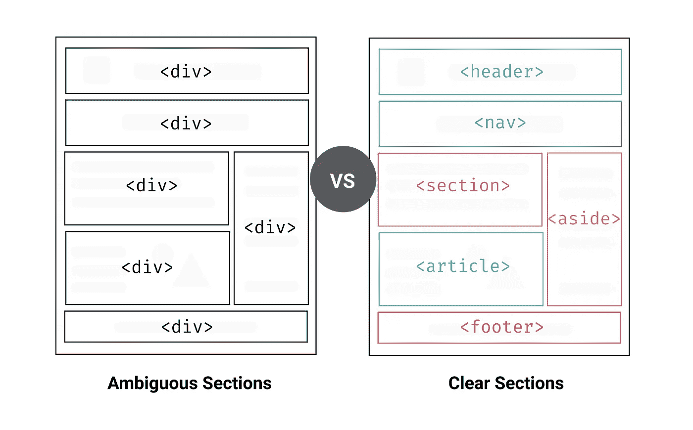
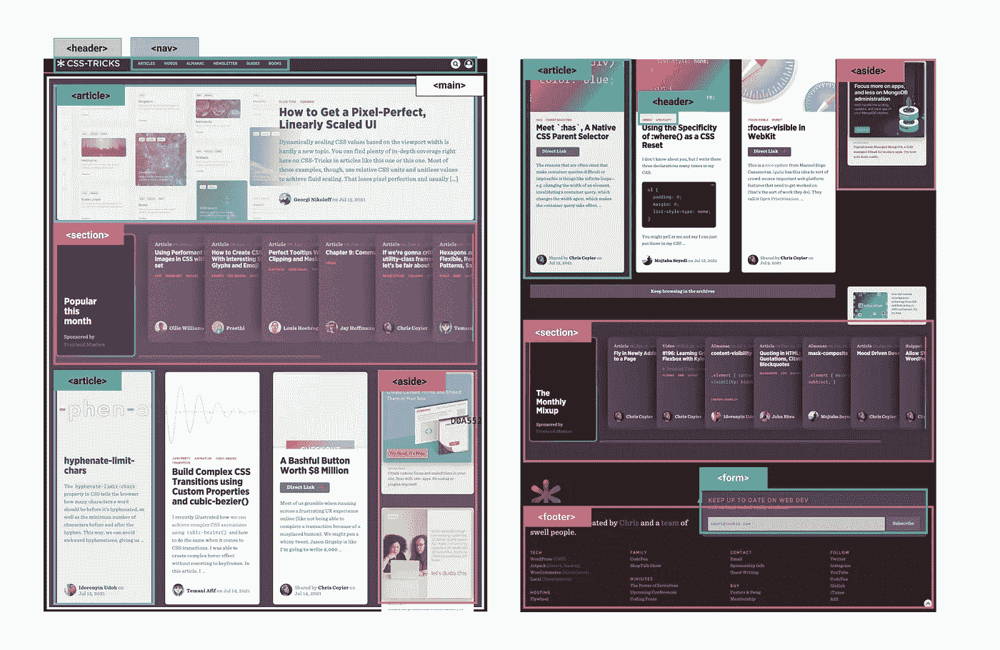

# 什么是语义标记，为什么你应该使用它

> 原文：<https://medium.com/codex/what-is-semantic-markup-and-why-you-should-use-it-44777543c29c?source=collection_archive---------5----------------------->

# 什么是语义标记？

语义标记是一种编写和组织 HTML 的方式，用来描述其内容的结构语义或意义，而不是它如何可视化地呈现内容。换句话说，HTML 只关注你网页的结构，CSS 关注你网页内容的风格。

> “编写语义标记意味着理解内容的层次结构，以及用户和机器将如何阅读它。”

该结构是在纸张和电子文档中交流信息的重要方式。例如，检查以下文件的图片。你会注意到这两个文档有一些相似的结构，读者可以理解这些文章中的标题、副标题和段落是什么。这种结构使读者更容易快速掌握文档中信息的重要性层次和广泛含义。

就像上面的例子，当你看一个网页的时候，你可以清楚地辨认出一个段落；一个

标签表明这个包含的文本是一个段落。同样，由于这既是语义的又是表示的，用户知道这是一个段落，浏览器知道如何显示它们。

另一方面，如果我们在文本中使用**或*，它不会给标记提供任何额外的含义，因为它们没有语义。相反，它们只定义文本的外观。***

# **HTML5 和语义**

虽然 HTML 从一开始就包含了语义标记，但 HTML5 引入了更多的语义标记，如

、、、、

您可能见过一些带有

和标签的 web 页面混搭，这些标签没有给出页面的那一部分是关于什么的信息。然而，使用语义标记，开发人员可以向搜索引擎、爬虫或其他开发人员提供关于页面的该部分是关于什么的信息。

以下 HTML5 标签可以用来代替

标签，将页面内容分成有意义的部分。

*   —该元素为一节、一篇文章或整个网页提供介绍性内容。
*   —导航菜单链接将全部放在标签中。
*   页面的主体应该放在

    <main>标签中。每页应该只有一个。</main>

*   —这个元素表示网页上的一篇独立文章。比如一篇博文。
*   —元素是一种将相似主题的邻近内容组合在一起的方式。

*   —元素位于页面或节的底部。它可能包括联系信息和一些网站导航。

让我们以 [CSS 招数](https://css-tricks.com/)的主页为例，看看我们如何使用语义标记来拥有更有意义的网页结构。

在下面的图片中，您可以看到不同颜色的块，这些块标有用于/可用于页面上每个部分的语义标签。这给了我们如何使用语义标签来构建网页一个清晰的思路。

# **为什么我们要使用语义标记？**

**无障碍**

并非所有网络用户都能够查看网页上的内容。视力正常的用户可以很容易地识别和访问网页的各个部分。但是，一个有视力障碍的人可能需要一些帮助来访问网页。一些残障人士使用不同的辅助应用程序和设备来使用网站，如文本到语音转换器、文本大小控制以及颜色和对比度控制等。

如果网页不使用语义标记，使用语音阅读器访问网页会是一种非常令人沮丧的体验。例如，如果你没有正确地用

标记你的站点导航，用

有了语义标记，用户和机器都将能够理解内容结构、页面元素之间的关系以及元素内部内容的性质。此外，使 web 应用程序具有可访问性将确保残疾人的平等访问，并通过提供更多选项来定制他们的体验，使每个人受益。

**搜索引擎优化**

当你考虑网页的 SEO 时，搜索引擎爬虫是最重要的部分。语义标记在扫描页面内容时为这些爬虫提供了更好的指示；它告诉他们什么是页面上的重要内容。

例如，包含在

# 标签中的关键字比包含在

标签中的关键字更重要。您可以使用语义标记来帮助搜索引擎使用页面上最相关和最有意义的内容对您的页面进行排名。

通过添加语义标记与搜索引擎进行清晰的交流，可以确保为正确的查询提供正确的页面。

**可维护性**

语义标记比包含大量表示标记的网页更容易更新和更改。这是因为开发人员花费大量时间维护和修改现有代码，而不是编写原始代码。当你有一个以逻辑方式组织的清晰的代码时，即使是不同的开发人员也很容易维护，不会有任何混乱。因此，语义标记使得在需要时更改和更新内容的外观变得更加容易，并为开发人员节省了大量时间。

# **结束语**

使用语义标签带来的好处不仅仅是纯粹的效率。语义帮助你建立更好的站点结构，提高搜索引擎的性能，并且它们可以极大地提高可访问性。

语义是关于意义的，使用语义标记构建网页意味着创建用户和机器都能访问的更有意义的网页。