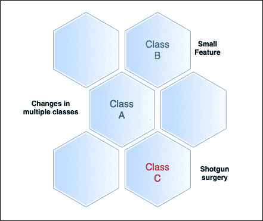

# 什么是猎枪手术

> 原文：<https://medium.com/codex/what-is-shotgun-surgery-a856c4d2dab9?source=collection_archive---------21----------------------->

让我们从大多数开发人员都能理解的事情开始——我们无意中在代码中加入了代码味道，这使得我们的设计容易受到攻击。在编程中，代码气味，也称为讨厌的气味，是指程序源代码中可能预示更大问题的任何症状。

在这篇文章中，让我们来看看一种叫做鸟枪手术的代码味道，以及它的用途和好处。

**目录**

*   什么是霰弹枪手术？
*   有问题的场景
*   霰弹枪手术的必要性
*   如何修复该问题？
*   结论

# 什么是霰弹枪手术？

正如上面指出的，猎枪手术是代码库中一种特殊的代码味道，当需要对代码库进行大量更改来完成看似基本的任务时，就会出现这种味道。通常，您会发现自己对看起来非常相似的代码进行了修改，要么是因为它是直接复制的，要么是因为目标是相似的。

在进入细节之前，我们先了解一下为什么叫散弹枪手术。考虑一个常规的外科手术。当你想到外科医生做手术时，你会想到精确和最小的侵害性。他们带着手术刀进去，只做必要的事情。

想象一下，如果用散弹枪来代替这个过程会发生什么。霰弹枪的工作原理是发射弹丸在一个很短的区域内扩散，基本上是在路径上的所有东西上炸出洞来。因此,“霰弹枪手术”是最具侵入性的手术——几乎是外科手术过度杀伤的缩影。霰弹枪手术的目的是描绘一个代码库，迫使一个混乱的，容易出错的方法超过一个精确的方法。

以下是造成霰弹枪手术气味的几种原因:

*   由于缺乏担心分离。
*   未能使用正确的设计模式。
*   未能理解形势的严重性。通常，这是由于误解(单一责任原则)。
*   没有认识到普通的行为或有微小变化的行为。

霰弹枪手术的后果:

*   有许多重复的代码。
*   在次要功能的开发上投入更多时间。
*   代码库不可维护。

# 有问题的场景

以下几个场景会让你明白霰弹枪手术的必要性:

**场景 1:** 首先也是最重要的一点，你有没有遇到过将事物分割成 n 次方的代码库？它可能有一个针对所有常量的类和一个针对静态变量的类。也许它还有一个可以定义所有菜单项的位置，以及一个可以定义它们的后续操作的地方。

最终的结果是什么？每次要添加菜单项时，必须先在 Constants.cs 中声明菜单项文本，然后在另一个类中定义所有处理菜单项单击的委托。您需要在第三个位置进行调整，将菜单项添加到 GUI 中，并在第四个位置将代理附加到特定的操作。对你的软件来说，一个简单的概念上的改变，就是很多的改变。

**场景 2:** 投机性的过度架构是另一个突出的例子。您是否遇到过这样的代码库，它定义了许多层，充满了数据传输对象、数据访问对象、域对象等等，来管理一个简单的 CRUD 应用程序？除了这些层中不同的属性包对象之外，每当您想要向数据库中添加一个表时，您现在必须跨所有四层安装脚手架？这是另一个猎枪手术的例子。

**场景 3:** 接下来是最简单的例子。通过到处复制粘贴代码来更新代码库。这意味着，如果您更改了一些复制粘贴代码，您将不得不为每个后续实例重复这个过程。

# 霰弹枪手术的必要性

现在你知道什么是霰弹枪手术，你可能想知道是什么原因造成的。代码库怎么会沦落到这种地步？

让我们选择复制粘贴编程的场景。当人们很着急或者不知道什么更好的时候，他们复制和粘贴代码。这导致了整个代码库中的知识重复，增加了维护开销。

通过复制和粘贴，你的代码库缺乏内聚力的问题被放大了。内聚性指的是由 NDepend 计算的特定度量和更广泛的概念。为了我们的目的，考虑下面的一般概念:属于一起的事情一起发生吗？

高度内聚的代码库遵循单一责任原则，该原则规定每个代码单元应该只有一个更改的原因，并且该原因应该是唯一的原因。除此之外，他们试图尽可能保持局部变化。当您的代码库由于任何原因变得不连贯时，就需要进行猎枪手术。

# 如何修复该问题？

第一步是列出对代码库所做的所有更改。审核您的源代码控制工具，或者在头脑中进行理论上的基本更改时，跟踪您正在处理的文件数量。如果太多，你就有问题了。

一个健康的代码库是这样的，你只需要更新一些源文件就可以构建一些次要的特性。您可能最终会处理许多主要的修改，但不是整个代码库，甚至不是它的重要部分。对于代码维护来说，本地化修改应该是重中之重。

如果你是复制粘贴代码，你就有问题了。使用重复代码检测工具来找到它。例如，NDepend 包括一个强大的重复代码识别工具。

# 结论

你永远无法创造出理想的设计。将多个元素分开可能看起来总是明智的，甚至似乎是最好的玩法。然而，如果你发现自己处于一个猎枪手术的情况下，你必须接受你周围的环境已经改变和演变，你必须适应。可以说，你能做的最有效的事情就是在工作时留意气味。弄清楚你的维护程序员是否需要一把猎枪或一把手术刀来实现未来的变化。如果答案是“猎枪”，你应该重新考虑你的策略。

*原载于*[*https://www . partech . nl*](https://www.partech.nl/nl/publicaties/2021/08/what-is-shotgun-surgery)*。*