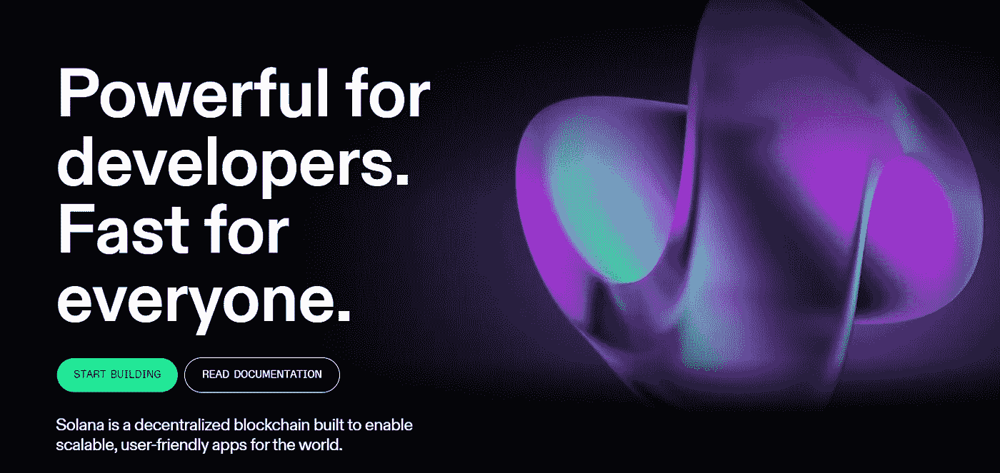
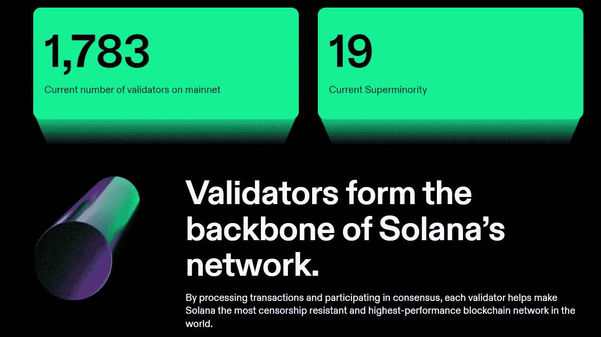
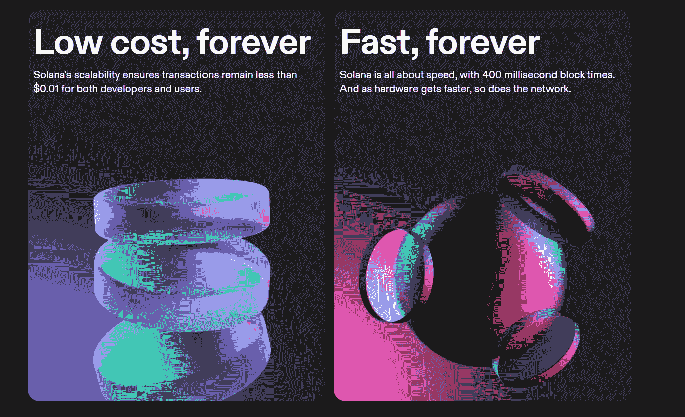
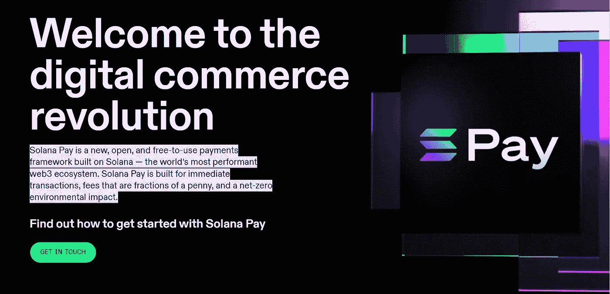
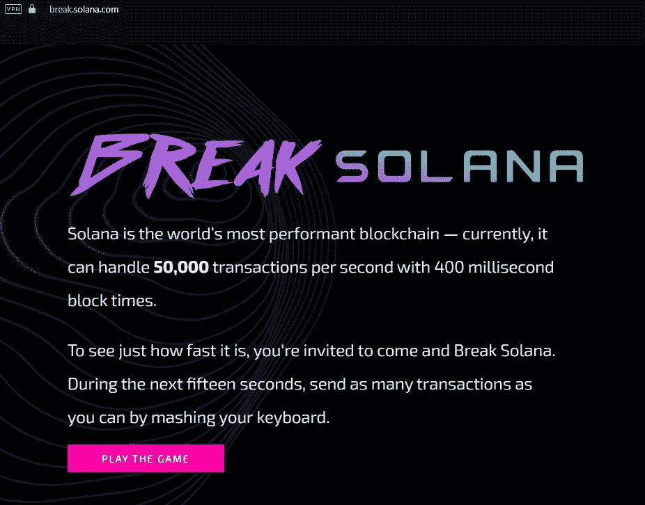
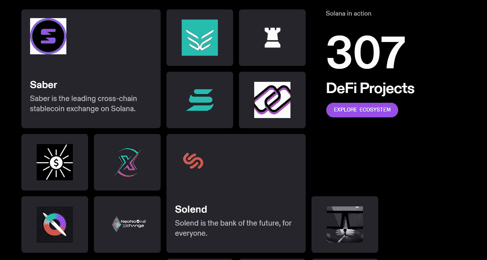
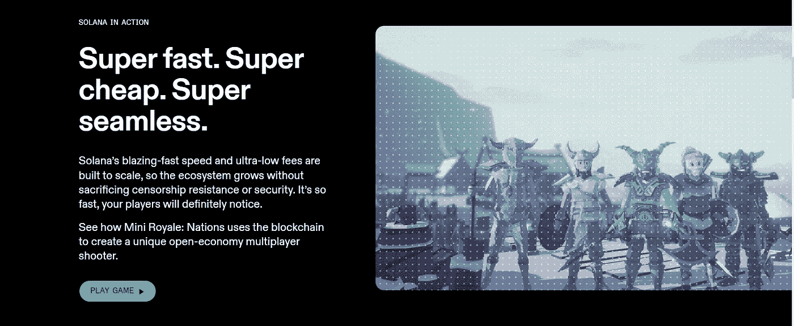
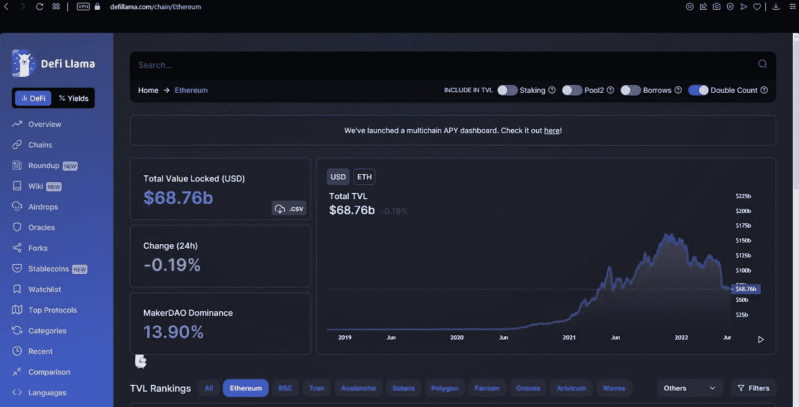
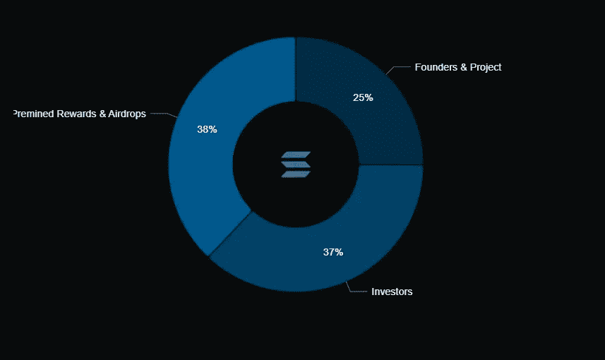
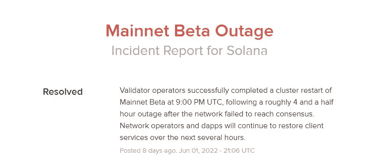

# 索拉纳是什么？它能战胜以太坊吗？

> 原文：<https://medium.com/codex/what-is-solana-and-can-it-overcome-ethereum-b3761068e81d?source=collection_archive---------26----------------------->

Solana 是一个开源的区块链，以其高吞吐量和高效率而闻名。该项目的快速增长使其能够与以太坊等最强大的区块链竞争。

索拉纳于 2017 年由阿纳托利·亚科文科、格雷格·菲茨杰拉德、拉杰·戈卡尔和斯蒂芬·阿克里奇创作。在和他的团队一起创建 Solana Labs 之前，Anatoly 曾经是高通的高级工程师。

索拉纳区块链的本地令牌是 SOL，它用于保护网络中的交易和用户之间的价值转移。

# 索拉纳的区块链:

Solana 使用了一种混合的利害关系证明(PoS)和历史证明(PoH)协议，这是由区块链的创始人阿纳托利·亚科文科引入的新概念。

*利害关系证明:*

通过利害关系证明协议，SOL 所有者将它们委托给验证者，验证者通过验证索拉纳区块链上的新块来获得 SOL 奖励。

在该协议中，验证者被选择来添加新的区块链块，这取决于他们下注的 SOL 硬币的数量(下注意味着将硬币委托给网络)以及他们下注的时间。

基本上，索拉纳网络奖励那些为保持网络安全抵御 51%攻击而付出努力和贡献的人。这些攻击只有在实体获得网络现有令牌的 51%时才会发生，由于 PoS 协议，这是极不可能的。

茄属验证者

*什么是历史证明协议？*

历史证明允许验证者给网络上发生的每一个事务打上时间戳。与节点必须通过整个块来验证事务的其他网络相反，Solana 网络中的节点可以实时验证这些事务，这要归功于 PoH 协议给出的时间戳。

该系统通过减少网络延迟，在使 Solana 成为如此快速的区块链方面发挥了巨大作用。

# 是什么让索拉纳独一无二？

索拉纳·区块链引入了一种混合共识机制，它牺牲了分散化，支持更高的吞吐量。这种混合共识机制使索拉纳成为密码领域独一无二的区块链。

本质上，区块链的速度可以用 TPS(每秒的事务数量)来衡量。通常，较高的 TPS 允许区块链更快地扩展，而不会面临网络拥塞等问题。

在大多数区块链中，验证器生成一个新的事务块，然后将该事务块发送给网络的其余部分。其他节点对照它们的区块链版本来验证新块的真实性。然后，网络中的每个节点对照所有其他节点审核区块链和新产生的块的版本。接下来，节点进行某种投票，选择是否将新块添加到分类帐中。

这个过程需要时间，以便允许网络中的大多数节点达成共识，并决定是否添加新的块。

在 Solana 的案例中，这个过程要快得多，允许网络具有非常高的 TPS，并且比其他区块链扩展得更快。

Solana 的高可扩展性

这种高速度背后的原因是 Solana 网络中的节点将它们的投票发送给基于 PoS 机制选择的领导者，然后负责节点之间通信的领导者决定是否添加这个新块。

有一个领导批准网络上的新块，即使它使网络有更高的 TPS，与竞争对手相比，减少了 Solana 的分散化。

Solana 的另一个独特之处是引入了 Solana pay，这是一个免费的框架，使商家能够使用 Solana 网络接受客户的付款。这些付款可以在 USDC 等稳定的城市进行。

索拉纳薪酬

# 索拉纳 vs 以太坊:

由于其高 TPS 和非常低的费用(平均 Solana 交易费仅为 0.00025 美元)，Solana 已被证明是最强大的区块链之一，可以与以太坊这样的巨大行业参与者竞争。

事实上，索拉纳的 TPS(可以达到 50000 以上)是如此巨大，以至于索拉纳实验室(索拉纳背后的公司)推出了一款名为 [Break Solana](https://break.solana.com/) 的游戏，玩家可以通过敲击键盘和发送交易来尝试断开网络。

打破索拉纳游戏

与这个巨大的数字相比，以太坊目前的 TPS 只有 15，与索拉纳相比非常慢。除此之外，与索拉纳相比，以太坊的交易费是[巨大的](https://www.coindesk.com/tech/2021/11/22/ethereums-fees-are-too-damn-high/)。

由于这些原因，索拉纳已经看到了指数增长，并已被世界各地的区块链开发人员采用。例如，索拉纳是一个很好的选择:

*   在 NFT 市场上制造、销售和交易 NFT 的创造者，如 [OpenSea](https://opensea.io/explore-solana) 。
*   开发者构建去中心化平台如 [codenjobs](https://www.codenjobs.com/) ，特别是 DeFi(去中心化金融)平台如去中心化交易所。事实上，索拉纳已经锁定了超过 110 亿美元的总价值，迄今为止，索拉纳已经建成了 307 个 DeFi 项目:

Solana DeFi 项目

如果你是一名区块链开发者，并且想在索拉纳上开发应用，你可以参考[这篇文章](https://www.codenjobs.com/blog?&title=How-to-start-with-Solana&id=8b777b74-b8e2-408b-9bc6-f11669e694f6)获取索拉纳区块链开发的相关资源。

*   构建区块链和 web3 游戏，如迷你皇家:

索拉纳游戏

另一方面，以太坊进入加密领域的时间比索拉纳长得多，并且在用户数量和 TVL 数量上仍然超过索拉纳(目前为 68.76 亿美元)。

以太坊的 TVL

# 茄属植物的缺点:

像任何区块链项目一样，索拉纳也有它的缺点。除了我们之前提到的有争议的共识机制， [52%的 SOL 加密货币供应](https://messari.io/asset/solana/profile/launch-and-initial-token-distribution#:~:text=The%20initial%20distribution%20of%20SOL,5.07%25%20to%20Validator%20Sale%20investors)由创始人和投资者(风险资本家)所有，他们可以被视为内部人士。由于这些原因，索拉纳比其竞争对手更加集中。

茄属供应分布

此外，索拉纳网络最近出现了重大问题和中断，上周网络[第六次面临停机](https://solana.com/news/06-01-22-solana-mainnet-beta-outage-report-2)。上一次中断持续了四个半小时，导致 mainnet 上的事务暂停。

索拉纳断电

这些问题往往会让投资者对区块链的未来感到担忧，有时会引发抛售，导致 SOL 的价格[暴跌](https://www.cnbc.com/2022/06/01/solana-suffered-its-second-outage-in-a-month-sending-price-plunging.html)。

尽管这两个问题看起来很重要，但随着时间的推移，它们都可以得到解决。

事实上，Solana 仍然处于 mainnet 的测试版本中，它的联合创始人 Anatoly 亚科文科在 Reddit 上说“如果一个东西花了两年时间来建造，它也需要两年时间来稳定”。

此外，随着时间的推移，区块链通常会变得更加分散，因为更多的供应被放开并开放给公众购买。索拉纳仍然是一个相当年轻的区块链，在未来可以变得更加分散。

# 索拉纳是个好投资吗？

索拉纳显然有潜力茁壮成长，成为行业领导者之一。如果这个项目继续吸引更多的开发者和用户，它可以成为一个更大的生态系统，也是商家接受使用 Solana Pay 在线支付的绝佳选择。

当您投资 Solana 时，您可以通过将您的代币用于奖励(新的 SOL 代币添加到您的钱包中)来获得一些被动收入。

即使这个项目最近一直受到网络问题的困扰，如果你相信索拉纳背后的团队能够长期解决这些问题，你仍然可以投资它。

然而，永远记住加密货币的波动性很大，只投资你能承受损失的东西。

# 如何选购 Solana？

Solana 已在各种集中交易所上市，例如:

*   [FTX](https://ftx.com/#a=codenjobs)
*   比特币基地
*   北海巨妖
*   币安

索拉纳也可以在这些分散的交易所购买:

*   雷迪姆
*   奥尔卡
*   血清

这篇文章[最初由 u/fyras 在](https://www.codenjobs.com/blog?&title=What-is-Solana?-and-can-it-overcome-Ethereum?&id=c0d0c5e2-6627-4ffd-be42-1b468572a8b4) [codenjobs](https://www.codenjobs.com/) 上发布。