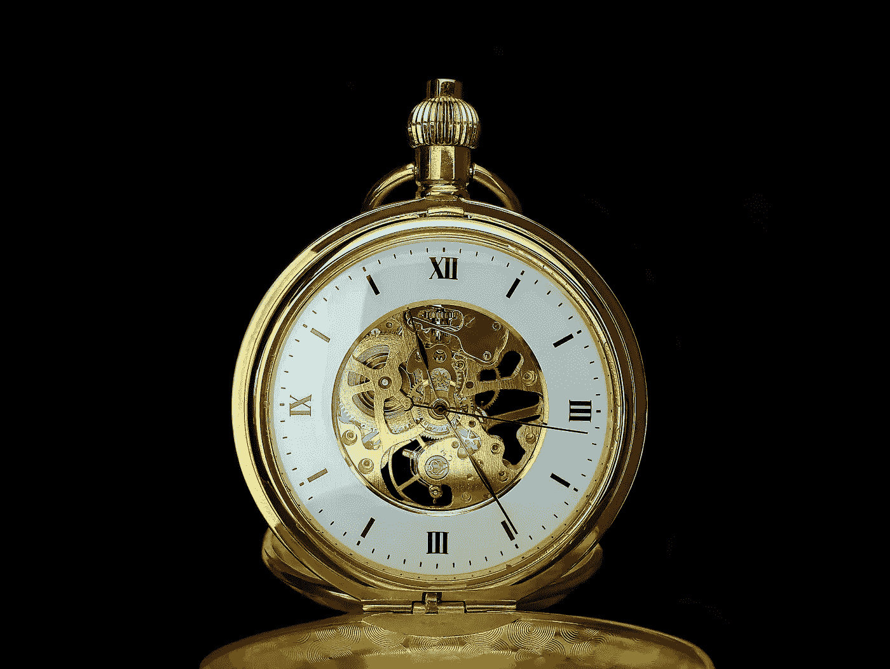
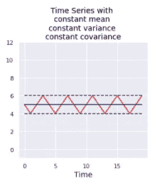
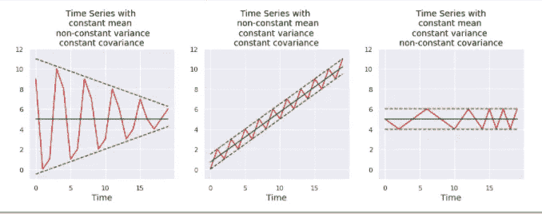
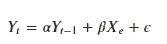

# 时间序列中的平稳性是什么？如何检测到它？

> 原文：<https://medium.com/codex/what-is-stationarity-in-time-series-how-it-can-be-detected-7e5dfa7b5f6b?source=collection_archive---------1----------------------->

**照片由** [**菲利克斯**](https://www.pexels.com/@felixmittermeier?utm_content=attributionCopyText&utm_medium=referral&utm_source=pexels) **发自** [**Pexels**](https://www.pexels.com/photo/close-up-of-watch-against-black-background-325845/?utm_content=attributionCopyText&utm_medium=referral&utm_source=pexels)

当观察值不依赖于时间时，时间序列具有**平稳性**。这些时间序列的统计特性不会随时间而改变，因此它们将具有恒定的均值、方差和协方差。

静态时间序列的可视化如下。

非平稳时间序列会有非常数的均值、方差或协方差。

具有 [**趋势**](/codex/time-series-data-decomposition-b51819f15e23) 或**季节性**的时间序列不是平稳的。因为趋势会改变与时间相关的数据移动，这将导致平均值随时间的变化。而当时间序列中的模式在一个固定的时间间隔内显示出变化时，就会出现季节性，这将导致方差随时间而变化。

**时间序列中的周期行为**和**白噪声**是平稳的。时间序列的循环行为将是稳定的，因为周期不是固定长度的，所以在我们观察序列之前，我们不能确定周期的波峰和波谷在哪里。

白噪声的均值为零，其变量是独立的，在任何时间点看起来都差不多。

当一个时间序列是非平稳的时，均值、方差和协方差都在不断变化，所以即使对它们进行平均后再进行估计，也不可能从中得出准确的结论。

时间序列的平稳性可以通过以下方式检测:

1.  直观地绘制时间序列，并检查趋势或季节性。
2.  通过**将时间**序列分割成不同的分区并比较统计推断。
3.  可以执行**增强的 Dickey-Fuller** 测试来检查平稳性。

**增广迪基-富勒(ADF)检验**是一种统计检验，属于检验零假设的单位根检验。

单位根是时间序列的一个特征，它使时间序列具有非平稳性。如果 1 是过程的特征方程的根，则线性随机过程有单位根。这样的过程是不稳定的，但并不总是有趋势。

如果下面的等式中α= 1，那么时间序列中存在单位根(即时间序列不是平稳的)

Yt 是时间序列在时间 t 的值。

在 ACF 中，零假设(H0)被认为是测试时间序列不是平稳的，即它有一个单位根，而替代假设被认为是时间序列是平稳的，即它没有单位根。

像 ARIMA 这样的时间序列模型假设数据是平稳的。因为当时间序列是平稳的，均值、方差和协方差是恒定的，我们可以精确地进行统计分析。

在 ACF 中要断定**时间序列是平稳的，**的零假设应该被拒绝。

要拒绝零假设，要么 p 值应小于 5%的默认显著性水平，要么测试统计量小于临界值。

如果数据不是静态的，那么在建立 ARIMA 模型之前，必须对数据进行转换。

将级数转化为平稳性的两种最常见的方法是:

*   **变换**:用对数或平方根来稳定非常数方差。
*   **差分**:从上一个值中减去当前值。差分可以以不同的顺序进行，如一阶差分(将具有线性趋势)、二阶差分(将具有二次趋势)等。

参考

 [## 扩充迪基-富勒测试-维基百科

### 在统计学和计量经济学中，一个扩展的 Dickey-Fuller 检验(ADF)检验单位根是……

en.wikipedia.org](https://en.wikipedia.org/wiki/Augmented_Dickey%E2%80%93Fuller_test)