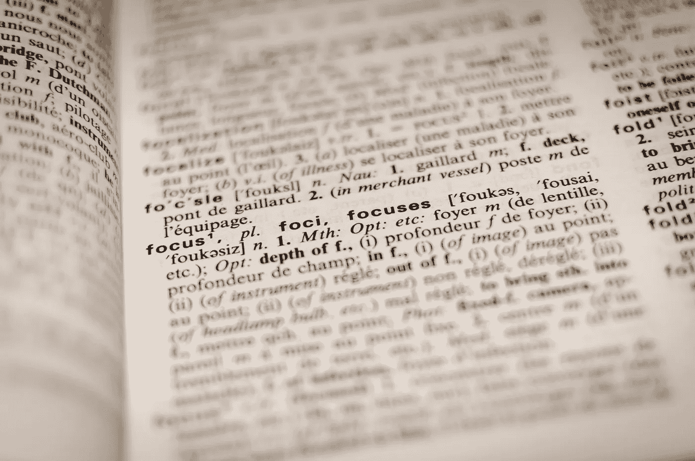

# 最好的机器学习翻译工具？

> 原文：<https://medium.com/codex/what-is-the-best-machine-learning-translation-tool-16ed593087c7?source=collection_archive---------7----------------------->

## 以及如何在您的服务中使用它

罗曼·维涅斯在 [Unsplash](https://unsplash.com/s/photos/translation?utm_source=unsplash&utm_medium=referral&utm_content=creditCopyText) 上的照片

当一个人想快速地把某件事翻译成另一种语言时，有几种可能性。谷歌翻译可能是迄今为止最著名的解决方案。但是除此之外，还有一些很好的替代品，比如 DeepL，根据一些消息来源，它应该是最好的在线翻译器[1][2][3]。