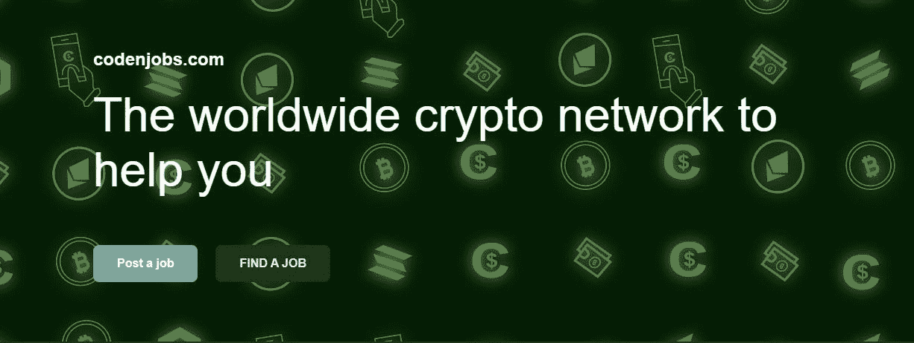
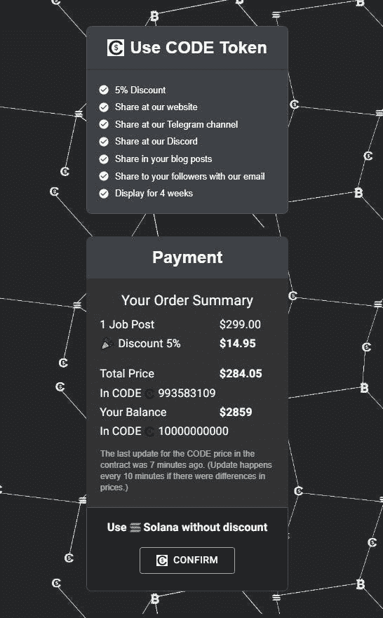
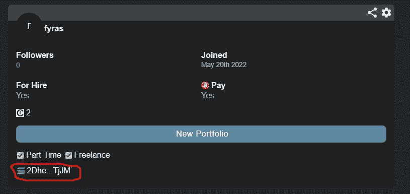
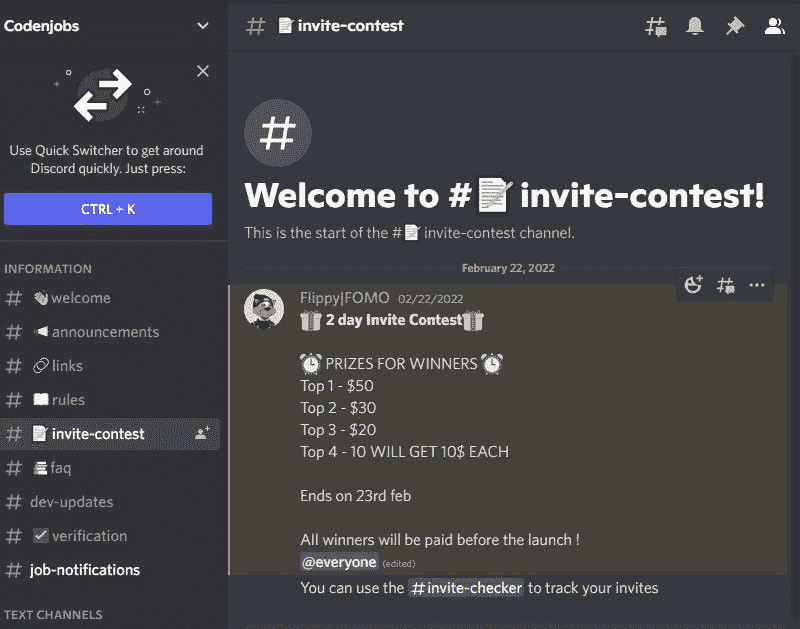
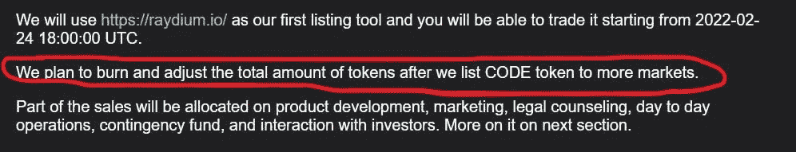
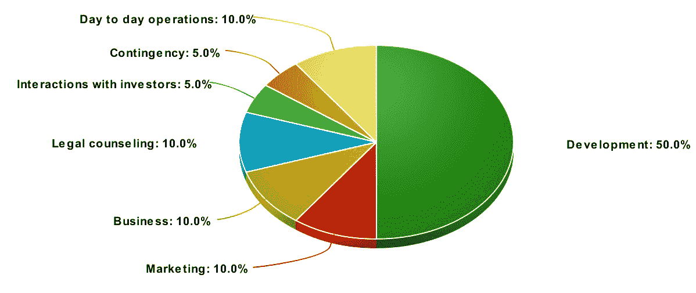
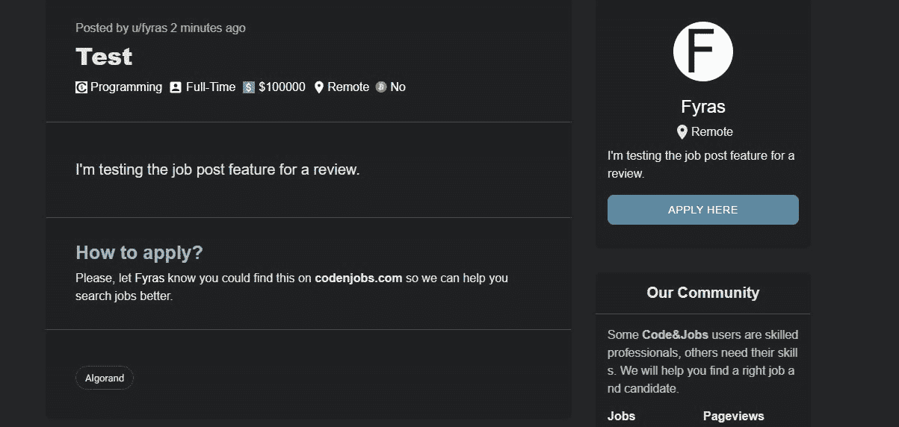
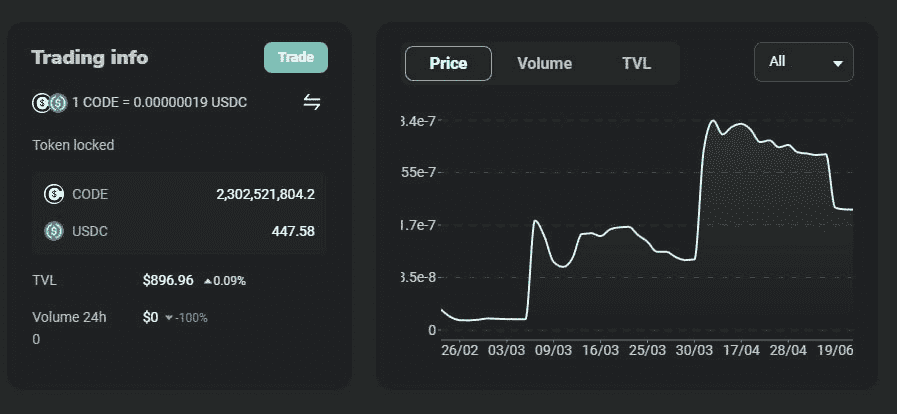

# 什么是$CODE 令牌？你应该投资它吗？

> 原文：<https://medium.com/codex/what-is-the-code-token-and-should-you-invest-in-it-f2c683b434f6?source=collection_archive---------13----------------------->

## 背景:

$CODE token 是一个 [Solana](https://www.codenjobs.com/blog?&title=What-is-Solana?-and-can-it-overcome-Ethereum?&id=c0d0c5e2-6627-4ffd-be42-1b468572a8b4) SPL token，用于支持 [codenjobs](https://www.codenjobs.com/) 工作搜索平台。在这篇文章中，我们将涵盖这个令牌的各个方面，以及它是否是一个好的投资在短期和长期。

**效用:**

Code & Jobs 是一个为招聘人员和求职者构建的分散式应用程序，他们希望以一种比 LinkedIn 等传统求职平台[更友好的方式找到候选人和公司。](https://www.codenjobs.com/blog?&title=How-does-Code&Jobs-compare-with-other-job-posting-websites?&id=495a2cb4-667f-4735-a7ce-a924b1ff9767)

该网站通过提供博客、智能合同互动以及允许用户直接在网站上聊天等功能，使 Web3 爱好者更方便地搜索工作。他们还允许用户将 GitHub 和 Discord 添加到他们的 OAUTH2 个人资料中，以增加他们自称的可信度。

该平台的用户可以使用他们的$CODE 令牌发布招聘广告，比 Solana 优惠 5%，并受益于令人兴奋的即将推出的功能。例如，在 codenjobs DEX(去中心化交易所)交换他们的 SPL 代币，在一个内置的 NFT 市场交易 NFT，并在其网站简介中使用 NFT。他们还计划给他们的 NFT 持有者额外的折扣。

此外，每个用户的个人资料上都显示了他的 Solana wallet 地址，允许公司直接向候选人发送 Solana 付款和代码令牌，如果他们喜欢用户的博客帖子，还可以收到提示。

如果你对 Web 3.0 和去中心化的未来感到兴奋，当你在密码领域和其他领域寻找工作或招聘时，你应该使用[代码& Jobs](https://www.codenjobs.com/) 。

事实上，该平台非常适合希望在该领域与其他人互动并渴望学习新技术的专业人士，如用于移动应用开发的 [Flutter](https://www.codenjobs.com/blog?&title=Flutter-app-basics:-Building-a-quotes-app&id=255b6b97-6d31-4072-8a42-99e449e48e74) 和 [Rust](https://www.codenjobs.com/blog?&title=Traits-in-Rust&id=59b2549f-be9b-4a46-8018-fa825897a810) 编程语言等。

**团队:**

这个平台是由一个开发团队构建的。开发团队致力于确保平台高效运行并持续发展。这将是一个长期的项目，有计划地进行大量投资。他们已经雇佣了一些开发人员和作家，并支付了他们应得的报酬。

虽然他们可以为 ETH 变体和比特币等其他区块链签订智能合约，但考虑到 Solana 的高吞吐量、低费用和低速度，他们选择了使用 Solana。他们还喜欢它的各种功能，允许程序员帮助定制智能合同和 CLI 的细节。

开发人员活跃在 [Discord](https://discord.gg/rTRcJ4dYr9) 和 [Telegram](https://t.me/codenjobsgroup) 上，回答用户的任何问题，立即向他们更新添加到项目中的新功能。

如果您对这个项目有任何疑问，或者您希望在这个平台上增加什么功能，请随时联系他们。

**词汇组学:**

由于$CODE token 是一个 [Solana](https://www.codenjobs.com/blog?&title=What-is-Solana?-and-can-it-overcome-Ethereum?&id=c0d0c5e2-6627-4ffd-be42-1b468572a8b4) token，所以它的交易费用非常低，几秒钟内就可以发送到钱包或交易所。

事实上，所有支持 SLP 令牌的 Solana 钱包都支持该令牌，例如 Phantom。

以下是令牌的详细信息:

合同地址:[code 7 HV 6 dak 5 werof 8 c 7 vpwbxlvhmewvubu 2 afhbzarb](https://solscan.io/token/Code7hV6DaK5Werof8c7vPwBxLvhmEWVUbU2AfhBZArB#markets)

符号:代码

小数:6

代码令牌的最大总量:10，000，000，000.00

该项目背后的团队在白皮书中承诺，当更多的 dex 上市时，将烧掉一定数量的令牌供应，这将有助于提高其价格。

**资金分配:**

Code&Jobs 团队将利用他们在交易所出售代币获得的资金来改进网站的功能。

以下是该项目的[白皮书](https://www.codenjobs.com/company/whitepaper)中资金分配的详细概述:

*   50%的资金将用于提供更好的用户体验和为平台添加新功能。
*   10%将用于营销和增加项目的采用。
*   10%用于法律咨询和任何其他法律费用。
*   5%将分配给投资者和项目社区。
*   5%将用于解决任何可能发生的紧急情况。
*   10%将用于平台及其用户的日常运营。

**路线图:**

项目团队正根据该路线图开展工作:

*   2022 年，在 Q1 开发发布工作的智能合同。开发团队几乎达到了这个里程碑，因为智能合同已经完成，并在 Solana devnet 上进行了测试)

*   2022 年第二季度发布平台的去中心化交易所
*   在 2022 年第 3 季度部署该平台的 NFT 项目
*   NFT 市场将于 2022 年第四季度发布。该平台正在积极增加新的 NFT 功能，例如在你的个人资料中显示 NFT 的功能。

$CODE token 是一项好的投资吗？

由于代币目前在代码-USDC 对中的交易价格为 0.00000019，代币的市值较小，增长潜力巨大。

鉴于目前的市场状况及其下跌趋势，购买任何加密货币作为短期投资都很可能导致亏损。然而，如果你相信这个项目将继续增长，并且 Code&Jobs 将成为大多数 Web3 和密码行业招聘人员和求职者使用的平台，这个令牌将是一个长期的伟大投资

持有代币对企业和初创公司的所有者尤其有利，因为如果代币价格上涨，他们可以以更低的价格发布招聘广告。

**如何购买密码令牌:**

你现在可以在 T4 镭上用 USDC 和 USDT 在索拉纳网络上购买 10 美元的代码代币。

我建议使用虚拟钱包购买代币，因为它非常用户友好，易于使用。

单击下面的链接了解更多关于代码和作业的信息:

[Code&职位与其他职位发布平台相比如何](https://www.codenjobs.com/blog?&title=How-does-Code&Jobs-compare-with-other-job-posting-websites?&id=495a2cb4-667f-4735-a7ce-a924b1ff9767)

[我的代码体验&乔布斯](https://www.codenjobs.com/blog?&title=My-Experience-with-Code-&-Jobs&id=b3a20118-ddd6-4386-acbd-aaacf6546971)

[白皮书](https://www.codenjobs.com/company/about)

[关于代码&工作岗位](https://www.codenjobs.com/company/about)

[电报](https://t.me/codenjobs)

[不和谐](https://discord.gg/eWTXzPrsJ3)

[推特](https://twitter.com/codenjobs)