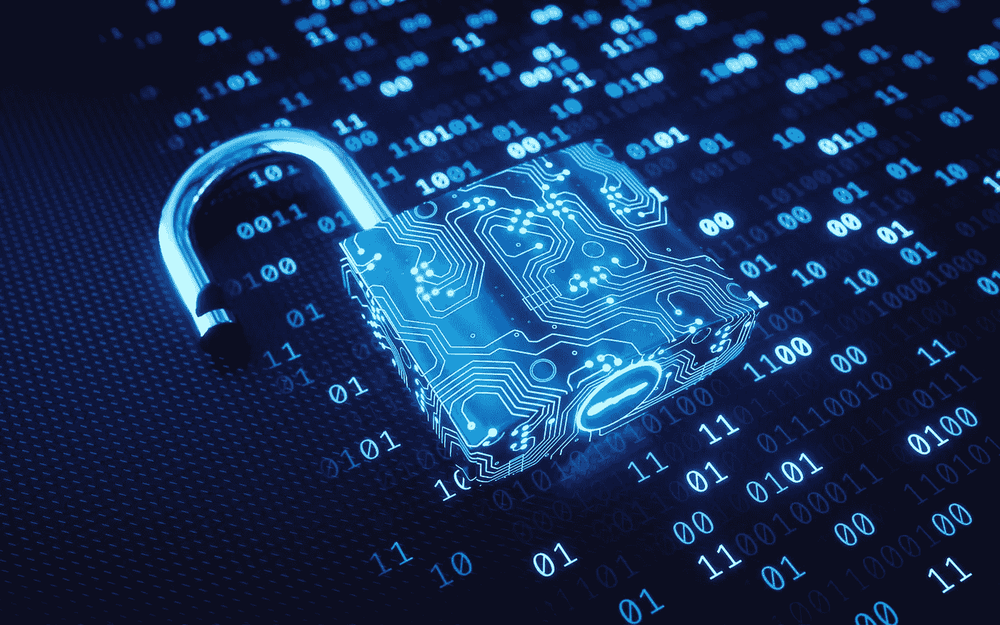

# 对移动安全的妥协是什么？

> 原文：<https://medium.com/codex/what-is-the-compromise-on-mobile-security-266783b94b0f?source=collection_archive---------19----------------------->

对技术的需求和依赖正朝着一些人看来违背直觉的方向发展。我们的生活被常识和冲动的小玩意所控制，导致我们牺牲基本权利，这些权利我们似乎已经接受，并很快成为规范。手机是一个主要的技术例子，它继续推动可接受行为的界限，因为许多人总是努力购买最新款，似乎接受它入侵我们的生活。就像社交媒体改变了年轻一代(Z 世代)的大脑线路，使他们的行为与上一代人如此不同。像 OnlyFans 这样的网站显示了女性被关注的需求，在没有完全欣赏销售的情况下努力出售她们的存在以变得富有，这不仅仅是为了恋物癖市场而看她们的身体或表演。

人类进化的变化是没有人能预料到的。移动技术及其在地球上任何地方的可访问性改变了这一切，不管是好是坏。它变成了一种有利于设备的共生依赖。

通信市场上有如此多的设备被作为隐私大使出售和展示。苹果公司和它的 iPhone 是承诺这款手机可以防止操作系统被黑从而防止你的数据被黑的厂商之一。但是，当一个政府机构向整个黑客社区开放，为任何能够入侵手机的人提供现金奖励时，一名黑客宣布获奖。从而把王国的钥匙交到我们应该尽量避免的人手中。苹果公司声称其所有的隐私，安全和客户体验。

那么，为什么苹果继续支付大量费用让谷歌成为它的默认搜索引擎呢？

为什么默认情况下附加安全功能是关闭的？

为什么大多数移动技术制造商从谷歌那里拿钱来推动它的搜索引擎成为设备上的默认？

为什么火狐也接受同样服务的付费？

有没有手机可以免受这种窥探和监视？简而言之，答案是需要更多问题的答案。你真的需要防止你的数据被监视吗？你是偏执狂，还是像许多人一样，觉得自己拥有并购买的产品有隐私权？

答案是响亮的是的，有一些公司生产的手机系统可以保护你的数据，加密所有通话和通信，甚至隐藏设备的 GPS 和 IMEI，使其无法跟踪或追踪。他们甚至增加了系统，如果手机丢失或被盗，可以远程摧毁手机。许多人甚至自带定制的 SIM 卡，以避开常规的全球网络，从而增加了安全性。那么成为一个私人的代价是什么呢？

提供安全产品或服务的最大品牌(排名不分先后)是

blackphone 2(350 起)

Sirin Solarin(起价 2650 美元)

Bittium Tough mobile(起价 1000 英镑)

这些不是唯一的公司，但它们是市场上最具主导地位的公司。值得注意的是，要获得该产品的全部好处，您需要为他们自己的额外服务付费，这些服务利用他们自己的 VPN 服务来保持连接和安全性。

值得吗？那要看情况了，你真的需要加密设备，让你的通信不被监听吗？

难道这不是我们应得的吗？当局可以在几秒钟内解锁任何现有的手机，手机本身内置了各种系统，以防你涉嫌犯罪。即使你的手机不是犯罪的一部分，或者在你犯罪的时候和你在一起。它仍然被用来寻找同事，GPS 数据，你的行为模式等。这些数据远不只是你在社交媒体上发邮件、跟谁说话、关注谁。你让自己独一无二的模式对执法部门来说就像对谷歌或任何一家每分钟都在收集万亿字节类似数据的社交媒体公司一样方便。

你仍然有隐私权吗？你能改变你的生活来允许这些等级吗？

大约 7 年前我把手机扔了。我的工作能力仅限于联想笔记本电脑和平板电脑。我一点也不想念手机，但最近考虑了更多手机的好处，但觉得隐私仍然很重要。毕竟，我们确实在家里装了门、窗帘和百叶窗，把人挡在外面。毫无疑问，我们应该把同样的东西应用到技术上，不折不扣地让所有人都可以使用。

我使用加密的 USB 驱动器运行安全版本的 Firefox、open office、Tutanota 收发电子邮件，以及 Signal 收发信息。如果您尝试在没有正确密码的情况下使用 USB 驱动器，它会自行擦除。如果我离开笔记本电脑一会儿，我就会锁定它。你可以改变你做事的方式，这当然值得考虑你想与世界分享什么信息。如果您不关心或不认为您有隐私权，请随时将您的银行卡详细信息发布给我们，我们可以证明为什么您需要更多的技术和服务。

你会做些什么来保持你的私人生活的私密性？