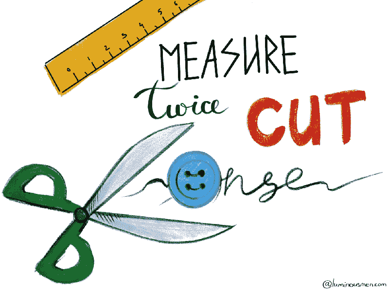

# 好的软件工程师的定义是什么？

> 原文：<https://medium.com/codex/what-is-the-definition-of-a-good-software-engineer-b57030ed4c59?source=collection_archive---------13----------------------->

"你对优秀软件工程师的定义是什么？"—我喜欢向每个以某种方式参与软件开发的人提出这个问题。我总是得到不同的答案。答案似乎取决于人们和他们的态度——经理们认为好的工程师是那些很好理解任务、能在截止日期前完成任务并具备所需技能的人。中高级软件工程师总是从…