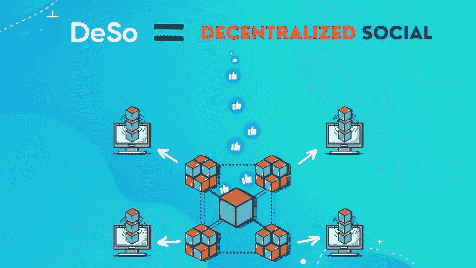

# 什么是德索区块链💎|二进制加密

> 原文：<https://medium.com/codex/what-is-the-deso-blockchain-fcd5972229cf?source=collection_archive---------11----------------------->

什么是德索区块链

在本教程中，你将了解什么是 DeSo T1，它与 T2 的 Twitter T3 和 T4 的脸书 T5 相比如何，你如何通过发布一条信息来获得加密，以及为什么它是社交媒体 T7 的未来。

# 什么是 DeSo

DeSo 代表 [**去中心化**](https://en.wikipedia.org/wiki/Decentralization) **社交**，是一种新型互联网，所有社交媒体内容都公开存在于区块链上。因为内容是在区块链上，跨越世界各地的许多计算机，没有一个人或中央机构可以拥有数据，因此术语**分散**。

DeSo 是一个去中心化的社交媒体平台

# 集中式与分散式

你可能想知道，“那么 DeSo 就像 Twitter 或脸书”吗？而答案是**“没有”**，因为 DeSo 大那么多。为了理解它，让我们用下面的例子:

当你在 Twitter 网站上发布一条推文时，这条推文是出现在脸书、 [Instagram](https://instagram.com/) 还是 [LinkedIn](https://www.linkedin.com/) 上？它没有。这是因为 Twitter 应用程序背后是一个归 Twitter 所有的平台，所有的推文、用户资料、图像和视频都存储在这里。Twitter 是一个众所周知的集中式社交媒体平台，因为他们拥有数据并管理可以存在的内容或用户账户。目前几乎所有其他社交媒体平台都属于这一类。

迄今为止，大多数社交媒体平台都是集中式的

这种设置的问题在于，你，这个**用户**，变成了产品和广告商，这个**顾客**。你在这些平台上说的和做的每一件事都会被拥有它的公司分析。这些数据然后被用来销售有针对性的广告，更糟糕的是，通过你的社交媒体来影响你，以更好地让广告商受益。

集中式社交媒体平台使用你的数据来销售有针对性的广告

# 一种新的社交媒体

但是，如果你的帖子不仅仅存在于脸书的平台上，而是存在于一个任何社交媒体应用都可以使用的开放平台上，那会怎么样呢？如果你是一个 Twitter 用户，决定开始使用 Instagram，而不是在那里创建一个新帐户，并在一个新的平台上重塑自己，那么你当前的个人资料、关注者、你关注的人和你的所有活动都会自动可用。你可以继续使用 Instagram，而不是 Twitter。

跨所有应用程序共享的社交媒体内容

**DeSo** 解决方案让所有这些成为可能，并消除了集中式社交媒体平台的缺点。它不是脸书或 Twitter 的翻版，而是存储和管理社交媒体应用程序创建和引用的所有内容的底层系统。

在 DeSo 上，你只需要一个**单一用户账号**就可以访问在 DeSo 区块链上开发的任何应用程序。您在任何应用程序上的一言一行都将关联到您的帐户。

一个社交媒体账户覆盖所有应用

# DeSo 区块链上的应用

在这篇教程的时候，DeSo 区块链上有超过 200 个**应用程序。值得一提的是:**

# 钻石应用

[Diamond](https://diamondapp.com/) 是 DeSo 上开发的首批应用之一。Diamond 的功能与 Twitter 类似，你可以发布、点赞、转发、关注和发送直接消息。但是，由于钻石是建立在区块链之上的，因此还有许多附加功能:

*   使用 DeSo 的加密硬币( **$DESO** )，你可以奖励用户的帖子加密或奖励你的帖子
*   任何帖子也可以转换成 **NFT** ，可以在 DeSo 区块链上转让、出售或拍卖
*   每个用户配置文件都有自己的加密令牌，称为**创建者币**。这允许其他人投资你作为一个内容创作者，反之亦然

## 过度拥挤

[overcloud](https://overclout.com)类似于 Diamond，但是允许你发布**故事**、**直播**或者创建丰富的文本内容，例如**文章**和**教程**。

## DeSocialWorld

DeSocialWorld 提供多种语言的社交媒体内容。

## 穆赛

[Mousai](https://mousai.stream/) 允许你流式播放音乐，投资你喜欢的艺术家。

## 在…之间

[Entre](https://joinentre.com) 是一个类似 LinkedIn 的职业网络。

这些只是 DeSo 区块链上存在的许多应用程序中的一小部分，列表还在继续增长。

一些应用建立在 DeSo 区块链之上

# 关闭

凭借去中心化的内容、 **post-2-earn** 功能和广泛的社交媒体应用，DeSo 已经成为独一无二的区块链，是社交媒体的真正未来。

德索为了胜利