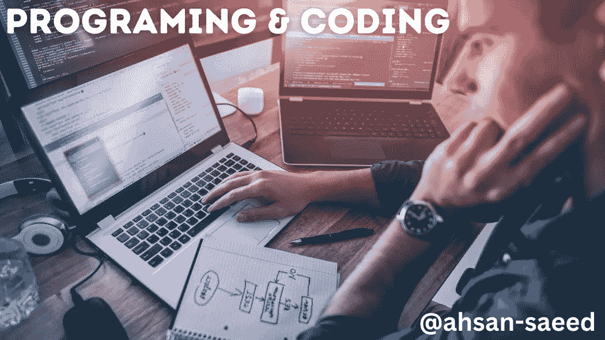

# 编码和编程有什么区别？

> 原文：<https://medium.com/codex/what-is-the-difference-between-coding-and-programming-cc7b96b74735?source=collection_archive---------16----------------------->

编码和编程相似但不同。了解他们之间的区别是很重要的，因为他们经常需要彼此的澄清，尤其是那些没有任何领域背景的人。本文将探讨每份工作都包含哪些内容，以及它们与其他工作有何不同。

# 编码和编程都不需要…