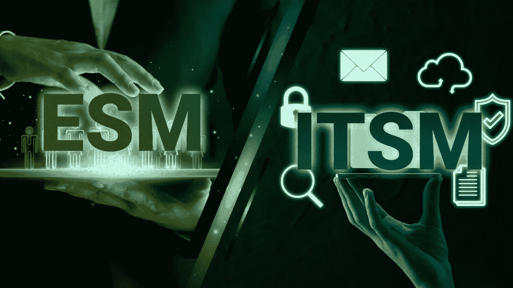

# ESM 和 ITSM 有什么区别？

> 原文：<https://medium.com/codex/what-is-the-difference-between-esm-and-itsm-f32bed78757d?source=collection_archive---------10----------------------->

服务管理的前景正在发生变化。根据最近的一项市场研究，数字化转型是组织在为服务管理的未来制定计划时正在准备的主导趋势。为了支持数字化转型过程，组织现在正在实施服务管理技术，以改善以前孤立的职能部门的服务交付。因此，企业服务管理(ESM)作为一种实践，是 IT 服务管理成功的直接结果。

企业服务管理(ESM)包括用数字化工作流取代人工劳动密集型流程。得益于执行良好的 ESM 战略，组织已经能够推进其数字优先工作流，该战略提高了员工价值，并允许企业扩展服务交付，提供无与伦比的客户体验。

让我们更深入地了解企业服务管理(ESM)！

什么是企业服务管理(ESM)？

从某种意义上说，企业服务管理随着 IT 服务管理的扩展而显著增长。ESM 意味着应用 ITSM 能力和原则来改进组织非 IT 领域的服务交付。由于他们已经看到了 ITSM 的第一手成果和 IT 自动化的优势，例如运营效率的提高和停机时间的显著减少，现在有更多的组织看到了 ESM 的价值。

ESM 旨在提供和支持更易于使用的员工服务。组织现在认为，通过利用 ESM 提供的这些自动化技术和工作流，他们可以提高各种其他业务职能的效率。

**企业服务管理(ESM)是什么样子的？**

企业服务管理(ESM)鼓励您将所有业务活动组织到一个简单、可管理的框架中，这是其最大的优势。结果，过程变得更容易理解。此外，这是组织中 ESM 的三个视角。

最终用户视角—在一个可访问的位置提供用户友好的企业服务门户。

服务领域视角—创建由自动化服务执行程序支持的面向业务的服务列表。

IT 视角——协助创建门户，并与业务职能部门密切合作，以定义和自动化其服务执行流程

**企业服务管理(ESM)与 IT 服务管理(ITSM)有何不同？**

ESM 的基础是 ITSM。ITSM 涵盖了提供 IT 服务所涉及的所有流程、活动和法规。然而，ESM 在整个组织中整合了 ITSM 的最佳方面。

在开始讨论 ESM 和 ITSM 的区别之前，有一点很重要，那就是它们几乎没有共同点。无害环境管理使用的 ITSM 的主要方面包括:

1.服务管理原则和理论

2.服务台

3.聊天机器人和知识管理等自助服务工具

4.将从中受益的领域的自动化

5.事故请求管理软件

尽管 ESM 和 ITSM 有相似之处，但它们在以下几个方面也有所不同:

1.无害环境管理适用于超出 IT 范围的广泛组织流程；ITSM 只专注于与信息技术相关的服务。

2.ESM 侧重于面向业务的用例；ITSM 专注于 IT 运营的技术方面。

3.ESM 可以应对 ITSM 可能无法应对的非技术性需求。例如，HR 需要维护一定级别的数据隐私。

总之，ESM 将服务管理的原则和程序扩展到组织内的各个部门和业务垂直领域，而 ITSM 方法则侧重于 IT 级别的服务管理。

在漏洞分析阶段，在这种情况下使用机器学习是最关键的。

总而言之，在数字化转型时代，ESM 变得更加有价值。如果做得好，ESM 会产生定义明确的操作流程，同时将用户体验放在首位，以推动持续改进。

点击此处了解 ESM 如何让您的组织受益！