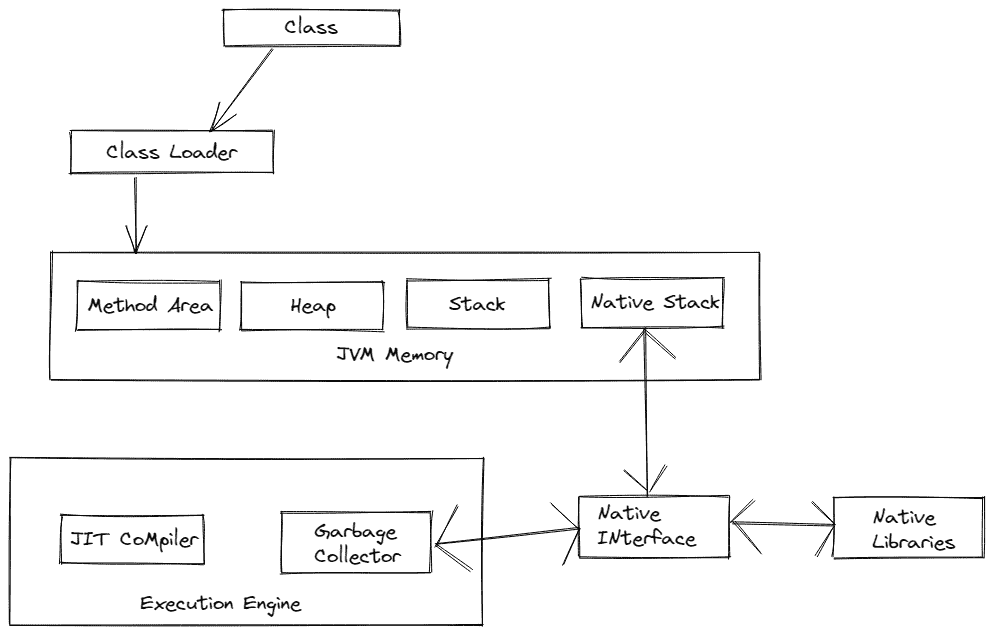

# JRE、JDK 和 JVM 有什么区别？

> 原文：<https://medium.com/codex/what-is-the-difference-between-jre-jdk-and-jvm-9ba31d56a2a6?source=collection_archive---------9----------------------->

# 介绍

在当今使用的所有编程语言中，Java 是最常用的。大多数开发人员将其用于移动和桌面计算、游戏、后端开发等。 [**Java**](https://www.java.com/) 开发严重依赖 JVM、JRE 和 JDK。JDK、JRE 和 JVM 之间的区别对于深入理解这种语言至关重要。本文将解释它们之间的区别

# 什么是 JVM

Java 虚拟机(JVM)是一种抽象机器。因为它在物理上并不存在，所以被称为虚拟机。这个规范定义了 Java 字节码的执行环境。此外，它还可以运行用其他语言编译成 Java 字节码的程序。

JVM 可以在许多平台上使用。每个操作系统的配置使得 JVM、JRE 和 JDK 依赖于平台。相比之下，Java 是平台无关的。JVM 有三个概念:规范、实现和实例。

JVM 执行以下任务:

*   加载代码
*   检查代码有效性
*   代码执行
*   提供一个运行的环境

# JVM 的特性

*   使用它，您可以在您的设备或云中运行应用程序。
*   Java 虚拟机将字节码转换成特定于机器的代码。
*   包括了许多基本的 Java 功能，比如内存管理、安全性和垃圾收集。
*   Java 虚拟机通过使用 Java 运行时环境提供的库和文件来执行程序。
*   JDK 和 JRE 都包含 Java 虚拟机。
*   由于它可以逐行执行 Java 程序，因此也被称为解释器。
*   JVM 可以用多种方式定制，比如分配最小和最大内存量。
*   它不受硬件或操作系统的影响。 [Java **程序**](https://www.sanfoundry.com/java-programming-examples/) 可以编写一次，在任何地方运行。

# JVM 体系结构

JVM 由以下组件组成:

**类加载器**:类加载器是 Java 虚拟机的一个子系统。它加载类文件。当我们运行一个 Java 程序时，类装入器首先装入它。

**类方法区**:这是 JVM 中存储类数据的数据区之一。静态变量、静态块、静态方法和实例方法都存储在这里。

**堆**:当 JVM 启动时，会创建一个堆。当应用程序运行时，它的大小可能会增加或减少。

堆栈:JVM 堆栈被称为线程堆栈。在 JVM 内存中，它是为每个执行线程创建的数据区。在线程的 JVM 堆栈中，存储了各种元素，例如局部变量、部分结果以及方法调用和返回的数据。

**本地堆栈**:应用程序中的所有本地方法都包含在这个类中。

**JIT 编译器:**实时(JIT)编译器包含在运行时环境中。在运行时，它将 Java 字节码编译成机器码以提高性能。默认情况下，JIT 编译器是启用的。

垃圾收集器:使用垃圾收集器来管理内存，这是一个 Java 程序。该系统包括两个步骤，标记和扫描。

**本机接口:**该接口使 Java [**方法**](https://www.scaler.com/topics/java/methods-in-java/) 调用能够连接到本机库调用。

**原生库:** Java 原生库包含用 Java 以外的语言编写的程序或代码，如 C、C++等。

# JRE 是什么？

Java 运行时环境(JRE)是为运行其他类型的软件而设计的软件。其中包含一个类库、一个加载器和一个 JVM。简单地说，你需要 JRE 来运行 Java 程序。如果你不是程序员，没有必要安装 JDK，但是你必须安装 JRE 才能运行 Java 程序。然而，需要注意的是，所有 JDK 版本都与 Java 运行时环境捆绑在一起，因此您不必从 JDK 中单独下载和安装 JRE。

# JRE 的特点

*   JRE 是一组帮助运行 JVM 的工具。此外，还包括 Java Web Start 和 Java 插件。
*   用户可以只使用 JRE 高效地运行 Java 代码。然而，JRE 不允许你写程序。
*   JRE 捆绑了几个集成库，包括 JDBC、JNDI 和 RMI(远程方法调用)。
*   Java HotSpot 的虚拟机客户端包含在 JVM 中。

# JRE 的架构:

JRE 由以下组件组成:

*   **类加载器:**运行 Java 程序所需的各种类都是通过这个加载的。JVM 中有三种主要的类装入器:系统类装入器、引导类装入器和扩展类装入器。
*   **字节码验证器:**验证字节码，防止解释器受到干扰。
*   **解释器:**一旦加载了类并且验证了代码，解释器就会逐行读取代码。
*   **运行时间:**运行时间是程序中用来决定程序运行时间的系统。
*   **硬件:**Java 原生代码一旦完成，就在特定的硬件平台上执行。Java 运行时环境以这种方式运行 Java 程序。

# 什么是 JDK？

JDK 代表 Java 开发工具包。这个软件开发环境允许你开发小程序和 Java 应用程序。JDK 包括 JRE 和开发工具，以及 JDK 本身的物理副本。JDK 可以同时安装在多台计算机上。Java 开发人员可以在 macOS、Windows、Linux 和 Solaris 上使用它。Java 开发工具包帮助他们编写和运行 Java 程序。JDK 包含私有 JVM 以及一些其他资源，如 java、javac、Javadoc 和 jar，用于开发 Java 应用程序。

# JDK 的特色

*   在一个 catch 块中可以处理多个扩展。
*   JDK 包含了 JRE 的所有特性。
*   包括编译器、调试器和其他开发工具。
*   Java 开发工具包提供了一个开发和执行 Java 代码的环境。
*   可以使用 Windows、Unix 和 Mac 等操作系统来安装它。
*   可以使用菱形运算符指定泛型类型接口，而不是编写精确的接口。

# JDK 建筑

JDK 由以下部分组成:

*   **JDK 和 JRE** :开发者使用 JDK 创建运行 JRE 的 Java 程序，JRE 包括一个 JVM 和类库。
*   **类库:**这些是 Java 程序可以动态加载的库。
*   **编译器:**是一个 Java 应用，将开发者给的文本文件编译成 Java 类。它是编译器产生的一种输出形式，包含 Java 字节码。Javac 是主要的 Java 编译器。
*   **调试器:** Java 调试器允许开发者测试和调试 Java 程序。
*   JavaDoc:JavaDoc 是 Sun Microsystems 的 Java 文档。使用 JavaDoc 从源代码生成 API 文档是可能的

# 结论:

如今，Java 在应用程序开发中起着至关重要的作用，这就是为什么 JDK、JREs 和 JVM 会一直被使用的原因。为了开发 Java 应用程序，使用 Java 开发工具包(JDK)。

用 Java 编写的应用程序由 Java 运行时环境(JRE)运行，它提供了 Java 虚拟机(JVM)、类库和其他组件。另一方面，Java 虚拟机(JVM)为 Java 字节码的执行提供了一个环境。