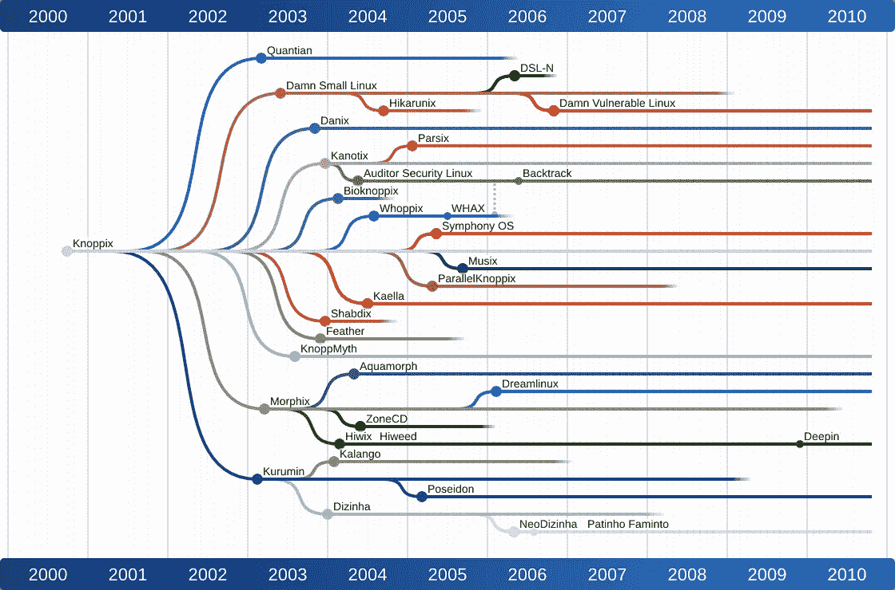
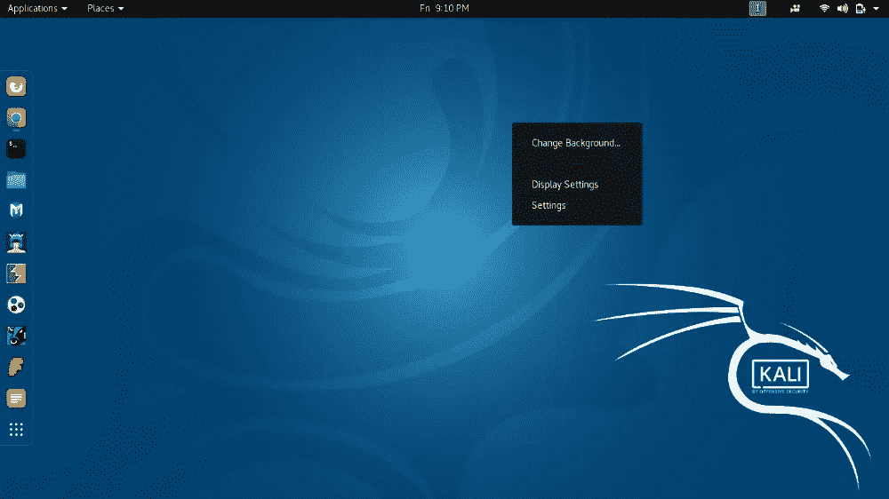
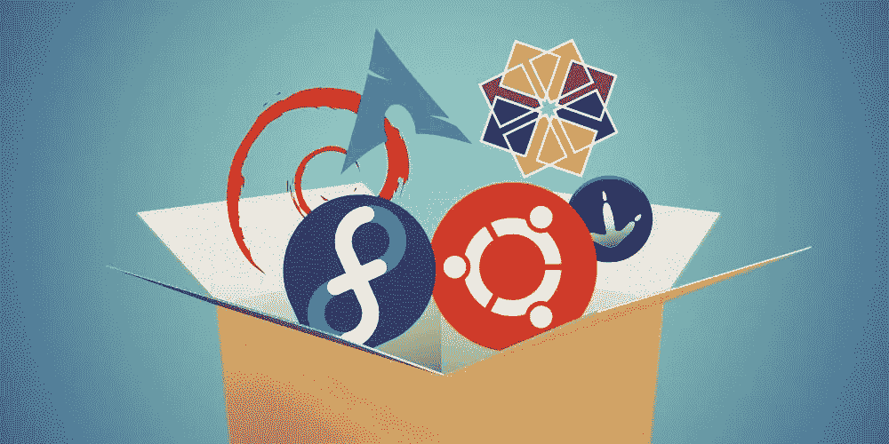

# Linux 有什么区别？

> 原文：<https://medium.com/codex/what-is-the-difference-between-linux-5dbf0567358f?source=collection_archive---------5----------------------->


不同的 Linux 发行版是不同的，所以如果你正在学习或者你是一个 Linux 用户，这篇文章是为你准备的。现在，Linux 发行版已经不仅仅是一根头发，每个公司和个人都为自己创建和上传了发行版，但是并不是所有的发行版都是相同的，在不同的方面有所不同，你可以通过识别相似和不同之处。为您的工作选择 Linux

要理解 Linux 发行版，您必须首先熟悉 Linux 家族:



## Linux 家族

通常每个 GNU Linux 发行版都有一个父发行版，其他发行版都是从这个父发行版派生和发展而来的，比如 Ubuntu Linux 就是从 Debian 家族派生出来的。最流行和最广泛使用的母 Linux 是 Debian，Ubuntu，Arch，Gentoo，Slackware。

好了，现在您已经熟悉了 GNU Linux 系列，您需要知道 Linux 之间的区别并做出选择:

## 桌面环境



你的桌面环境必然只是你的操作系统的美观，与工作类型无关。最好的环境是 GNOME，KDE，XFCE，budgie，如果你想了解更多，你可以搜索一下…如果你的系统比较弱，最好最快的选择是 XFCE，你可以下载并享受使用这个环境的 Linux。

而如果你有一个中强系统，我必须说，你可以轻松地使用和享受所有的环境(像中强系统，它是一个系统有 4 个或更多的 RAM 和 2 个以上的图形)。

## 包管理器



如果 Linux 来自不同的家族，比如 Arch、Debian 和 Red Hat，他们有不同的包管理器，你应该做一些研究。

软件包管理器是更新操作系统或安装其他程序的工具，例如，在 Debian Base Linux 中使用 apt 和 apt-get 软件包管理器，在 Red Hat Linux 中使用 Red Hat Base。你用 yum。例如，我们使用以下代码安装 Timax 工具:

对于基于 Red Hat Linux:

```
sudo yum install tmux
```

对于基于 Debian Linux:

```
sudo apt install tmux
```

对于 Archbase Linux:

```
sudo pacman -S tmux
```

> 要了解如何使用 Arch Linux 软件包管理器，请访问以下链接:
> 
> [Arch linux 和 manjaro 包管理器](/@aliakbarzohour/use-pacman-in-arch-linux-and-manjaro-c987e4a0da66)

## 释放；排放；发布


Linux 提供两种模式的更新，滚动发布和固定发布，您可以根据您对 Linux 的使用来使用它们:

## 固定释放

这种类型的 Linux 发行版通常每月和每年更新一次，例如，Ubuntu 提供了 5 年版本，并在这 5 年中支持它。

这些类型的发行版适合新手或服务器，原因是你不用担心更新和 bug 很长一段时间，你可以安全地到漫画。

## 滚动释放

这几类发行版一般一周或者一个月更新一次，有些发行版比如 Fedora 一天更新一次(现在一天一次太多了，但是更新很快)。

如果你是一个新用户或者如果你做敏感的工作比如服务器工作，你根本不应该去这种类型的 Linux，但是如果你喜欢处理 Linux 的 bug 并且总是在技术的边缘，你可以享受这种类型的分发。

## 结论

我希望这篇文章对那些对技术领域，尤其是 Linux 感兴趣的人有所帮助。如果我们想变小，Linux 有非常小的和工程化的差异，但总的来说，你读的东西对理解 Linux 是有好处的。总的来说，所有的 Linuxes 都是好的，可以做很多彼此的工作，如果你不做非常专业的工作，Ubuntu 是你最好的选择。但是如果你想找到你喜欢的 Linux，你可以看看上面，决定…健康健康。。。