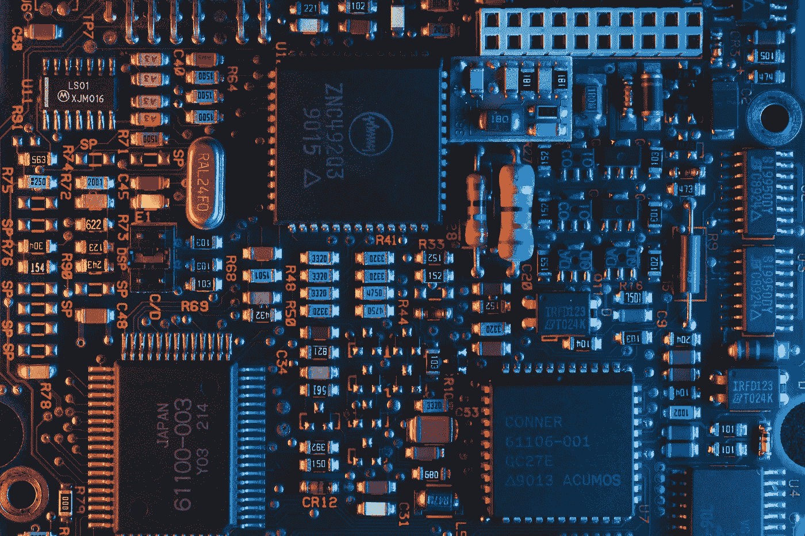

# 什么是数字鸿沟？现代全球问题导论

> 原文：<https://medium.com/codex/what-is-the-digital-divide-an-introduction-to-a-modern-global-problem-ffd04d81e292?source=collection_archive---------9----------------------->

从人类发现火到第一批石器的发明，我们已经走了很长一段路来满足对不断改进的技术的需求。

今天的技术进步速度是人类历史上前所未有的。

尤其是在当今通讯技术飞速发展的情况下。

信息和通信技术(ICT)在全球范围内的指数级增长和采用帮助我们超越了获取知识、购买商品和远程合作的物理障碍。这引导我们为现代问题找到现代的解决方案。

可以说，无障碍信通技术的出现解决了许多问题。但尽管如此，一个挥之不去的问题依然存在。所谓的数字鸿沟是显而易见的，而且只会进一步扩大。

# 什么是数字鸿沟？

[**数字鸿沟产生于 20 世纪 90 年代中期**](https://www.edutopia.org/digital-divide-technology-access-inclusion) ，当时我们现在知道的这些流行技术刚刚开始出现。它最初是作为一种识别“ [**”和“**](https://www.ntia.doc.gov/ntiahome/fallingthru.html) ”人群的方式，这些人拥有和没有数字技术。在随后的几十年中，随着数字技术的改进，这些技术发展到使用更快、更小和更便宜的组件，使它们能够被更多的人使用。

最初的定义已经过时，取而代之的是马丁·希尔伯特的“**拥有的多，拥有的少** ”，这是一个更恰当的术语，强调了现代数字技术的影响和有效性。这意味着人们更加关注如何利用这些技术来改善生活。缺乏专业知识、负担得起的数据计划和互联网带宽导致了发达国家和发展中国家之间的巨大差距。

简而言之，数字鸿沟是从数字时代早期的信通技术的可获得性问题演变为相对于个人收入而言缺乏负担得起的数据基础设施和有效使用信通技术的困难。[**研究表明**](http://martinhilbert.net/TechInfoInequality.pdf) 由于无数的社会因素扩大了差距，发达国家和发展中国家之间的不平等变得明显。

但是数字鸿沟并没有显示出受影响的整体的两个部分之间的明确定义。相反，有不同类型的差距造成了数字鸿沟，使其比最初想象的更加复杂。我们将在后续文章中进一步发现这些明显的差距，以及我们如何成功地弥合它们。

然而，为了让我们理解我们是如何以及为什么走到这一步的，我们需要看一看普遍影响这一现代数字鸿沟扩大的基本因素。一旦我们理解了这些基本方面，我们将能够提出更好的问题，并为它们找到更好的解决方案。

# 数字鸿沟的因素是什么？

# 数字素养

当充分利用现代数字技术时，文档的创建、通过网络的研究和通过平台的交流是最重要的方面。在发展中国家，由于缺乏适当的数字技术教育，大多数人没有充分利用这些优势。有些人没有机会也没有接触到这些信息和通信技术。

但这不仅延伸到那些无法在基本水平上正确使用这些技术的人，事实上它也影响到那些已经可以访问但难以辨别在线信息的有效性和价值的人****。****

****如果对这些设备能够提高个人生活质量的能力没有正确的理解，这项技术将会因低效和滥用而失败。这导致数字鸿沟通过无效使用和浪费影响带来的复合不平等。****

# ****收入****

****高收入家庭比低收入家庭更倾向于采用数字技术。 [**根据 NTIA**](https://www.ntia.doc.gov/legacy/ntiahome/digitaldivide/factsheets/income.htm) 的说法，高收入人群(> $75，000.00)采用这些技术的可能性要高出二十倍(20x)。因此，低收入家庭(< $30，000.00)获得这些技术的机会较少，个人成长和学习的机会也较少。****

****我们可以清楚地看到，尽管这些技术比以往任何时候都更便宜和更快，但由于可负担性和可获得性，个人之间的鸿沟仍然存在。****

# ****地理位置和限制****

****一个人离城市化的城市越远，上网就越受限制。在大多数农村地区，由于人口规模小和投资回报率低，适当的基础设施还没有发展起来。技术分散的问题在历史上一直存在，但它没有任何借口。今天，我们实现这些技术的手段很容易廉价获得。****

****根据皮尤研究中心的数据， [**20%的农村居民没有接入互联网，而城市居民**](https://www.pewresearch.org/fact-tank/2013/11/08/whos-not-online-5-factors-tied-to-the-digital-divide/) 只有 14%。事实仍然是，仍然有一些人没有适当的机会获得信息和通信技术，尽管这些技术每年都在成倍地改进并变得越来越便宜。****

# ****个人的动机和一般兴趣****

****根据个人使用信通技术的需要和必要性，影响数字鸿沟的一个普遍因素可归结为个人独特的个人兴趣。有些人对学习和浏览现有技术不感兴趣。****

****其他人在其职业中不使用信通技术，并广泛影响他们对这些技术的看法和需求。总的来说，这更像是一种个人选择，他们积极参与其中，并意识到这样做是在扩大差距。****

# ****教育上的差异****

****[**根据 Educause**](https://er.educause.edu/articles/2017/10/higher-education-digital-divides-and-a-balkanized-internet) 的调查，那些接受过大学教育的人更有可能采用信息通信技术，并利用其为个人和职业生活服务。一个人受教育程度越高，采用技术的机会就比受教育程度较低的人高 10 倍。****

# ****我们将何去何从？****

********

****当我们走向不确定的未来时，我们知道只有一件事是肯定的——日益扩大的数字鸿沟是明显的。我们所熟知的因素并不仅仅基于人们可用的技术。大多数问题源于当今社会普遍存在的社会问题。****

****弥合数字鸿沟需要大量的艰苦工作，坚定不移的责任感和一点点的创新才能弥合这一鸿沟。我们需要充分了解并意识到这一分歧的根源，以便为这一普遍问题提供急需的解决方案。****

****请和我一起深入探讨涵盖数字鸿沟的主题，并探索我们如何理解其症状以及如何通过这些知识来弥合鸿沟。****