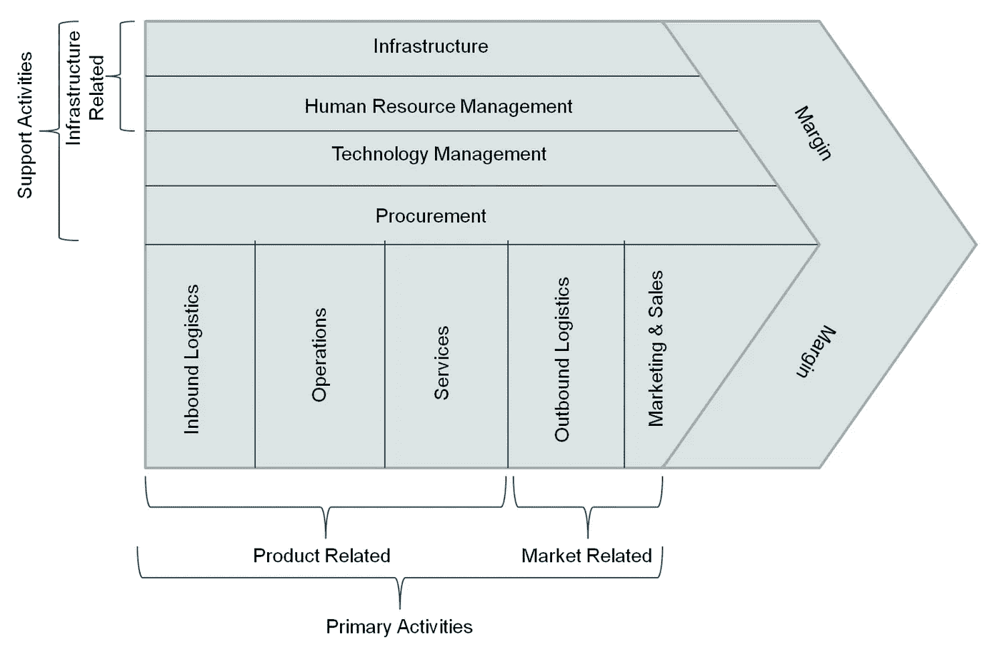

# DevOps 转型的主要目标是什么？

> 原文：<https://medium.com/codex/what-is-the-main-goal-of-devops-transformation-217ea33270d7?source=collection_archive---------8----------------------->

伊登·康斯坦丁诺在 [Unsplash](https://unsplash.com?utm_source=medium&utm_medium=referral) 上拍摄的照片

开发软件是一个复杂的过程。有许多活动的部分，很难知道每个部分在更大的事物计划中的位置。

由于这种复杂性，我们必须首先对我们试图在一个组织中做出的任何改变赋予价值。这意味着理解什么是真正的价值。此外，由于人类运行这些系统，除了技术甚至人的问题之外，许多其他因素也与这个目标有关。

企业开发软件是有原因的:**为了获得商业价值。**

企业级开发运维转型的主要目标是什么？DevOps 有助于优化从创意到最终用户的价值流，并鼓励协作以获得这一商业价值。

DevOps 不仅仅是开发和运营协同工作；一家公司要想在 DevOps 上取得成功，这是一种文化变革，因此文化是一大焦点。

# 交付价值的能力

交付客户价值对于持续生存和增长至关重要，但企业通常难以有效地做到这一点。

你如何改进软件开发？你以前尝试过敏捷和 Scrum，但是没有成功。

在一天结束的时候，你必须交付工作软件。如果你不知道什么可行，什么不可行，你就不能这么做。

问题是，你没有简单的方法来找出什么可行或不可行，而不犯错误，走进死胡同，在浪费资源的事情上花费时间和金钱。

借助 DevOps，您可以降低风险并缩短上市时间。随着从每次试验中学习，您的业务变得更加敏捷、适应性更强、对变化的反应更快。这也有助于你衡量什么是真正重要的:你的客户的需求和期望。因此，您可以就未来如何为他们创造价值做出更好的决策。

## **实验学习**

[实验](https://daniel-leivas.medium.com/why-experimentation-is-so-important-bc1f67022bd2)通过减少不确定性，团队可以更快地学习，并更快地向客户交付价值。此外，这有助于他们比传统流程更快地响应不断变化的业务需求。

但是，如何通过从你的实验中学习来更有效地测试，这样你就可以花更少的时间去做没有结果的实验，或者花更少的时间去吸取教训？

在 Continuous，我们相信，让 backlog(史诗、用户故事……)和最终用户收到产品之间发生的事情变得清晰可见，可以极大地改善当今组织的工作方式。因此，我们首先通过关注可见性和最大化开发人员交付商业价值的时间来消除软件开发过程中的浪费。

## 衡量什么是重要的

最大的痛苦之一是没有反馈回路。通过关注指标，您可以立即了解应用的生命周期、性能和发布速度，为您的应用交付流程提供可操作的指标。

从历史上看，软件开发组织很难衡量什么是重要的。然而，当涉及到度量驱动的软件开发时，用好的度量连接应用程序是关键。

测量有助于实现核心 DevOps 目标，增强端到端渠道。

# 更快生产软件的能力

正确交付应用程序是当今 IT 成功的核心。在快速交付软件的压力下，IT 没有充分利用其人员或流程。团队在非生产性的活动中浪费时间、金钱和精力，例如修复 bug 和返工。

在过去的几年中，我们已经看到许多软件团队试图提高他们的交付性能。但是，如果没有持续的交付最佳实践，他们无法以可接受的速度提高交付绩效。

通过 DevOps，我们帮助提高您团队的交付绩效，以始终如一地满足您的业务目标。该过程包括在整个软件开发生命周期中使用连续交付核心概念快速构建和高质量交付的能力。

DevOps 也是一种过程改进文化，通过协作解决问题，将业务、开发人员和运营人员聚集在一起，帮助消除软件开发中的浪费。

为了实现 DevOps 目标，我们必须关注我们作为一个组织的表现。因此，让我们建立一个基础，通过将人放在第一位，创建敏捷团队，在整个组织中共享所有权和责任，允许自治，同时仍然保留对我们工作的责任，从而允许我们更快地交付软件。

这只有通过三个基本方面才能实现:改善价值链、打破孤岛和创建跨职能团队。

## 改善价值链

你是否觉得你的企业不如以前富有成效了？您是否发现很难在截止日期前完成您的产品或服务？

1985 年，哈佛大学商业战略教授迈克尔·波特(Michael Porter)出版了《竞争优势:创造和保持卓越绩效 》一书，书中提出了公司的[价值链](https://en.wikipedia.org/wiki/Value_chain)模型。

波特的价值链是一种管理工具，它允许绘制和分析为公司增加价值的活动，并将它们分配到主要活动:那些致力于开发为公司创造价值的产品或服务的活动，以及次要活动或支持:那些对公司正常运作来说是必要的活动。

价值链的目标是确定在产品或服务的生产过程中公司价值的来源。

价值链—迈克尔·波特

价值链是一个组织过程的整体视图。它使管理层能够了解具体变化对整个组织的影响。

在这个世界上，一切都是相连的。组织中某个部分的变化会影响到其他部分。

组织必须能够快速响应不断变化的市场条件。然而，大多数组织已经变得如此复杂，以至于他们无法快速做出反应，因为经理们很难看到问题来自哪里以及问题之间的关系。

DevOps 提供了一种摆脱这种复杂性陷阱的方法。价值链视角将活动从组织漏斗中分离出来。

DevOps 原则可能适用于一个产品的整个价值链，但不适用于拥有众多不同团队或产品团队的大企业，前提是这些产品彼此完全独立。因此，要声称一个特定的软件产品符合这个标准，一个组织或团队必须遵循该产品价值链的所有部分中的概念和实践。

DevOps 通过自动化任务和整合组织内以前独立的系统来实现和改进价值链。

## 打破筒仓

组织中的筒仓无处不在，它们对软件的交付是有害的。DevOps 旨在打破孤岛，创建跨职能团队，为处理器“流程”开发一定程度的共享所有权。

团队成员之间互动良好是很常见的。然而，如果团队在整个软件交付周期中包括专家，那么操作孤岛将被自然打破。

无论您是否意识到，您的组织中存在孤岛。如果您修复了您的端到端渠道，那么您将实现 DevOps 背后的主要目标。

DevOps 有效地减少了等待时间和不必要的返工。缺乏完全的所有权是分离团队的一个典型问题。只需几封电子邮件和几个电话，就能确定负责的资源，并根据需要分配任务。因为 DevOps 团队是自助式的，每个团队成员都是负责任的，DevOps 避免了确定“谁负责”的头痛问题

## 创建跨职能团队

跨职能软件开发团队的基本结构包括开发人员、测试人员、分析师和系统管理员。

生产软件团队变得超负荷，不能足够快地生产软件。客户需求越来越多，时间流逝，团队压力很大。

没有必要花费数周的时间在“分析瘫痪”中，同时确定什么特性应该进入你的下一个版本。相反，尝试一些小的变化，这些变化可以很快发布，但仍然对你的客户体验有很大的影响。DevOps 让你这么做！

一个解决方案是建立跨职能团队，让合适的人一起工作，为每个客户群提供重要价值。理想情况下，同一批人应该在整个客户生命周期中工作…从设想解决方案到营销和长期支持。

# 结论

采用 DevOps 方法需要整个组织的根本转变。

企业级 DevOps 思维模式的集成将打破孤岛，提高向客户交付价值和更快生产软件的能力。

这样的变化会影响整个 IT 价值链，而不仅仅是开发和运营团队。DevOps 的持续交付文化有助于缩短上市时间，优化从创意到最终用户的价值流，并鼓励协作创建跨职能团队。

# 快速小结

*   开发和最终用户交付之间的差距是巨大的，这使得很难理解高质量软件的交付是如何与业务目标相违背的。
*   企业开发团队有一个目标:优化从想法到最终用户的价值流，并为我们试图在组织中做出的任何改变赋予价值。
*   DevOps 对速度和敏捷性的关注是关于我们如何开发软件以及我们如何作为一个组织来运营。DevOps 是关于改善价值链、打破孤岛和创建跨职能团队。

感谢阅读。

请在 Medium 中关注我，这样您就不会错过接下来的文章。

 [## 竞争优势

### 如何着手评估一个市场，特别是将要面临的竞争，以及…

www.goodreads.com](https://www.goodreads.com/book/show/134776.Competitive_Advantage)  [## 软件产品交付的价值链

### 波特的价值链迈克尔·波特在其著作《竞争优势:创造和创造》中提出了价值链框架

www.linkedin.com](https://www.linkedin.com/pulse/value-chain-software-product-delivery-thomas-lee)  [## 2020-2021 年企业开发运维报告

### 了解如何在整个组织中扩展开发运维实践，以提高业务指标、客户满意度…

azure.microsoft.com](https://azure.microsoft.com/en-us/resources/enterprise-devops-report-20202021/)  [## 为什么实验如此重要？

### 根据美国著名物理学家理查德·费曼的说法，他的简单陈述是关键:

daniel-leivas.medium.com](https://daniel-leivas.medium.com/why-experimentation-is-so-important-bc1f67022bd2)  [## DevOps 是什么？

### 我是一个敏捷和 DevOps 的布道者。通过在各种项目上工作多年，我已经经历了不同的…

连续团队](https://continuous.team/a/what-is-devops)  [## BizDevOps 是什么？

### 我是一个敏捷和 DevOps 的布道者。通过在各种项目上工作多年，我已经经历了不同的…

连续团队](https://continuous.team/a/what-is-bizdevops)