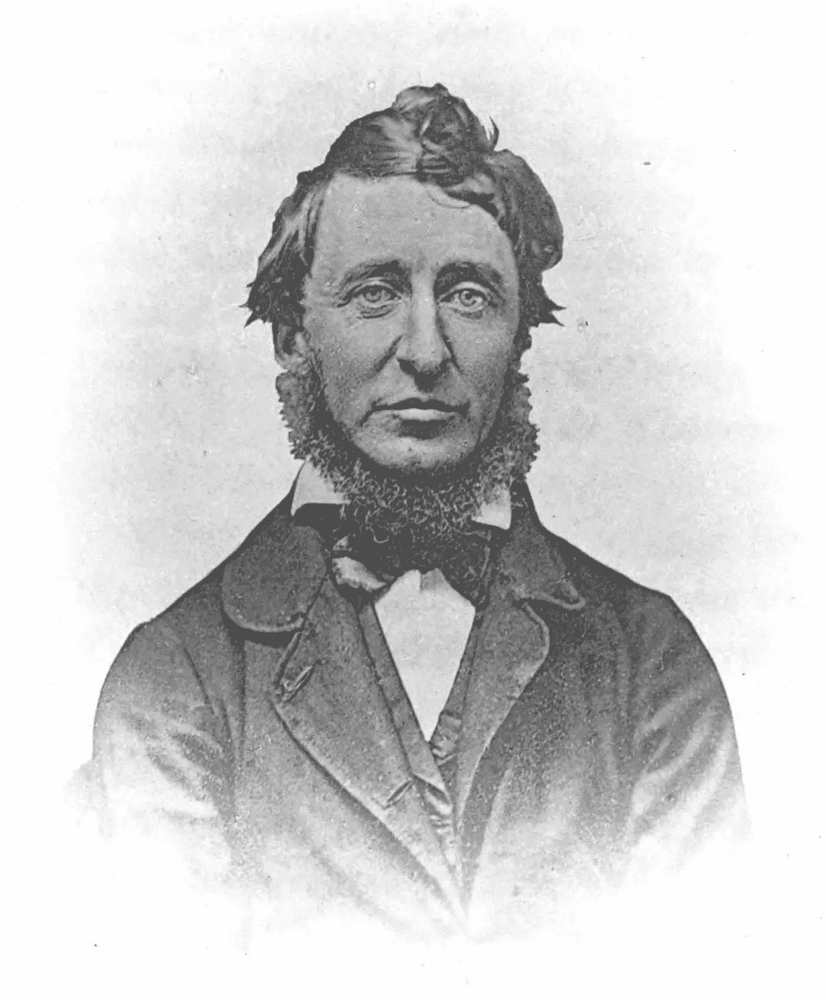

# 计算机科学的高等教育有什么意义？

> 原文：<https://medium.com/codex/what-is-the-point-of-higher-education-in-computer-science-b8a29b63ebdc?source=collection_archive---------4----------------------->

梭罗·达盖罗式|维基媒体

我以前可能提到过这个，但是 nbd 我现在是一个专业的教育工作者，在一个 CS 硕士项目中，因此已经超越了你们 pl3bs 和你们所有的尘世烦恼。一月的一个星期一，天刚亮，我就出发了，穿着凉鞋，刚刮过胡子——一副[的硬邦邦的样子](https://www.merriam-webster.com/dictionary/bindle%20stiff)，对携带硬邦邦的世界来说是陌生的，带了几件额外的衬衫、一片面包皮和一些精选的硬奶酪。

现在，我发现自己在一个遥远国度的水边，手里拿着皮面日记本，一边看着鸟儿或者其他什么一边潦草地写着笔记:我是现代的编程梭罗(据说，[更像是鼻子而不是人](https://en.wikipedia.org/wiki/Henry_David_Thoreau#Physical_appearance))。

我很不策略地提出了这个问题，但它确实是真实的——我正在认真寻找一个答案:计算机科学高等教育的意义何在？

首先，计算机科学程序应该创造*程序员*还是应该创造*计算机科学家*？计算机科学项目有一个非常难解决的问题。这让我想起了那段时间，那时我住在夏尔以东的河谷里，和一把火把在一起。一个家伙带着一枚戒指走了过来，上面刻着自由民族写的一首大诗的一小部分:

> 天空下的企业软件开发人员有三个等级，
> 七个等级是石头大厅里的领章，
> 九个等级是注定要死的网络程序员，
> 一个等级是黑暗王座上的复杂性理论家
> 在阴影笼罩的魔多之地。
> 一个 CS 程序来统治他们，一个 CS 程序来寻找他们，
> 一个 CS 程序来把他们都带来，并在黑暗中束缚他们，
> 在魔多的阴影之地。

一年中的这个时候魔多很美| [维基媒体](https://commons.wikimedia.org/wiki/File:Mordor_(24554757530).jpg)

你看到这里的困难了。一个项目如何准备好所有这些不同的追求？这些人有什么共同之处？我想共同的主线是“计算”——但是在 2022 年，哪些工作不需要熟悉计算才能具有竞争力？此外，一个程序能提供什么是越来越多的优秀、免费的在线资源所不能提供的？

这是一个需要咀嚼的问题，不是一篇短短的中型文章就能回答的。

我知道我不能明确地回答这个问题(我也没有资格回答)，但我可以描述一个我认为可能对大部分学生(也许不是复杂性理论家)有帮助的具体方法:边做边教。这并不新奇，但是在我的计算机科学教育中，我真的从来没有见过任何教授这样做过。具体来说，**在学生面前使用代码实时思考问题**。

这是我一直试图解决的问题，一点一点地，一路摆脱(希望如此)我的教学无能。而且肯定有很多。

作为一个具体的例子，考虑这种方法在 TDD 教学中有多有用。考虑使用 TDD 成功开发所需的实用技能:

1.  对单元测试框架的语法理解。
2.  循环:编写测试，运行测试，重构系统，等等。
3.  “某种”编辑的基本命令。
4.  了解何时将某些东西提交给版本控制，以及要包括哪些非编码信息(比如好的提交消息)。

我在这里只是浅尝辄止，根本只描述了做 TDD 的一些必需品，更不用说*好的* TDD 了。我已经开始接触学校或工作中通常不会明确教授的东西，还有许多更深层次的、“更软的”技能我也*喜欢*交流，我认为我只能*通过在学生面前练习来交流:*

1.  看看你的工作流程能有多快！看看命令行的流畅性比点击 SourceTree 或者点击一个按钮来运行单元测试要有效得多。
2.  为什么难以置信的快速运行的单元测试会对你的输出产生指数级的影响。
3.  如何完成[单元测试](https://thegoldenmule.medium.com/the-binary-search-methodology-3cd21fc66531)之外的*系统的整体设计。*
4.  一个花了几千个小时写代码的人是如何安排他们怪异的窗口的。
5.  当*不使用* TDD 时。

火山口湖| [维基媒体](https://commons.wikimedia.org/wiki/File:Crater_Lake_winter_pano2_0.5.jpg)

这是一个很深很深的水池中的一个脚趾浸——一方面，期望学生在教室环境中学习这些的大多数是不现实的。另一方面，接触孕育对话和思考。这在他们的脑海中留下了视觉记忆，当他们发现自己面对一个他们不知道如何解决的问题时，这些记忆可能会闪现出来。这是我们在行业中结对编程的部分原因。向对方展示细节。

对我来说，[这些细节是蝴蝶](https://en.wikipedia.org/wiki/Butterfly_effect)，与计算一起工作和思考的结果对这些初始条件高度敏感。

不管怎样，把皮面杂志放一放——我要回去工作了。