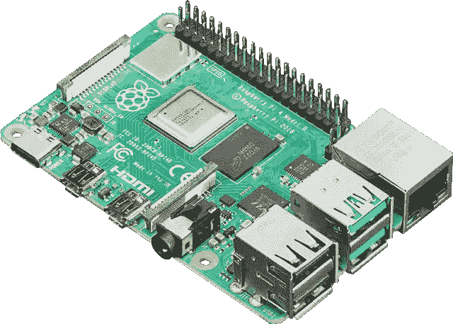
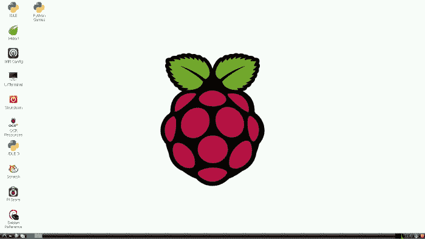

# 什么是树莓派，为什么你应该买一个

> 原文：<https://medium.com/codex/what-is-the-raspberry-pi-and-why-you-should-buy-one-aaae7f417b63?source=collection_archive---------8----------------------->

图片由 [www.adafruit](http://www.adafruit,ci) 提供。com

树莓派是 2012 年首次亮相的单板电脑，现在已经是第四代了。它是英国有史以来最畅销的电脑之一，截至 2021 年 5 月，全球已售出超过 4000 万块主板。在这里，我将解释为什么你应该购买和一个，你可以用它做什么。

首先，这是一台用来学习的电脑。您需要一台已连接互联网的现有计算机来下载 Raspberry Pi 操作系统，并将其加载到插入 Raspberry Pi 的存储卡中。它可以通过 HDMI 导线连接到电视/显示器，您可以使用现有的键盘和鼠标。

Raspberry Pi 操作系统界面

它运行名为 Linux 的开源软件，这意味着没有像微软 Windows 那样的许可，但仍然给你一台具有类似 Windows 的指导用户界面(GUI)的计算机的所有功能。树莓派上的微软 Office 等价物被称为 Open Office，它拥有微软 Office 的大部分功能，但完全免费。它甚至有 VBA(尽管有些函数(API)不被支持)，可以让你创建宏。Raspberry Pi 操作系统包含它自己的网络浏览器 Chromium，就像 Chrome 只适用于 Raspberry Pi 一样。

**那么你能用它做什么呢？**

学习和操作 Linux

首先，您可以通过 Raspberry Pi 上的终端学习使用 Linux 操作系统。这是一个开源的命令行操作系统，比 Windows 中的命令行更加强大和灵活。许多大公司使用基于 UNIX 的服务器，包括金融机构和软件公司。学习在 Linux 中导航，在诸如 nano/vi 等编辑器中编辑文件，以及编写 shell 脚本(可编程的 Linux 脚本),如果你为使用这些的公司工作，这些都会给你很大的帮助。

学习编程语言、SQL 和连接硬件配件

你可以安装 Python 之类的编程语言，甚至是 MySQL 之类的数据库，并加载模式来帮助或提高你对 SQL 的理解。非常适合初露头角的程序员和计算机科学家。此外，您可以使用 Pi 创建各种项目，例如温度监视器、光传感器、运动传感器 CCTV 等等。剪切的可能性是无穷无尽的，查看网站【www.thepihut.com 了解可用配件的范围。

点击这个链接，你可以用树莓派做很多事情:[https://www.makeuseof.com/tag/different-uses-raspberry-pi/](https://www.makeuseof.com/tag/different-uses-raspberry-pi/)

那么我用树莓酱做什么呢？

我个人把我的树莓派当做‘无头’单元；一个通过以太网电缆连接到家用路由器，我通过 Mac 电脑上的终端远程访问它。

对我来说，Raspberry Pi 的最佳用途之一至少是运行一个专用 VPN，这样我就可以从世界上的任何地方安全地远程访问我的家庭闭路电视和家庭网络访问存储(NAS)驱动器。这是通过一个名为 WireGuard 的程序实现的，它在我的每台设备上都安装了一个客户端；连接到家庭网络的 iPhone、iPad、MacBook。

PiHole 是另一个优秀的程序，它删除了困扰网站的大量讨厌的广告，让你的冲浪体验更加愉快。

洪水是一个通过浏览器访问的 torrenting 应用程序，而不是使用计算机来下载 torrents，Raspberry Pi 可以轻松做到这一点。这样，任何恶意文件(您无意中下载的)都存储在 Linux 操作系统中的 Pi 上，不太可能对您其他古老的 Windows 和 Mac 计算机造成损害。如果你碰巧有一个 NAS 驱动器(我有)，你可以简单地将文件从 Raspberry Pi 转移到 NAS 驱动器。这样，我的家庭网络上的所有计算机都可以使用下载的文件。

最近，我一直在学习“整理”我的应用程序(即 PiHole、WireGuard 和 flood)。这允许通过“虚拟化”Linux 操作系统来更好地使用 Raspberry Pi 资源(查看我最喜欢的 YouTubers 之一；网络查克的剪辑了解更多信息—【https://www.youtube.com/watch?v=9FtERdqKa2s[。](https://www.youtube.com/watch?v=9FtERdqKa2s)

结论

我向你推荐 4GB 的 Raspberry Pi 4 型号 B，价格在 50 至 60 英镑(69 至 83 美元)之间，来自 thePiHut.com、易贝或亚马逊。这是一台完美的计算机，适合儿童学习计算技能(并让他们从智能手机或游戏控制台中解脱出来)，甚至适合希望学习更多计算和修补知识的 IT 工作者。你需要一根电源线、一个盒子、一个风扇、一个鼠标和键盘，别忘了一根微型 HDMI 线来连接显示器/电视。

在后续文章中，我将解释我如何安装和配置动态风扇(它主动监控 CPU 温度并相应地开关风扇)，我如何通过 Docker 配置 WireGuard、PiHole 和 flood。留下来…