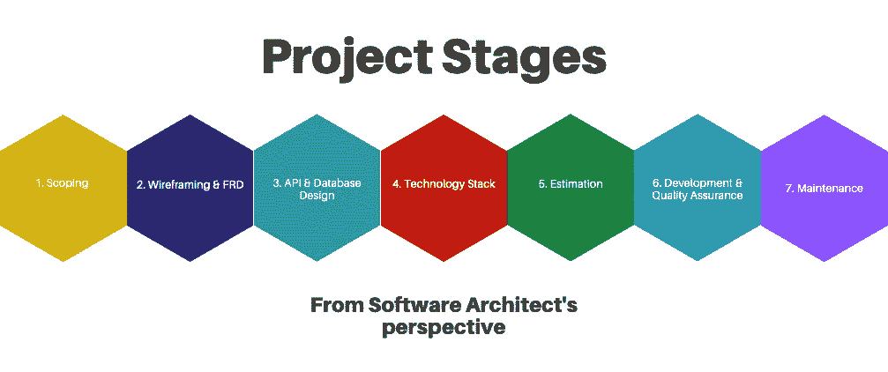
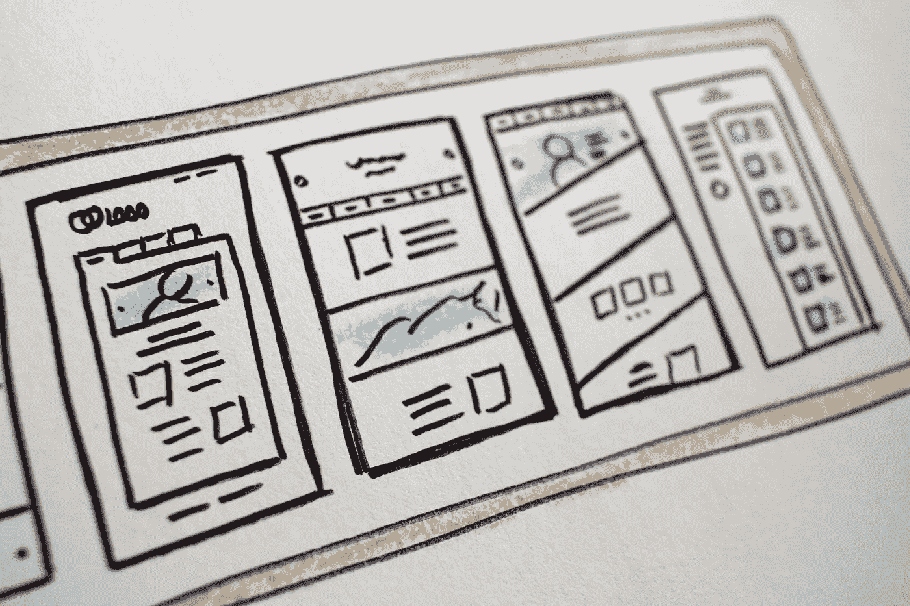

# (在你的公司里)软件架构师的角色是什么？

> 原文：<https://medium.com/codex/what-is-the-role-of-software-architect-in-your-company-784715f32dbf?source=collection_archive---------12----------------------->

作为一名开发人员，我总是感到沮丧，因为功能没有完全定义，规范要么不存在，要么写得很差，文档(注释、迁移、API 文档、er 图、架构概述)是陈旧过时的。我浪费了很多时间去寻找所有必要的信息，而且经常得不到。然后我会开始自己编写代码，但并不总是有结果。我的假设并不总是正确的，这将导致我不得不修改部分逻辑。

我在公司工作过，也做过自由职业者，在大型团队、小型团队和个人中工作过。我还注意到公司内部的项目之间没有太多的一致性。

另一方面，开发人员编写了不可重用的组件。技术、堆栈和工具都是根据当前的宣传来选择的，这样每个人都可以使用最先进的技术。人们总是认为它加速了软件开发过程，提高了产品质量。但事实真的是这样吗？

我想得越多，我就越对在编程前正确设置项目的角色感兴趣；试图纠正我在编程过程中诊断为问题的东西(无论是作为一个单独的开发人员还是在一个多人的小组中)。有时，会有前台或团队领导参与进来，他们会组织周围的人，协助编写功能、测试，并帮助年轻同事提高技能。

然而，总是缺少“某些东西”。这就是为什么我认为软件架构师是软件开发过程中必要的组成部分。

# 软件架构师

软件架构师的定义是什么？

> “软件架构师是专家级的软件开发人员，他与企业和客户沟通，与软件工程师团队一起设计和执行解决方案。软件架构师负责执行软件设计决策。他们经常扮演设计师、开发者和沟通者的角色。”— [的确](https://www.indeed.com/career-advice/careers/what-does-a-software-architect-do)

…或者我们看看维基百科:

> “软件架构师是软件开发专家，他做出高层次的设计选择，并试图执行技术标准，包括软件编码标准、工具和平台。”— [维基](https://en.wikipedia.org/wiki/Software_architect)

## **软件架构师写代码吗？**

在这种情况下，我发现自己——更少。软件架构师还有许多其他的职责，是的，“编程”也在菜单上，但是程度要小一些，并且根据需要而定。

软件架构师花在编写代码上的时间比软件开发人员少得多，因为他们的角色完全不同。两者都存在于软件开发生态系统中，但是前者主要关注于将业务需求转移到功能性需求，后者更倾向于将功能性需求转移到代码。

Software Architect 通常通过为外部服务或第三方 API 编写高级伪代码、概念证明来简化开发。这加快了开发人员“失去”阅读所有文档的时间。(用引号括起来，因为阅读任何文档都很可能不是浪费时间)。

# 当前位置

我目前的职位是软件架构师。对我来说，这个职位包括:

*   **与客户合作**——与项目经理一起参与日常活动，将业务需求转化为功能需求。我作为连接开发团队、客户和产品的纽带参与其中。在每日或每周的简报中，我试图让项目问题和产品的当前状态更贴近客户。这有助于我们及时做出正确的决定。大部分的输出是功能需求文档以及每周的更新
*   **与设计团队合作** —一旦确定了项目的范围，定义了用例，通常需要创建线框——初始系统草图/模型，以查看框架，并直观地了解是否涵盖了所有用例及功能。为了创建线框，咨询设计团队总是好的，他们在这个领域的知识可能比我多
*   **与项目经理一起组织流程** —在建立和维护项目时，通常选择流程和工具来促进开发、进度监控、评估和瓶颈
*   **个人工作**——编写文档、创建 API、创建数据库并经常研究新技术
*   **概念验证**——以便开发人员尽快变得高效，而不必过于担心项目文档和外部服务文档
*   **与开发人员一起工作**——参与更复杂的任务，重点是确保任务被成功理解，并且结果输出是已知的。这一项有时包括写代码，伪代码，辅助图，并给出确切的例子

## **项目阶段**

由于我已经经历了许多项目，我已经在内部将每个项目的阶段放在一起(不考虑产品开发方法)。我把它分为:

1.  预开发(范围界定)
2.  线框和功能要求文件(FRD)
3.  API 和数据库设计
4.  技术栈
5.  估计
6.  开发和质量保证
7.  后期开发(维护)

在项目的不同阶段，责任是不同的。

基于软件架构师职责的项目阶段

# 1.预开发(范围界定)

开发前阶段可视为项目的初始阶段。项目可能已经在进行中(例如，我们从另一家公司继承了代码，客户在途中找到了我们，或者客户需要我们的专业知识来处理项目的特定部分/模块)。此外，这个想法可以是全新的，我们需要从一开始就启动这个项目。这个阶段总是从启动会议开始。

通常有两个开球时间。一个是**内部**——我们团队成员之间。通常，我们会收到一些需要分析的文档，以便为会议做好准备。那就是会上讨论的内容。
**第二个**是与客户——这是一个介绍性会议，我们在会上与客户见面，交流基本信息并介绍自己。客户经常告诉我们这个想法的来源以及更多关于这个项目的信息。

在最初的启动之后，我们通常会与客户召开持续 30 到 60 分钟的周会。目的是收集我们需要做什么的信息。我们必须收集客户的业务需求并确定其范围，以便了解他们需要什么类型的应用程序(web、移动、物联网)。我们需要了解我们在项目中的责任。

1.  我们必须理解这个项目的范围。
2.  有哪些功能？
3.  在项目经理的帮助下讨论用户案例
4.  定义特性和功能—定义项目范围
5.  定义角色
6.  定义第三方集成(至少是更大的集成，如 Zoom、Google Maps、Slack、Stripe 等。)

在这一阶段，我的职责将被划分到启动会议、周会和两次会议之间要做的事情上。

**1。动员会:**

*   阅读文档(如果有)
*   做一个积极的倾听者

**2。每周会议:**

*   为即将到来的会议做准备(单独或与项目经理一起)
*   在注意系统的功能和逻辑组件的同时，与客户讨论这个想法
*   做笔记，了解下一次会议的交付内容
*   提出问题并要求澄清
*   确保双方(**公司**和**客户**)都明白接下来的步骤

**3。在会议间隙:**

*   研究你不了解的话题
*   如果需要的话，询问其他架构师的见解和意见
*   关于潜在第三方集成的研究
*   在你的研究结论中包括项目经理

# 2.线框和功能需求文档

一旦项目被定义到双方都满意的程度，大多数项目至少会有一个，如果不是两个都需要的话(线框和 FRD)。

清单上第一个是 **功能需求文档**。功能需求文档是定义通用目的、架构概述、应用程序角色和应用程序功能的文档。它鼓励将功能集、用户故事、参考(与第三方集成)、角色和架构都放在一个地方的想法。这有助于双方确保他们在同一水平线上，没有任何遗漏。

**线框图**，另一方面，是平台上内容管理的初始过程。它有助于:

*   双方理解并准确定义每个屏幕上将显示什么类型的内容
*   双方要确保应用程序的工作流程是流畅的
*   客户了解应用程序将如何使用
*   建筑师了解项目的组成部分
*   设计师对应用程序应该是什么样子有一个大致的想法
*   项目经理和开发人员给出更好的估计

插图模型

线框化是一个半创造性的过程，在这个过程中，架构师(有时是项目经理)在浏览已经定义的功能的同时绘制应用程序草图。

在这个阶段，架构师需要遵循某些职责:

*   **创建**线框
*   在每周电话中解释你的想法
*   **讨论**想法
*   **引导**客户通过每个屏幕和每个工作流程
*   **根据客户的需求和反馈调整**线框
*   关注工作流程，而不是所有的细节
*   **注意**记下工作流程中可能影响项目其他阶段的任何潜在问题(例如，缺少“恢复密码”的工作流程)

# 3.API 和数据库设计

当设计团队基于线框创建可点击的演示时，software architect 专注于初始项目设置——基于功能需求文档的数据库设计和应用程序编程接口(API)。

设计师使用先前创建的线框，并使它们活起来。最常见的情况是，他们先创建一个包含 2-3 种配色方案或 2 个不同设计的屏幕的初始页面，然后再继续。一旦客户确认了正确的设计路径，设计师就创建其余的屏幕。

在这个阶段，**软件架构师**需要:

*   为设计团队和客户提供潜在的咨询
*   开始设计数据库
*   开始创建应用编程接口(API)

# 4.技术栈

当设计团队在创建屏幕和可点击演示的过程中，软件架构师可以开始研究项目架构并做出决策。这可能需要高级开发人员利用他们的专业知识来检测可能的缺陷，并决定遵循哪些实践和设计要使用的模式。您需要定义将使用哪种技术堆栈。该决定应基于几个因素:

*   项目复杂性
*   客户输入
*   我们的资源专家(开发人员)
*   舒适水平
*   多方面的

**注意——了解贵公司和开发人员的优势和劣势非常重要。如果尖端技术被使用，而没有人能够实现它们并获得它们的好处，你有什么好处？**

有这么多不同的选择，挑选堆栈并不总是一件容易的事情

通常*没有必要将项目和团队置于失败的风险中，只是为了使用和学习最新的技术。每件事都有它的时间和地点。*

除了选择堆栈之外，软件架构师应该完成**设计数据库**并定义大部分**API**。

在这个阶段，软件架构师必须:

*   选择技术堆栈
*   完成数据库架构(建模)
*   完成 API

# 5.估计

不要将评估视为硬性的截止日期。没用的。

当我们有了一个定义好的特性集，当我们与客户沟通我们将继续开发时，这个阶段就开始了。大多数情况下，项目经理会找到熟悉我们将要使用的技术的可用资源。

使用功能集、线框和可用的设计，在项目经理和架构师的帮助下，开发人员提供一份文档，其中包括每项任务、功能和总工作量的天数或小时数。基于评估文档及其确定性，创建时间线。

在这个阶段，软件架构师和开发团队之间的合作非常重要。软件架构师的职责是:

*   **向开发人员解释**项目理念
*   **引导**开发者通过线框
*   **协助**开发人员并做出任何必要的澄清
*   如果估计值过大或过小，**试着**找出原因——也许有误解

**附注:不要将评估视为硬性截止日期。没用的。**

# 6.开发和质量保证

一旦定义了项目范围，完成了线框，设计就绪，提供并批准了项目估算和成本，您就可以开始开发过程了。初始阶段(还)包括:

*   **人员配备**并寻找合适的资源
*   **建立项目** —这包括各种各样的任务，取决于项目——获得必要的证书和 API 密钥、设置开发服务器、CI/CD、测试环境、代码标准、符合期望
*   选择**适当的管理**和**代码版本化工具**
*   选择合适的**项目方法**(瀑布、V 模型、敏捷方法)
*   将功能集和任务转移到管理工具中

## 6.1.特点、任务和进展

当一切准备就绪，我们终于开始编码。项目经理和软件架构师需要相处并区分任务的优先次序，**开发人员必须编写逻辑和代码**，而**质量保证团队**需要在标记为“完成”之前验证开发的每一个任务。

这是一个漫长的过程，从几个星期到几年，取决于项目的范围和长度。因为这是一件长期的事情，所以 PM 和 s a 都有必要跟踪项目的进展。

如果有延迟，应该记录下来，并与客户进行适当的沟通——为什么会发生延迟，以及延迟发布的程度。

架构师和项目经理清楚地编写任务，并且开发人员清楚地理解任务，这一点很重要。

由架构师负责以精确和清晰的方式解释复杂的工作流(不一定，但最好是——编写带有详细解释、工作流、图表和伪代码的任务)。( *P.S.* *如果项目中没有专门的团队领导，则此规则适用。*)

任务解释得越好，工作流越简单(遵循最佳实践)，实现就越容易。

然而，并不是每个任务都需要详细解释。许多任务是不言自明的，并且在许多项目中是可重复的。在这种情况下，简单解释一下就够了。

## 6.2.质量保证

实施的每项任务都需要由**质量保证**团队进行适当的测试。如果有一个复杂的工作流，或者一个不寻常的情况，通常建议 PM 和 s a 对什么是输入和什么是预期输出给出一个详细的解释。

对于不常见的情况，建议给出额外的输入，进行澄清并说明预期的内容，以便 QA 团队正确测试产品。

肯定会有你找不到的最终案例，但是总的想法是创造流畅的用户体验。

## 6.3.每周会议

大多数情况下，我们会在开发期间与客户召开周会，在会上我们需要向客户更新项目进度，提出任何问题和顾虑，并标记变更请求。

重要的是，客户在此阶段(评估后)提出的任何变更请求都要记录下来，如果这是一项额外的工作，可能会导致初始评估的延迟，那么您要对其进行适当的记录。

## 6.4.发布、构建、版本

建议以增量/迭代的方式发布 alfa/beta 版本。这有助于双方跟踪进度，尽早标记潜在问题和变更请求。

另请注意——**发布日期**应该适当沟通**。**

由于这可能是一个漫长的过程，它需要软件架构师的关注。你必须:

*   区分任务的优先级
*   必要时，通过创建详细的工作流程、图表和伪代码来帮助开发人员高效实施
*   准备关于第三方集成的文档和帮助(有时是概念证明和一点编码)。如果有时间，你也可以帮助未知的包和库。
*   定期与项目经理沟通
*   尽早提出对延迟和实施/集成问题的担忧

# 7.后期开发(维护)

产品完成了。这个项目(几乎)结束了。往往剩下的就是保养了。通常，公司会和客户呆上一段时间，以便维护产品并做一些小的(或大的)改变。这甚至可以发展到项目的第 2 或第 3 阶段，在这两个阶段中，您可以从**项目第 1 阶段(范围界定)**重新开始。

大多数情况下，您在这里的任务是:

*   回复电子邮件
*   修复 bug，进行较小的更改，确保产品功能正常

# 结论

软件架构师这个职位要求很高，如果考虑到有社交，需要良好的团队精神和对他人的理解，良好的技术背景和不断学习新事物的意愿。在我看来，一个人竞选软件架构师职位的主要障碍如下:

*   **良好的** **自我组织能力**是必需的——当你被分配了一项需要找到解决方案的明确任务时，这比你自己创造并提供任务和解决方案要容易得多。
*   它需要**与人不断互动**和精细的**软技能**
*   他们担心“你可能知道得不够多”,无法胜任这样的职位——但这是一个很好的机会去“足够”地学习和发展它
*   写了很多**文档**
*   同时处理多个项目
*   如果项目失败，更大的责任

在你的环境中，软件架构师的职位是什么样的？