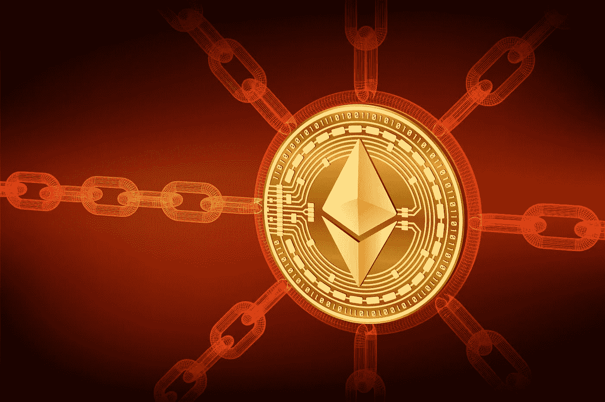
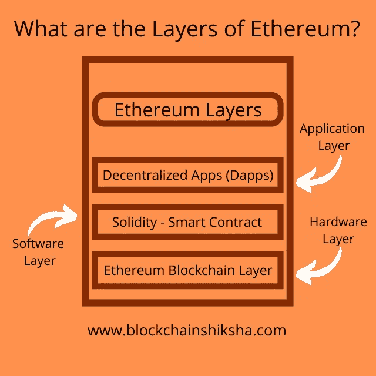

# 以太坊的结构是怎样的？初学者终极指南第 2 部分

> 原文：<https://medium.com/codex/what-is-the-structure-of-ethereum-ultimate-guide-for-beginners-part-2-a7303eeb7de?source=collection_archive---------18----------------------->

以太坊是一个允许任何人开发不可阻挡的、分散的应用程序的平台。如果你没听说过以太坊，或者不确定以太坊有什么用，我强烈建议你读一读《什么是以太坊？在本文深入研究和了解它是如何工作的之前。

这篇文章提供了以太坊的逻辑和内部机制的基本和非技术性的概述。请注意，下面提供的解释是对所发生情况的简要总结，但它应该足够详细，以帮助您理解它是如何工作的。

我们可以把以太坊想象成由几层相互叠加而成的堆栈。

第一层也是最基础的一层是一个巨大的计算机网络，它执行交易并随时更新公共数据库(以太坊区块链)。

第二层是**软件层**，它使开发者能够使用“Solidity”编程语言在以太坊区块链上运行被称为“智能合约”的程序。

**第三层**包括为以太坊用户提供各种服务的应用程序(从治理到身份管理)。该平台的显著特点是，利用以太坊硬件和软件层使这些应用程序去中心化，没有单点故障，因此“不可阻挡”你不能关掉它们。

# 以太坊硬件层:区块链

我们知道世界各地的服务器存储着网络上的所有数据。当您启动浏览器并浏览互联网，下载您需要的内容时，您的电脑(客户端)会与这些服务器建立连接。这种客户机-服务器系统是为因特网设计的，它有几个集中的储存库(服务器)，可以向大量的消费者(客户机)传播资料。

然而，因为我们都是材料的制造者和使用者，所以今天的互联网将许多客户端连接到其他客户端(Web 2.0)。在一个巨大的网络中，计算机可以相互通信，从开发它的计算机向请求它的计算机发送信息。

称为以太坊硬件层的对等计算机网络计算交易，并在共享的分类帐中维护它们的顺序。这种方法使开发人员能够创建分布式数据库，该数据库可以跟踪网络中共享的所有信息，包括所有事务。网络中的每台计算机都被称为一个“节点”，它处理传入的事务并将它们分组为块，这些块随后被广播到整个以太网。在这里，你可以观察以太坊计算机网络现在是如何处理交易的。

相关:[区块链生态系统中的节点有哪些？终极指南(blockchainshiksha.com)](https://blockchainshiksha.com/nodes-blockchain-ultimate-guide/)

交易可以包括金钱和信息。以太坊平台的数字货币是以太，说明其价值。并且代码具有可以传递和启动操作的数据。这段代码与以太坊的软件层和硬件层相关。有必要记住，全球有数百台计算机通过互联网相互连接。

任何人只需在笔记本电脑上运行一些代码，就可以让他们的电脑处理网络交易。一项激励计划支持以太坊网络的发展；单个主机节点获得“以太”奖励，这是一种宝贵的资产，节点可以使用它来访问平台的应用程序。

这个结构会让你对以太坊硬件层有一个大致的把握。要了解更多关于这些计算机如何协调工作和处理交易的信息，你应该首先了解区块链技术的基本原理。

**2。以太坊软件层:坚固性**

以太坊平台的多功能性吸引了早期比特币和区块链的采用者。虽然比特币是作为不同参与者之间交换价值的货币而开发的，但以太坊的目标是扩大比特币基础技术的用途，并创造更广泛的通用区块链。

以太坊软件层的创建是为了促进任何形状或形式的价值交换，无论是金钱、房子、身份、使用或复制音乐的权利，还是您能想到的任何其他资产。

一种叫做“[可靠性](https://blockchainshiksha.com/five-languages-for-smart-contracts/)的新编程语言就是为此而开发的。对于软件工程师来说，它和 JavaScript 非常相似。Solidity 允许程序员创建简单的“智能合约”程序，实现基本的交易逻辑。

以太坊还允许任何人创造新的数字货币(或“代币”)，所有以太坊用户都可以兑换。该功能允许各种应用，从数字化您最喜欢的咖啡店的奖励积分到在特定市场建立新经济。

以太坊的代码是开源的，开发者可以通过 Github.com 的[来使用它。此外，任何人都可以免费下载并使用代码来创建新的应用程序。因为以太坊是开源的，任何想要贡献的人都可以创建新代码并公开发布，添加新功能或通过解决缺陷来改进整个平台。这个特性也暗示了以太坊平台是自我进化的，因为社区总是添加新的代码，类似于维基百科用户如何添加最近的文章并更改当前的文章。](https://github.com/ethereum/)

任何人都可以扎实地学习编程；网上有无数的免费资源，比如以太坊官网或者这些游戏化的僵尸类。

总而言之，以太坊软件层允许软件开发人员创建智能合约，从而实现可编程的价值转移。因为所有智能合约的代码都是公开的，所以每个人都可以看到这些程序真正在做什么。

**3。以太坊应用层:** [**dApps**](https://blockchainshiksha.com/dapps-decentralized-apps-importance/)

上述硬件和软件层使以太坊能够作为一台全球、分散的超级计算机运行，用户可以在其上运行第三方应用程序。

虽然许多早期用户使用以太坊的“令牌发射”功能来获得资金以建立新的企业(最初的硬币发行)，但以太坊的应用远远超出了金融领域。在以太坊上，已经建立了超过 2900 个应用程序。

由于以太坊的开放和透明特性，来自世界各地的许多开发者聚集在一起，建立了一个庞大而健壮的社区，目前正在努力扩展该平台的功能和应用。

与私有和集中式系统相比，公共和分散式应用程序的开发具有各种优势，包括:

**①透明度。任何人都可以阅读代码，并确保应用程序兑现其承诺。所有交易都是公开的，可追踪的。**

**②韧性。那些应用一旦在以太坊上运行，就很难停下来。**

(3) **更好的编码。**因为代码是公开的，任何黑客都可以访问，所以必须快速有效地纠正缺陷，从而产生更高质量和更值得信赖的代码。

在本系列接下来的文章中，我们会看到以太坊和比特币的区别。区块链 Shiksha

*原载于 2022 年 8 月 1 日 https://blockchainshiksha.com***。**