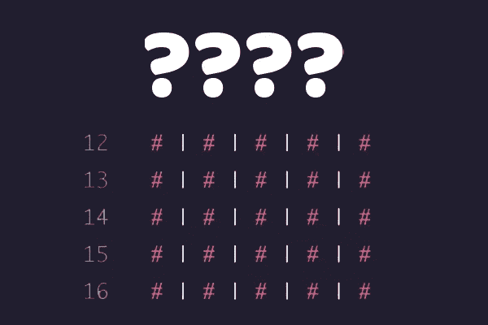

# 我一直听到的散列图是什么？

> 原文：<https://medium.com/codex/what-is-this-hash-map-thing-i-keep-hearing-about-794f4e27b980?source=collection_archive---------13----------------------->

## 哈希映射、哈希函数、碰撞和其他你可能听说过但还没有深入研究过的东西的介绍。



# 哈希映射简介

哈希映射(有时称为哈希表)是一种数据结构，通常用于以使用更多内存为代价提供更快的数据检索方式。

假设我有大量数据，我想从中找出一个值。如果我知道那段数据的确切索引，那么我可以直接查找它，但是如果我只知道我要查找的值，我可能必须查看数组的每个索引，直到我找到该值。

当我们只有一个值时，通过使用我们称之为散列函数，散列映射提供了索引样式的查找。hash 函数将您正在搜索的值转换成一个数值，然后使用该值在我们的 Hash 图中进行直接查找。

听起来很混乱，所以让我们来分析一下。

# 哈希函数

我们的散列函数将负责把我们正在寻找的值转换成散列值。例如，假设我们有一个很大的单词字典，我们正在查看某个单词是否在其中。如果是，我们将返回它的定义。

这听起来就像 Ruby 中的 Hash 或 JavaScript 中的 Object，我们将单词存储为键，将其定义存储为值，形成对。

但是，假设我们正在使用一种语言，在这种语言中，我们必须提前预定义对象的大小，或者我们可能想要比内置的对象/散列查找更快的查找时间。我们可以构建自己的哈希映射，并使用哈希函数将每个单词正确地放入映射中。

我们的哈希函数逻辑可能看起来像这样:

1.  用值 0 声明 hashCode 变量
2.  对于键中的每个字符，将当前字符代码值和 hashCode 之和加到 hashCode 上
3.  返回哈希码

让我们把它编码出来:

```
hash(key) { let hashCode = 0; for (let i = 0; i < key.length; i++) { hashCode += hashCode + key.charCodeAt(i); } return hashCode % this.hashmap.length;}
```

现在，如果我们有一个字符串“word”的关键字，我们的哈希函数将遍历该字符串，将每个字母的字符值添加到 hashCode 变量中，得到以下内容。

w = 119o = 111r = 114d=100

hashCode = 0 + 119 + 111 + 114 + 100 = 444

然后，它将返回该代码除以 hashmap 长度的余数，以确保它匹配 hashmap 中从 0 到 length 的一个索引。例如，如果上面例子中的 hashMap 有 8 个槽，我们的散列函数将返回 4，我们将把“word”的定义放在 Hash Map 的第 4 个索引中。

现在，当我们稍后查找定义时，我们的哈希函数将再次在字符串“word”上运行，并将返回查找值 4，因此我们的主 HashMap 函数将知道在索引 4 中查找定义。

我们的散列函数在存储和查找过程中都运行。

# 碰撞

现在，我敢肯定，我们的许多精明的读者刚刚说了类似“如果两个不同的单词返回相同的哈希代码会怎么样？我们的 HashMap 将如何知道返回哪个定义？”

这肯定是个问题，我们称之为碰撞。事实上，我们放入哈希表的键越多，有限的哈希表就越有可能发生冲突。有两种主要的方法来处理这个问题。

## 单独链接

第一种方法不是让我们的 Hash Map 的键引用一个值，我们可以让键引用一个链表，这个链表本身包含许多其他的值。这被称为分离链接(链表就像一个定义的长链，然后可以搜索到合适的定义)。

如果你不熟悉链表[，我在这里写了一篇关于它们的博客](/swlh/real-life-example-of-a-linked-list-8f787b660b3f)。

基本上，您要做的是将哈希表中的每个键指向一个单独的链表，然后使用您创建的链表类的查找功能来查找您需要的特定节点。这里有一个关于[的指南，一种用 JavaScript](https://www.geeksforgeeks.org/hashing-set-2-separate-chaining/) 实现的方法。

## 散列地址

处理冲突的另一种方法叫做开放式寻址。在这种方法中，如果我们到达一个已经被占用的索引，我们使用某种设置的步长间隔在另一个索引中寻找空位。例如，让我们回到“word”的例子，其中散列码是 4。如果我们将“word”添加到我们的哈希表中，而索引 4 已经满了，那么我们将跳过预定数量的空间来寻找另一个。

现在你的直觉可能会说，好吧，让我们看看下一个相邻的空间，但这并不总是最佳策略，因为它可能会导致集群。假设数字 4-6 是我们的哈希代码非常流行的返回。现在每次我们添加一个值为 4 的键时，都会遇到这样的问题。

“4 号已经满了，好吧，我们去 5 号看看。5 号也满了，好吧，我们去 6 号看看。6 也满了…7…8…9…”

现在突然一个散列码为 4 的键被存储在 10 中，现在一个索引为 10 的键也不在原来的位置了，因为其他键都在原来的位置，现在我们整个事情都乱套了。通过使步长增量为一个更大的数字，或者更好，使其基于键值(例如，步长= 3*key.length + 7)可变，我们实际上分散了位置，并减少了我们必须运行到一个完整空间然后移动我们的键的次数。[这里有一篇文章更详细地介绍了](https://www.geeksforgeeks.org/hashing-set-3-open-addressing/)开放式寻址方法中每种方法的优缺点。

# 用 JavaScript 构建散列图

```
class HashMap { constructor(size = 0) { this.hashmap = new Array(size) .fill(null); } hash(key) { let hashCode = 0; for (let i = 0; i < key.length; i++) { hashCode += hashCode + key.charCodeAt(i); } return hashCode % this.hashmap.length; } assign(key, value){ const arrayIndex = this.hash(key) this.hashmap[arrayIndex] = value } }
```

这里有一个标准的散列表，它没有解决上面的冲突问题。您可以随意使用这段代码，添加单独的链接和开放式寻址助手函数来处理冲突。使用上面的资源来实现它们，看看你更喜欢哪一个，以及在实现每一个时你会遇到什么样的挑战！