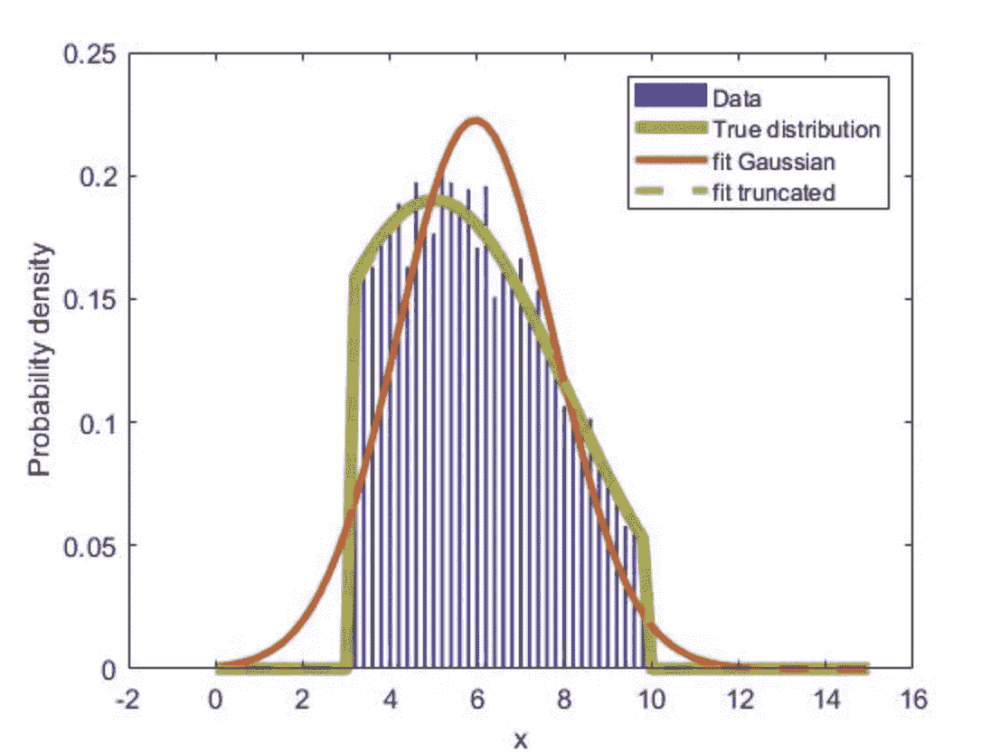

# 截断正态分布概述(含 R 代码)

> 原文：<https://medium.com/codex/what-is-truncated-normal-distribution-33541dd839cf?source=collection_archive---------1----------------------->

来源: [MathWorks](https://la.mathworks.com/matlabcentral/fileexchange/64040-fitting-a-truncated-normal-gaussian-distribution?s_tid=FX_rc2_behav)

首先，让我们看看维基百科上的定义:

> 在*概率统计中，* ***截尾正态分布*** *是由一个* [*正态分布的*](https://en.wikipedia.org/wiki/Normally_distributed) *随机变量通过从下方或上方(或两者)对随机变量进行定界而得到的概率分布。* [*截尾*](https://en.wikipedia.org/wiki/Truncated_distribution) *正态分布在统计学中有着广泛的应用*