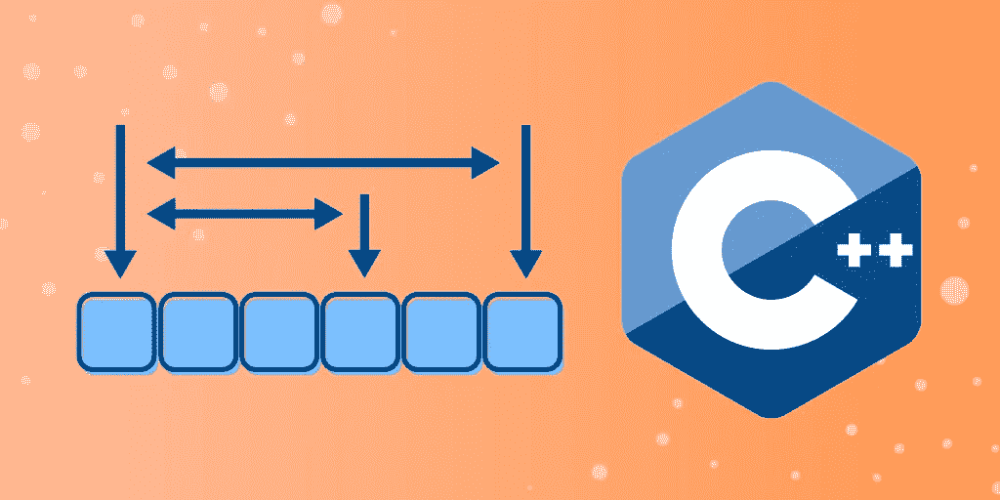

# C++中的 Vector 是什么？5 分钟后开始

> 原文：<https://medium.com/codex/what-is-vector-in-c-get-started-in-5-minutes-298c0415b6c1?source=collection_archive---------6----------------------->



C++ vector 是标准模板库(STL)中的一个模板类，作为一个更精确的数组。与数组不同，**向量可以在你插入或删除元素时自动调整大小**，所以当处理不断变化的数据时，它们非常有用。在你的 C++程序中使用向量可以让你更灵活更有效地存储数据。今天，我们将深入探讨 C++向量，并讨论它的好处、功能和初始化。

**我们将介绍**:

*   C++里的`std::vector`是什么？
*   C++向量函数
*   如何初始化一个 C++向量
*   接下来学什么

# C++里的`std::vector`是什么？

C++向量(也称为`std::vector`)是**序列容器，表示大小可以改变的数组**。它们用于处理动态数据，并且它们**为它们的元素使用连续的存储位置**。使用常规指针上的偏移量可以有效地访问元素。在内部，C++向量使用动态分配的数组来存储它们的元素。该数组可能需要重新分配，以便在插入新元素时其大小可以增长。

Vector 容器可能会分配额外的存储空间来适应潜在的增长，因此容器的容量可能会比实际存储的容量大。您可以使用库来应用不同的增长策略，以在重新分配和内存使用之间取得平衡，但是重新分配应该只发生在以对数增长的大小间隔上。这允许您在向量末尾插入单个元素时使用*摊提常数时间*复杂度。

由于 C++矢量执行自动重新分配，**它们能够以有效的方式管理存储和动态增长**。虽然它们比数组消耗更多的内存，但是它们的效率和灵活性使得使用向量是值得的。

让我们讨论一下 C++ vector 的更多好处:

*   没有最大大小，如果您事先不知道您的数据有多大，这很有帮助
*   它们的调整大小功能使得处理动态元素变得更加容易
*   由于 C++ vector 是一个模板类，您不必键入相同的代码来处理不同的数据
*   每当内存总量用完时，就会自动进行重新分配
*   您可以轻松地复制和指定其他向量

# C++向量函数

有许多与 C++向量相关的公共成员函数。让我们来看看其中的一些功能及其作用。

*   `cbegin`:返回一个指向容器中第一个元素的`const_iterator`

> ***注意*** *: A* `*const_iterator*` *是指向 const 内容的迭代器。可以像* `*vector::begin*` *返回的* `*iterator*` *一样增减，但不能用来修改它指向的内容。*

*   `cend`:返回一个指向容器中*末尾*元素的`const_iterator`
*   `crbegin`:返回一个指向容器中最后一个元素的`const_reverse_iterator`
*   `crend`:返回一个`const_reverse_iterator`，指向容器中第一个元素之前的理论元素
*   `emplace_back`:在 vector 的末尾插入一个新元素，就在当前最后一个元素之后
*   `max_size`:返回最大尺寸
*   `pop_back`:删除矢量中的最后一个元素
*   `push_back`:在矢量的末尾添加一个新元素
*   `rbegin`:返回一个*反向迭代器*，指向向量中的最后一个元素

> ***注*** *:反向迭代器向后迭代。增加一个反向迭代器会将它移向容器的开头。*

*   `rend`:返回一个*反向迭代器*，指向向量中第一个元素之前的理论元素
*   `shrink_to_fit`:请求容器减少其容量以适应其大小
*   `std::vector::end`:返回一个迭代器，引用向量容器中的*末尾*元素
*   `vector::capacity`:返回当前分配给矢量的存储空间大小
*   `vector::front`:返回对 vector 中第一个元素的引用
*   `vector::back`:返回向量的最后一个元素
*   `vector::size`:返回向量中元素的个数

> ***注意*** *:返回 vector 中保存的实际对象的数量，不一定等于其存储容量。*

*   `vector::begin`:返回指向向量中第一个元素的迭代器

# 如何初始化一个 C++向量

现在我们知道了更多关于 C++向量的基础知识和一些函数，让我们来讨论一下初始化方法。

**在 C++** 中有四种方式来初始化一个向量:

# 1.使用数组

该方法将一个数组传递给 vector 类的构造函数。传递的数组包含将填充 vector 的元素。

```
#include <iostream>
#include <vector>
using namespace std;

int main() {

  vector<int> vec{1,2,3,4,5}; 

  for (int i = 0; i < vec.size(); i++)
  {
    cout << vec[i] << " "; 
  }
  return 0; 
}
```

> ***输出*** *:* 1 2 3 4 5

# 2.一次推送一个值

使用 vector 类方法`push_back`，可以将需要填充向量的所有元素一次一个地推入向量中。

```
#include <iostream>
#include <vector>
using namespace std;

int main() {

  vector<int> vec;  

  vec.push_back(1); 
  vec.push_back(2); 
  vec.push_back(3);
  vec.push_back(4); 
  vec.push_back(5); 

  for (int i = 0; i < vec.size(); i++)
  {
    cout << vec[i] << " "; 
  }
  return 0; 
}
```

> ***输出*** *:* 1 2 3 4 5

# 3.使用 vector 类的重载构造函数

这种方法主要用于向量需要填充相同值的多个元素时(例如，如果向量需要填充十个 1)。

```
#include <iostream>
#include <vector>
using namespace std;

int main() {

  int num_of_ele = 10; 

  // the overloaded constructor takes the number of 
  // values and the value itself as parameters.
  vector<int> vec(num_of_ele, 1); 

  for (int i = 0; i < vec.size(); i++)
  {
    cout << vec[i] << " "; 
  }
  return 0; 
}
```

> ***输出*** *:* 1 1 1 1 1 1 1 1

# 4.使用已经初始化的向量

该方法将已经初始化的 vector 的`begin()`和`end()`迭代器传递给 vector 类构造函数。新向量被初始化，并由旧向量中的元素填充。

```
#include <iostream>
#include <vector>
using namespace std;

int main() {

  vector<int> vec_1{1,2,3,4,5};

  vector<int> vec_2(vec_1.begin(), vec_1.end());

  for (int i = 0; i < vec_2.size(); i++)
  {
    cout << vec_2[i] << " "; 
  }
  return 0; 
}
```

> ***输出*** *:* 1 2 3 4 5

# 接下来学什么

在你的程序中使用 C++ vectors 将允许你更灵活和有效地存储你的数据。它们是处理不断变化的数据的理想工具。现在你已经知道了更多关于向量的知识，你已经准备好学习更多的 C++概念了。

接下来推荐的一些概念包括:

*   C++模板
*   现代 C++的并发性
*   C++中的嵌入式编程
*   等等。

快乐学习！