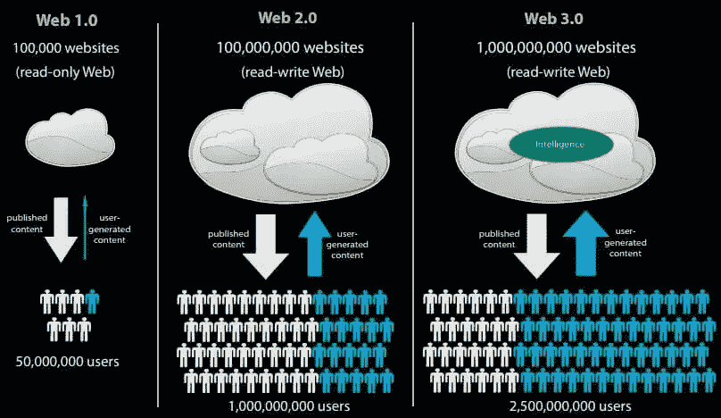
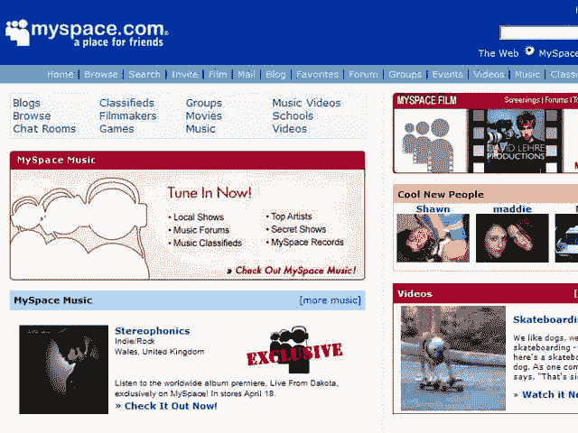
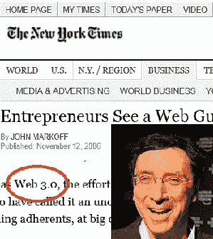
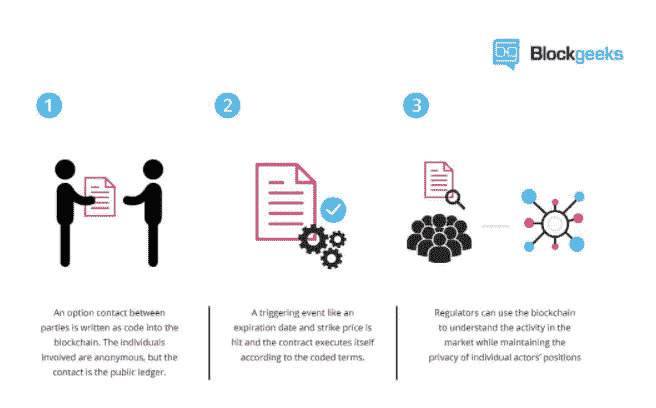
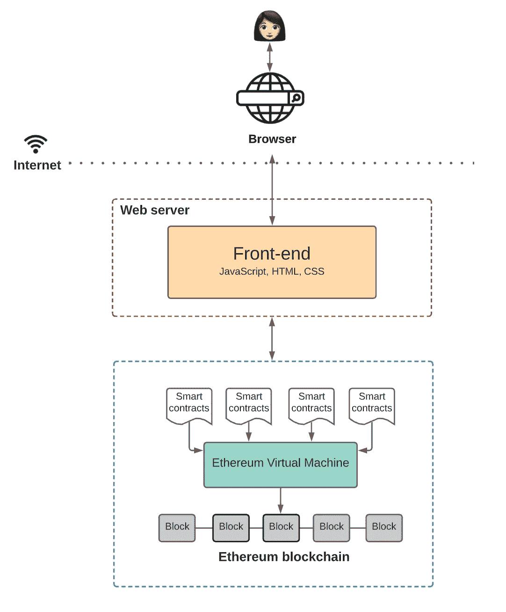
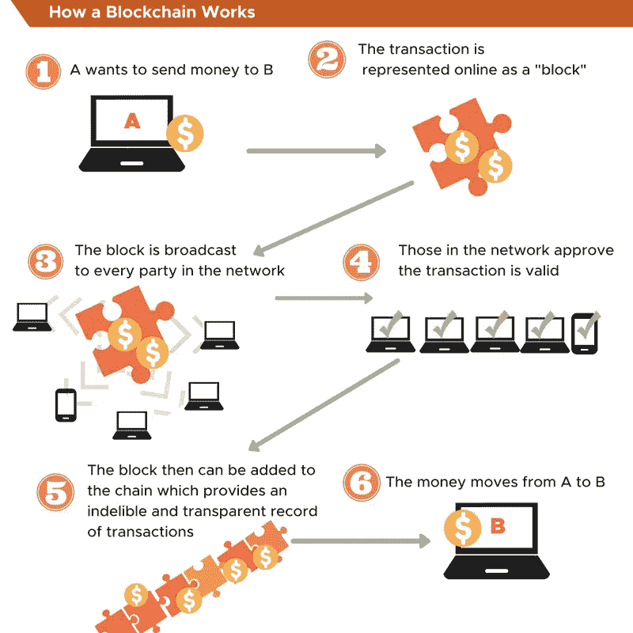
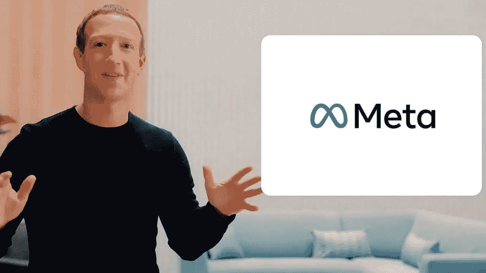

# 什么是 Web 3.0？互联网的未来

> 原文：<https://medium.com/codex/what-is-web-3-0-the-future-of-the-internet-493b9c0c3500?source=collection_archive---------0----------------------->

Pierre Borthiry 在 [Unsplash](https://unsplash.com?utm_source=medium&utm_medium=referral) 上拍摄的照片

Web 3.0 是最新的互联网技术，它利用机器学习、人工智能和区块链来实现真实世界的人类交流。锦上添花的是，web 3.0 不仅允许个人拥有他们的数据，而且他们将为他们在网络上花费的时间得到补偿。

在本文中，我们将讨论:

*   什么是 Web 3.0
*   web 1.0、web 2.0 和 web 3.0 之间的区别
*   web 3.0 的特点和重要性
*   web 3.0 与区块链的联系
*   web 3.0 将如何影响数字营销
*   互联网的未来

准备好了吗？我们开始吧！

# 什么是 Web 3.0

*Web 3.0(也称为 Web 3)是互联网的第三次迭代，它以分散的方式将数据互联，以提供更快、更个性化的用户体验。它是使用人工智能、机器学习和语义网构建的，并使用区块链安全系统来保护您的信息安全。*

去中心化、开放性和令人难以置信的用户效用是 web 3.0 的定义特征

使用语义网背后的想法是，它理解并解释数据的上下文和概念。因此，当用户搜索答案时，web 3.0 会向最终用户提供最准确、最相关的结果。

谷歌、脸书和微软等科技巨头是目前从用户数据中获取巨额利润的少数几家公司之一。但当 3.0 将使我们所有人的时间和数据得到补偿时:“人们本质上被科技公司剥削了。上当受骗，把有价值的数据给了收集数据并从中获益的公司，却很少或没有任何补偿。相反，人们应该为他们分享的数据付费

这意味着用户将能够向广告商出售他们自己的数据，同时仍然保留所有权和数据政策。此外，web3 将使网站和应用程序更有意义地使用数据，并为每个用户量身定制信息。

因此，第三代网络是一个互联网，在这里你将享受与机器和网站的个性化互动，就像你与任何其他人交流一样。

# Web 3.0 的关键特性

*   开放——它之所以“开放”,是因为它是由一个开放的、可用的开发者社区开发的开源软件制成的，并且是在公众的眼皮底下完成的。
*   无信任——网络为用户提供了公开和私下交互的自由，没有中介将他们暴露在风险中，因此没有“无信任”数据。
*   无权限—任何人，包括用户和提供商，都可以参与，而不需要获得控制组织的许可。
*   无处不在——Web 3.0 将使我们所有人在任何时间、任何地点都能使用互联网。在某个时候，互联网连接设备将不再像在 web 2.0 中那样仅限于电脑和智能手机。由于物联网(物联网)，技术将使众多新型智能设备的开发成为可能。

# Web 1.0、Web 2.0 和 Web 3.0 之间的区别

在我们深入研究 web 3.0 之前，我们需要了解我们是如何走到这一步的——通过 web 1.0 和 web 2.0。

以下是互联网的简史:

*   Web 1.0 是一个只读网站，人们可以在这里阅读写在网站上的信息。
*   Web 2.0 是一个读写网络，人们可以在网站和应用程序上读写内容。
*   Web 3.0 是一个读写互动的网络(由人工智能驱动)，人们可以在网站和应用程序上阅读、书写和互动内容，包括 3D 图形。

现在，让我们对互联网历史的每一部分多了解一点。

# 网络 1.0 (1989 年至 2005 年)

Web 1.0 始于 1989 年，一直活跃到 2005 年。

1989 年，蒂姆·伯纳斯·李爵士在欧洲核子研究中心工作时发明了万维网。

构成 web 1.0 的主要技术有:

*   超文本标记语言
*   超文本传输协议
*   统一资源定位器

web 1.0 的主要目的是查找信息。值得注意的是，网络用户不能自由互动，因为它是“只读的”，所以任何讨论都是离线进行的。

此外，因为在这个迭代期间没有可用的搜索引擎，所以在万维网(WWW)上导航远不像现在这样简单。你需要知道你想访问的任何网站的网址(URL)。正如一位科技作家回忆的那样，当年要“浏览”互联网，“我们必须一屏一屏地浏览 FTP 文件目录，希望我们想要的文件就在那里的某个地方。”

然而，到了 20 世纪 90 年代中期，Netscape Navigator 成为第一个(或至少是第一个成功的)网络浏览器，并开创了几个我们今天仍在使用的浏览器功能:

*   加载时显示网页
*   使用 Javascript 创建表单和交互式内容
*   使用 cookies 保存会话信息

唉，网景公司在众所周知的浏览器大战中被微软公司彻底打败了。

# Web 2.0 (1999 年至 2012 年)

然而，它后来在 2004 年末被蒂姆·奥莱利和戴尔·多尔蒂推广开来。

这是我们大多数人都熟悉的网络阶段。到 1999 年，人们开始能够通过社交媒体平台、内容博客和其他服务在互联网上相互交流。最终，智能手机诞生了，移动计算也推出了。

人们开始在论坛上进行在线互动，并创建其他互联网用户可以访问和喜欢、评论或分享的内容。这是 Instagram 影响者、Yelp 评论者和社交证明的时代。只读模式变得过时，web 2.0 现在被推广为交互平台。

O'Reilly 和其他人在 1999 年至 2004 年间定义的 Web 2.0 将世界从通过昂贵的服务器为信息使用而创建的静态桌面网页转移到了交互式接触和用户创建的内容。

优步、Airbnb、脸书和其他社交媒体平台等公司在 web 2.0 时代崛起。

Web 2.0 核心创新层

web 2.0 的出现主要是由三个核心创新层推动的:

*   移动的
*   社会的
*   云

移动的

2007 年推出的 iPhone 将移动连接扩展到了互联网，让用户可以随时在线。另一方面，web 2.0 服务于另一个目的，而不仅仅是简单地接收我们添加到 web 上的信息:它还自己从我们所有人那里收集数据来分析并添加到 web 上。它可以跟踪我们的行踪、购买习惯、财务活动等等。

社会的

直到 2004 年 Friendster、MySpace 和后来的脸书的到来，互联网基本上是黑暗和匿名的。

这些社交网络诱使用户参与具体的行动和内容创作，包括推荐和推荐——从说服我们在网上与特定的朋友群体分享照片，到在 Airbnb 上将我们的房子委托给陌生的旅行者，甚至和优步一起进入陌生人的汽车。

云

云使互联网网站和应用程序的创建和维护商品化了。新的云提供商在遍布世界各地的几个大规模数据中心内整合和改进了大规模生产的个人计算机硬件。

公司能够从预先购买和维护自己昂贵的专业基础设施过渡到随时租用仓库、计算能力和管理工具。数百万企业家享受着低成本资源，这些资源随着他们公司的成长而成倍增加。

不可否认，在这段时间里，互联网变得更有价值，更具参与性，更融入我们的生活。然而，这也导致了网络变得更加集中。

它通过引入新的组织和与他人联系的方式，促进了合作的增加。然而，它也为在线跟踪、网络欺凌、欺诈、散布虚假信息、身份盗窃和其他形式的在线骚扰创造了新的机会。

Web 2.0 的死亡和对 Web 3.0 的需求

最终，Web 2.0 在 2012 年底变得更加过时，人们开始意识到 web 3.0。

由于目前使用的大多数服务都被谷歌、脸书、微软和亚马逊等巨头所垄断，这引发了一些抱怨。客户对其数据使用的管理有限，这引发了对这些价值数十亿美元的公司和互联网上大量存在的众多小型企业的大量指控。

指责称，企业不公平地对待用户，利用他们的数据，并对民主和言论自由构成严重威胁。

弗朗西丝·豪根是一名数据设计师，也是一名产品经理，她揭发了脸书的不当行为。

在接受哥伦比亚广播公司采访时，她最近指责这家科技巨头无视其社交媒体平台上仇恨和虚假信息的传播:

“我在脸书一次又一次地看到，在对公众有益和对脸书有益之间存在利益冲突。而脸书一次又一次地选择优化自身利益，比如赚更多的钱。”

这就是为什么许多区块链专家认为 web 3.0 是一个更安全的版本。

# Web 3.0 (2006 年至今)

2006 年,“web 3.0”这个术语是由《纽约时报》的记者约翰·马科夫创造的:

在许多方面，web 3.0 是对 Berners-Lee 最初的语义 web 概念的回归，其中不需要中央权威机构的批准，也不存在中央控制节点。

# Web 3.0 的层次

web 2.0 主要由移动、社交和云技术的引入推动，而 web 3.0 则由三个新的技术创新层推动:

*   边缘计算
*   分散
*   人工智能和机器学习
*   区块链

1)边缘计算

虽然当前商品化的个人计算机技术在 web 2.0 的数据中心中进行了修改，但向 web 3.0 的转变正在将数据中心移出到边缘(即[边缘计算](https://www.intel.com/content/www/us/en/edge-computing/what-is-edge-computing.html))，有时甚至会直接进入我们的手中。

数据中心由分布在电话、笔记本电脑、电器、传感器和汽车上的一系列先进计算资源补充，这些资源将在 2025 年产生和消耗比 2010 年多 160 倍的数据[。](https://www.seagate.com/files/www-content/our-story/trends/files/idc-seagate-dataage-whitepaper.pdf)

2)分散数据网络

分散数据网络使各种数据生成者能够出售或交易他们的数据，而不会失去所有权、冒隐私风险或依赖中介。因此，在不断增长的“数据经济”中，分散数据网络将拥有一长串数据提供商

例如，当你使用你的电子邮件和密码登录一个应用程序时，或者当你喜欢一个视频或向 Alexa 提问时，所有这些活动都会被谷歌和脸书等科技巨头跟踪和监控，以更好地瞄准他们的广告。

然而，在 web 3.0 中，数据是分散的，这意味着用户将拥有他们的数据。分散数据网络使各种数据生成者能够出售或交易他们的数据，而不会失去所有权、冒隐私风险或依赖中介。它使您能够使用[互联网身份](https://smartcontracts.org/docs/ic-identity-guide/what-is-ic-identity.html)安全地登录互联网，而不会被跟踪。

3)人工智能和机器学习

人工智能和机器学习算法已经发展到可以做出有价值的、有时甚至是挽救生命的预测和行动。

当建立在新兴的分散数据结构之上时，这些数据结构提供了对当今技术巨头所期望的大量数据的访问，可能的应用远远超出了定向广告的范围，进入了以下领域:

*   精密材料
*   药物创造
*   气候模拟

虽然 web 2.0 有类似的功能，但它仍然主要以人为基础，允许腐败行为，如有偏见的产品评估，操纵评级，人为错误等。

例如，Trustpilot 等互联网评论服务允许客户对任何产品或服务留下反馈。不幸的是，一家公司可能会付钱给一大群人为其产品或服务撰写优秀的评价。

因此，为了提供准确的数据，互联网需要人工智能学习如何区分真假。

4)区块链

简单来说，区块链是 web 3.0 背后的又一层技术。更具体地说，区块链是 web3 的基础，因为它重新定义了语义网后端的数据结构。

区块链是一个去中心化的状态机，部署智能合约。这些智能合约定义了 web 3.0 应用程序的逻辑。因此，任何希望构建区块链应用程序的人都需要将他们的应用程序代码部署在共享状态机上。(下面将详细介绍 web 3.0 和区块链。)

# Web 3.0 是如何工作的？

web 3.0 背后的想法是使互联网上的搜索更快、更容易、更有效，甚至可以立即处理复杂的搜索句子。

在 web 2.0 应用程序中，用户必须与其前端交互，前端与后端通信，后端进一步与数据库通信。全部代码都存放在中央服务器上，通过互联网浏览器发送给用户。

Web 3.0 既没有存储应用程序状态的集中式数据库，也没有后端逻辑所在的集中式 Web 服务器。取而代之的是区块链，在分散的状态机上构建应用程序，并由网络上的匿名节点维护。

您的应用程序的逻辑在智能契约中定义，由开发人员编写，部署在分散的状态机上:

任何愿意构建区块链应用程序的人都可以在这个共享状态机上部署他们的代码。前端几乎和 web 2.0 中的一样。

下图描述了 web 3.0 应用程序的工作方式:

# Web 3.0 架构

构成 web 3.0 的架构主要有四个要素:

*   以太坊区块链——这些是全球可访问的状态机，由点对点节点网络维护。世界上任何人都可以访问状态机并向其写入数据。本质上，它不属于任何一个实体，而是由网络中的每个人共同拥有。用户可以写入以太坊区块链，但永远无法更新现有数据。
*   智能合约——这些是在以太坊区块链上运行的程序。这些由应用程序开发人员用高级语言编写，如 Solidity 或 Vyper，以定义状态变化背后的逻辑。
*   以太坊虚拟机(EVM)——这些机器的目的是执行智能合约中定义的逻辑。它们处理状态机上发生的状态变化。
*   前端——像任何其他应用程序一样，前端定义 UI 逻辑。然而，它还与定义应用程序逻辑的智能合约相连接。

# Web 3.0 的优势

Web 3.0 将使网络更加智能、安全和透明，从而带来更高效的浏览和有效的人机交互。

以下是语义网或 web 3.0 的主要优势:

# 1)数据隐私和控制

最终用户将获得数据加密的最大优势，以保护他们的信息不被泄露。

这种加密在任何情况下都是无法破解的。它将防止像谷歌和苹果这样的大型组织出于自身利益控制或使用人们的个人信息。

因此，用户将获得其信息的完全所有权和隐私。

# 2)无缝服务

分散的数据存储将确保用户在任何情况下都可以访问数据。用户将获得多个备份，即使在服务器出现故障的情况下也能从中受益。

此外，任何实体或政府组织都没有能力停止任何服务或网站。因此，帐户暂停和拒绝分布式服务的可能性将会降低。

# 3)透明度

无论最终用户使用哪个区块链平台，他们都将跟踪他们的数据并检查平台背后的代码。

非营利组织开发了大多数区块链平台，这意味着他们提供了一个开源的区块链平台，允许开放的设计和开发流程。这将有助于消除用户对开发平台的组织的依赖。

# 4)开放数据访问

可以从任何地方、任何设备访问这些数据。这个想法是通过允许智能手机和其他连接设备在同步的情况下访问计算机上的数据，来增加数据收集及其对全球用户的可访问性。

Web 3.0 将进一步扩大互动的规模，从无缝支付到更丰富的信息流，再到可信的数据传输。这将会发生，因为 web3 将使我们能够与任何机器互动，而不需要通过收费的中间人。

# 5)无限制平台

由于区块链网络对所有人开放，用户可以创建自己的地址或与网络互动。

用户不能因其性别、收入、地理位置或社会因素而被限制使用该网络。这一功能将使用户更容易将他们的资产或财富转移到世界任何地方。

# 6)单一轮廓创建

有了 web 3.0，用户不需要为不同的平台创建个人资料。一个单独的概要文件可以在任何平台上工作，用户可以完全拥有任何给定的信息。

没有用户的许可，任何公司都不能访问他们的数据或验证其准确性。然而，用户可以选择分享他们的个人资料，并向广告商或品牌出售他们的数据。

# 7)增强的数据处理

Web 3.0 有利于解决问题和密集的知识创造任务。它利用人工智能从海量的[数据](https://www.singlegrain.com/artificial-intelligence/the-future-of-data-science-predictive-modeling/)中筛选出有价值的信息。

用户还将受益于其进行客户需求预测和个性化客户服务的能力，这是繁荣企业所必需的。

# Web 3.0 的缺点

web 3.0 的实施也带来了一些挑战。个人数据管理和声誉管理问题将变得比以往更加重要。

以下是与 web3 的实施和使用相关的主要挑战:

# 1)需要先进的设备

不太先进的计算机将没有能力提供 web 3.0 的好处。这些设备的功能和特点需要扩展，以使全球更多的人能够使用这项技术。考虑到目前的情况，只有有限数量的人能够访问 web 3.0。

# 2) Web 1.0 网站将会过时

如果 web 3.0 在互联网上变得成熟，任何基于 web 1.0 技术的网站都将被淘汰。旧技术无法更新其功能以适应新技术。这意味着这些网站将会更加过时，从而失去相对于新网站的竞争优势。

# 3)尚未准备好被广泛采用

Web3 技术更加智能、高效和易用。然而，这项技术还没有完全准备好被广泛采用。为了满足用户的需求，在技术进步、隐私法和数据使用方面还需要做很多工作。

# 4)对声誉管理的需求将会增加

随着 web 3.0 用户信息的易获得性和更少的匿名性，信誉管理将变得比以往任何时候都更受关注。换句话说，品牌和公司需要在网上维护他们的名字、声誉和形象。

公司将需要帮助客户获得关键的市场情报、有价值的商业见解、引人注目的内容和尖端的互联网营销，以保持领先于竞争对手。因此，声誉管理将变得比以往任何时候都更加重要。

# 5)复杂的功能

对于任何新用户来说，Web 3.0 都是一项难以理解的技术，这使得他们在使用它时犹豫不决。它是老一代网络工具与尖端技术(如人工智能和区块链)的结合，也是用户之间的互联和互联网使用量的增加。

这将意味着只有先进的设备才能处理 web 3.0，这使得任何买不起这种设备的个人或企业都很困难。因为技术上健全的用户将从这项技术中获益最多，所以 web 3.0 的复杂性很可能会减缓它在全球范围内的普及。

# 为什么 Web 3.0 对未来很重要

Web 3.0 是为用户设计的系统*，由*用户以创造者驱动平台的形式设计*。*

以下是 web3 在未来几年变得重要的主要原因:

*   减少对集中式存储库的依赖:Web 3.0 将试图使互联网成为一个多样化的来源，从而避免黑客、泄密和对集中式存储库的依赖。利用可验证的数据稀缺性和标记化的数字资产，用户将有可能拥有自己的数据和数字足迹。任何平台都不会对数据使用负责。
*   更个性化的交互:Web 3.0 将在 2022 年变得越来越重要，因为大多数用户继续优先考虑定制和个性化的 Web 浏览体验。
*   由人工智能驱动的更好的搜索助手:对人性化的数字搜索助手的需求将会越来越多，这些助手将更加智能、普及，并由语义、区块链和人工智能驱动。
*   减少对中介的依赖:这将有助于去中介化业务，消除寻租中介，并将这一价值直接给予网络中的客户和提供商。网络用户将通过这些新的分散智能结构的相互所有权和治理，共同解决以前难以控制的问题。
*   点对点连接的增加:通过新的互联网发明，成员和组织之间的连接将保持内在的强大，以符合更具适应性的点对点互动和治理。通过点对点连接，人类、企业和机器将能够共享更多数据，同时保持更高的隐私和安全性。
*   增强信任:有了下一代互联网的知识，我们可以减少对个体平台的依赖，开展面向未来的创业和投资活动。

# 现实生活中 Web 3.0 的例子

Web 3.0 已经在多个领域实现，包括虚拟辅助、教育、社交网络、消息传递、交换服务、浏览等。

例如，当你坐在办公室时，如果你想查看家里的食品供应情况，你可以让你的数字助理通过与你家里的互联智能设备通信来检查你冰箱里的东西。

此外，您可以在家中使用无处不在的互联网连接设备来组织您的假期计划、商务旅行、周末聚会、家务，甚至确保您的家庭安全。虚拟助理的个性化建议可以帮助您安排完美的周末，从预订打折机票到寻找令人兴奋的地方，再到预订酒店。

# Web 3.0 应用程序的示例

以下是一些流行的 web 3.0 应用程序示例，解释了其采用范围:

苹果的 Siri

Siri 是作为 web 3.0 关键组件的语音识别软件的一个完美例子。使用这项技术，Siri 和其他个人助理可以进行通信，共享信息(通过链接块)，并为用户提供更有帮助的搜索结果，包括如何、为什么和做什么。以前，Siri 只能通过使用预编程的算法来完成简单的任务，比如提醒和指引当地杂货店的方向。

沃尔夫拉姆阿尔法

[Wolfram Alpha](https://www.wolframalpha.com/) 是一个计算智能平台，现在使用 web3。该平台可以计算用户在数学、营养和科学等不同领域的答案。它可以快速连接其他应用程序，从它们的数据库中收集信息，并为最终用户简化信息。因此，与 web 2.0 相比，它现在速度更快，提供的结果也更准确。Siri 是 Wolfram Alpha 的常客。

斯蒂米特

[Steemit](https://steemit.com/login.html) 是 web 3.0 社交网络网站的一个很好的例子。它是一个去中心化的奖励平台，完全基于 Steem 区块链社交媒体模型运行。它向在网站上贡献内容的内容创作者或博客作者奖励加密货币。这正是 web3 变得至关重要的地方，因为它有助于平台在安全的环境中奖励贡献者的加密货币。

索拉

web 3.0 社交网络网站的另一个例子是 [Sola](https://sola.network/) 。这是一个分散的社交平台，由分布式节点、IPFS 和以太坊区块链提供支持。

与 Steemit 不同，Sola 利用区块链人工智能来建立社交网络和媒体混合。它激励并惠及所有相关方，包括用户、第三方开发者和病毒内容的核心团队。

该网站使用人工智能算法来过滤好的内容，并不仅仅依靠用户的反应来传播帖子。此外，Sola 向用户支付其内部虚拟货币，即所谓的行动点，用户可以将其用于自己的内容或为其他用户的内容背书。

IDEX

[IDEX](https://idex.io/) 是一个著名的分散式交易所，交易基于 web 3.0 的 ERC-20 代币。由于 IDEX 是一个基于以太坊的交易所，用户需要一个以太坊钱包在平台上交易。此外，他们需要使用 MetaMask(一种用于与以太坊区块链互动的加密货币钱包)来获得 IDEX 的最佳体验。

电子聊天

[e-Chat](https://echat.one/) 是一款 web 3.0 应用，由去中心化的区块链提供支持。本质上，它是一个安全的信使，但它也被称为发展最快的社交网络。用户可以分享任何数据，而不必担心数据被盗。所以广泛用于发送加密货币。App Store 和 Play Market 为他们的用户提供了一款电子聊天应用。

斯托尔杰

分散存储是 web3 的主要特性之一，Storj 明智地利用了这一特性。它是最古老和领先的分散存储解决方案之一，由区块链技术提供支持，允许用户租用他们的免费磁盘空间。

Storj 有一个本地令牌，用作网络上的支付方式。用户可以根据平台上租赁者支付的共享磁盘空间来赚取。交易是通过区块链科技在这个平台上进行的。

Everledger

[Everledger](https://everledger.io/) 是基于 web 3.0 的保险和银行业务的一个例子。这种分布式数字全球注册旨在允许用户以数字方式存储其数据，并在方便时随时访问，同时确保其数据安全。由于 web 3.0 具有数据加密功能，Everledger 可以保护数据，并将用户、银行、开放市场和保险公司的欺诈风险降至最低。

LBRY

LBRY 是一个 web 3.0 视频和音乐网站，拥有不同形式的内容库，如书籍、音乐和视频。分散式数字图书馆使用区块链技术发布资料，并通过其集成支付系统将其货币化。

Ethlance

[Ethlance](https://ethlance.com/) 是一个 web 3.0 远程工作平台。分散式应用程序运行在以太坊区块链之上，在那里任何人都可以雇佣并开始工作，以换取以太加密货币，这在旧技术中是不可能的。

# Web 3.0 和区块链

区块链经常与 web 3.0 联系在一起，很难理解它们是相同还是不同。

简单来说，区块链是 web 3.0 背后的技术(以及物联网和人工智能等其他技术)。更具体地说，区块链是 web3 的基础，因为它重新定义了语义网后端的数据结构。

区块链，也叫[以太坊区块链](https://www.investopedia.com/terms/e/ethereum.asp#:~:text=Ethereum%20is%20a%20blockchain%20platform,for%20verifying%20and%20recording%20transactions.&text=Ethereum%20users%20pay%20fees%20to%20use%20dApps.)，是一个去中心化的状态机，部署智能合约。这些智能合约定义了 web 3.0 应用程序的逻辑。因此，任何希望构建区块链应用程序的人都需要将他们的应用程序代码部署在共享状态机上。

所有的应用程序数据和代码都在区块链上存储和管理，由节点的对等网络集体拥有和维护。网络中对等体之间的协议规则决定了状态机或[区块链](https://www.singlegrain.com/blockchain/blockchain-explained/)上的状态变化:

这里的所有数据都是全局可访问的，但是现有数据不能编辑或更改。用户可以用一种受复制保护的方式发送文件，从而实现真正的 P2P 交易，而不需要中介。这意味着文件和数据在共享前被加密，在 web 3.0 上完全安全。

当用户与 web 3.0 应用程序交互时，它利用人工智能和机器语言/自然语言处理来处理查询，并直接从世界任何地方都可访问的区块链带来所需的数据或信息。

# Web 3.0 和数字营销

以下是 web 3.0 将对数字营销产生影响的一些方式:

*   更少关注关键词:在 web 3.0 中，对关键词优化的关注会更少。营销人员必须创造理解用户需求和疑问的多媒体内容，而不是关注关键词。
*   减少“我附近”的查询:因为人们知道搜索结果会自动与他们的位置相关，所以“我附近”的查询会大幅减少[。因此，他们不再在搜索中添加“我附近”或邮政编码。Web 3.0 自动考虑用户的地理位置和行为数据，并显示符合其兴趣的相关结果。](https://www.thinkwithgoogle.com/marketing-strategies/app-and-mobile/local-search-mobile-search-micro-moments/)
*   语音搜索的增加:Web 3.0 将导致语音搜索的增加，人们将开始更多地使用数字助理。因此，关键是针对更具体的长尾查询进行优化。
*   微数据和模式更重要:理解数据在 web 3.0 中更重要。所有的营销人员都应该接受微数据和模式标记，以便在游戏中保持领先，因为它们有助于 web3 应用程序理解概念和上下文，并组织数据。有了清晰的理解，就能保证你的内容展示给用户进行相关查询。
*   问题关键词优化、特色片段优化和 PAA(人也问)部分的增长:Web 3.0 将增加问题关键词优化、特色片段优化和 PAA 优化。营销人员必须制作准确回答用户问题的内容。
*   超个性化体验的兴起:Web 3.0 也将取代旧的静态网站，代之以超个性化的体验，为每个访问者改变他们的信息和媒体格式。用自然语言与搜索引擎交流并找到准确的信息提供了无缝的用户体验；web 3.0 的学习和思考能力将为用户强调这种丰富的体验。

# Web 3.0 和元宇宙

自从脸书最近宣布了它的新名字[【梅塔】](https://www.youtube.com/watch?v=gElfIo6uw4g&ab_channel=CNET)后，元宇宙就成了一个时髦词。这个想法是为了展示该公司正在快速迈向元宇宙。然而，元宇宙仍然不是现实，但很快可能是互联网的下一次演变。

元宇宙通常指共享的虚拟世界环境或计算机生成的环境，用户可以通过互联网访问这些环境。这是一个数字空间，通过使用“扩展现实”，即增强、虚拟和混合现实的结合，设计得更加逼真。

目前，人们通过社交媒体平台或使用消息应用程序进行互动。在虚拟空间中，用户将拥有自己的“角色”，可以四处走动并与其他用户互动。他们可以通过化身、文本消息、声音、音乐视频、视频游戏等相互交流。

这意味着人们将在互联网上获得 3D 体验。他们可以在数字环境中互动、游戏、工作或参与，就好像他们在现实中体验一样，而不仅仅是观看内容。

web 3 的作用。0 对实现元宇宙至关重要，特别是如果它使用区块链技术的话。换句话说，web3 将使虚拟世界在线存在，并可通过网络浏览器访问。

目前，元宇宙更多地与虚拟游戏联系在一起，但这不仅限于游戏。web 3.0 元宇宙的范围更广，还包括教育行业。例如，在教育元宇宙中，用户可以进入沉浸式教室，与他们的老师和其他学生互动。

在未来，web 3.0 和元宇宙将一起在社会的各个方面扩散。

# 关于 Web 3.0 的最终想法

我们正在走向一个互联网，在那里人们将完全控制他们的数据和隐私，并允许公司使用(或不使用)他们的数据。所有这些都将由区块链提供动力。

因此，web 3.0 将加速诚实和透明地使用用户数据，从个性化搜索结果到跨平台开发工具和 3D 图形的使用。网络将变得更具沉浸感和互动性。

新的互联网即将到来！让我们张开双臂拥抱 web 3.0。