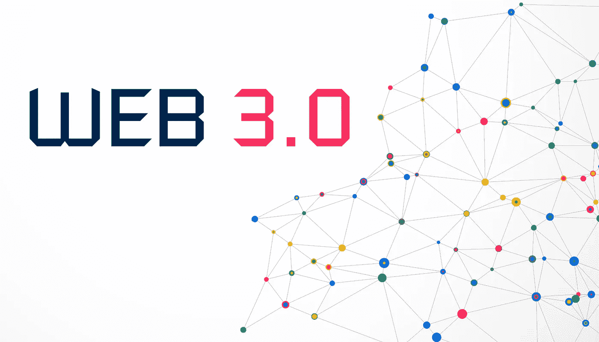

# 什么是 Web 3.0？—您的终极指南

> 原文：<https://medium.com/codex/what-is-web-3-0-your-ultimate-guide-dbac5dc69920?source=collection_archive---------7----------------------->

我们目前正在过渡到一个数字世界，在这个世界里，区块链将变得非常重要。人类的数字之旅从 Web 1.0 开始，然后我们过渡到 Web 2.0，现在 3.0 的时代即将到来。在这篇文章中，我将讲述所有关于 Web 3.0 的内容，什么是已知的，我们能期待什么，以及我们什么时候能期待它！

Web 3.0:互联网的未来

# 背景