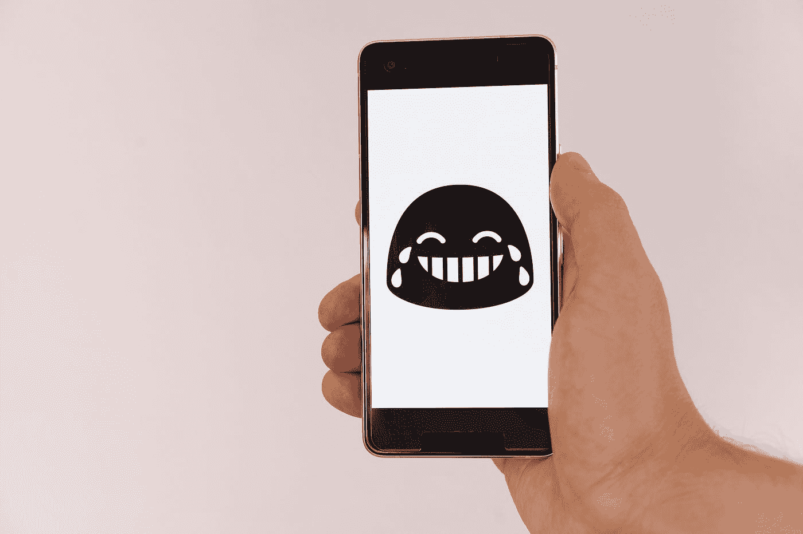

# 和一个讽刺的人工智能说话是什么感觉。

> 原文：<https://medium.com/codex/what-its-like-talking-to-a-sarcastic-a-i-38d2f66b5954?source=collection_archive---------2----------------------->

马库斯·温克勒在 [Unsplash](https://unsplash.com?utm_source=medium&utm_medium=referral) 上的照片

认识一下[马尔夫](https://beta.openai.com/examples/default-marv-sarcastic-chat)，这个讽刺的人工智能聊天机器人接受你的信息或问题，并像真人一样“说话”。我和这个聊天机器人的对话混合了机智、睿智和危险的黑暗。

不像 Siri、谷歌或 Alexa，它们的回答听起来有点太正式了，Marv 以一种不可思议的方式说话。它类似于[西姆西米](https://simsimi.com/)，但是是类固醇。