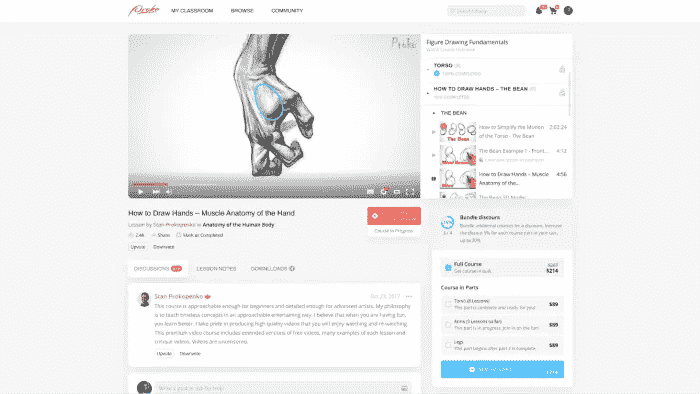
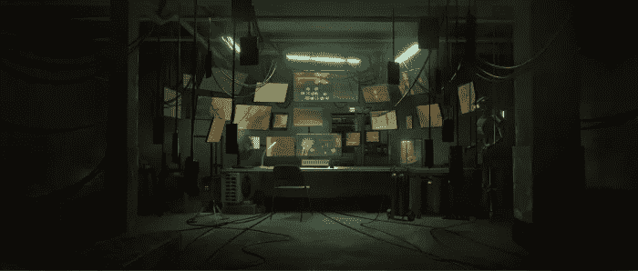

# 什么是好的代码——采访后端开发人员

> 原文：<https://medium.com/codex/what-makes-a-good-code-interview-with-a-back-end-developer-da015a874775?source=collection_archive---------7----------------------->

## 拥有 25 年以上经验的专家的日常生活

插图由克劳德兹，细节

后端开发者是做什么的？用瑞士表的例子更容易解释。如果瑞士表是一个网络平台或网络应用，那么 UI/UX 和前端就是它的设计。但这种手表之所以受欢迎，不仅仅是因为它们通过奢华的外观来代表你的地位。瑞士手表的机械装置最可靠。它们从不断裂。数字项目中的后端开发人员是一个创建和设计可靠机制的人，这样网站才能完美地运行。

对这个术语的“官方”解释是，后端或后端开发人员负责网站或 web 应用程序的内部和计算逻辑，以及其他软件和信息系统。

因为 Shakuro 专门做复杂大型的[项目](https://shakuro.com/works/)，我们当然有自己的后端开发部门。他们的主要工具是 T2 的 Ruby on Rails。

我们采访了我们的一位后端开发人员，他是一位拥有超过 25 年 IT 经验的专业人士，来了解您需要了解的关于全球数字机构后端的一切。

# —编程是艺术、手艺还是工程？

你所说的一切。编程是一门艺术，因为对于受过训练的人来说，好的代码看起来很有美感。它是一门手艺，因为报酬丰厚；它是一门工程，因为编程遵循严格的规则，每个 web 项目都有一个架构。

# —你的团队最让你自豪的是什么？

当然是我们的知识库。这些年来，我们积累了很多经验。正反。把这些都写下来并不丢人。所以我们有。我们创建了一个晦涩难懂的最佳实践库，其中包含图片、注释和代码，以及独特特性和功能的示例。

知识库有两个目的:为我们的[客户](https://shakuro.com/testimonials)节省时间和金钱，并且创造某种统一性，或者统一性，如果你喜欢的话。知识库使得执行不同的项目变得更加容易。我们得到的数字产品涉及的不是 10 个、100 个，而是 1 000 个、10 000 个文件……每次从头开始编码都很难处理。我们在很大程度上保持着创造性，但是在图书馆的帮助下使我们的工作更“正式”在我们的期限很紧的环境中是必不可少的。

# —后端开发人员有没有和设计师沟通？

是的，当然。我们不仅仅是除了代码什么都不做的“锤子和钉子”。我们也关心‌about 美学。有时候，设计师设计的模型中的现成元素被证明太过繁琐而无法实现。在这种情况下，我们[与 UI/UX 团队](https://shakuro.com/blog/meaningful-client-communication-in-agile-projects)沟通，向他们解释实体模型的困难，这样他们就能以一种可以工作的方式改变一些东西。然而，这种情况现在发生在‌rarely。有经验的设计师知道如何创造高效的[概念](https://shakuro.com/works)。

# —描述你一周做了什么。

该团队每天都有晨会，我们在会上讨论当前的项目并计划一天的工作。我们同步我们的进展，讨论问题，并对任务进行优先排序。会议通常涉及前端开发人员、项目经理和设计师。我们为每一个电话写行动项目:它们包括信息图、图片、评论。

之后呢？辛苦了。在周末，也就是周五，我们会组织“快乐时光电话”。

# — Shakuro 是一家使用敏捷开发系统的外包公司。它如何反映在你的工作上？

我认为敏捷开发[原则](https://shakuro.com/blog/10-principles-of-our-development-process)对于后端开发非常有用。敏捷开发中的一个常见实践是我们的一些团队成员进行代码审查。这样做有很多好处:

*   早期调试。
*   代码由公司保管。
*   我们可以互相学习。
*   团队合作被带到了另一个层次。
*   "真理在讨论中萌芽."

# —敏捷开发中的“快乐时光”是什么？

Shakuro 的每个开发部门都有自己的“快乐时光”:包括前端和移动开发人员。每个小组单独开会，讨论这一周有什么问题，他们了解到什么有趣的技术趋势和新闻。这通常是一场轻松的演讲，但是经常有准备过度的人……比如我，会在演讲的同时展示演示文稿。

我们分享‌we 认为重要的东西，激发我们对技术的兴趣。这对缓解疲劳很有帮助。“快乐时光”的存在是为了打破‌monotonous 的工作循环。

# —开发者害怕改变吗？

我不会这么说。有时候，情况恰恰相反:当我们发现一种构建网络平台或网络应用的新方法时，例如，我们可以使用一个新的库，立即就会有尝试的冲动。经验告诉我们这并不总是健康的。尝试新事物需要更多的时间和考虑。在讨论风险之前，我们从不做实验。这是一项艰苦的工作，在创造力和正式的实体流程之间取得平衡。然而，即使你做同样的事情第 100 次，它仍然没有抱怨，你对你的工作感觉良好。

# —你最近尝试了哪些新事物？

Proko 网络平台

通过 Proko，一个[电子学习网络平台](https://shakuro.com/works/proko)，我们实现了在线流媒体教室。有点像私人不和。教师可以在 web 平台内部组织视频通话，添加学生和其他管理员，并与屏幕进行交互，添加文本、视频和图片。它就像一台私人电视，但能够在 YouTube、Twitch、脸书等网站上播放你的课程。这项技术仍然是新的，所以它会造成压力，因为不是所有的东西都能马上正常工作。99%的人不做我们做的事情，这种感觉让压力得到了回报。

# —什么是好的代码？

好的代码有三个坚实的特征:你能容易地阅读它，理解它，并增强它。专业的开发人员记得代码的主要受众不是计算机，而是另一个人。我们的后端部门旨在编写长期服务于企业的代码。好的代码可以作为未来增强的基础被重用。

因此，阅读、理解、维护和增强代码的能力使它变得很好。

# 最后

作者声明:Nino Bedijn，

为了在当前不断变化的形势下生存和盈利，企业所有者必须接受新的方法来控制成本和提高业务效率。公司必须重新思考他们的业务，投资于适应性和弹性。选择一家拥有[专业后端部门](https://shakuro.com/web-dev)的外包机构是一件明智的事情。

[作者阿列克谢·古列耶夫&丽塔·恩威作者 ](https://shakuro.com/blog/interview-with-a-back-end-developer-what-makes-a-good-code)