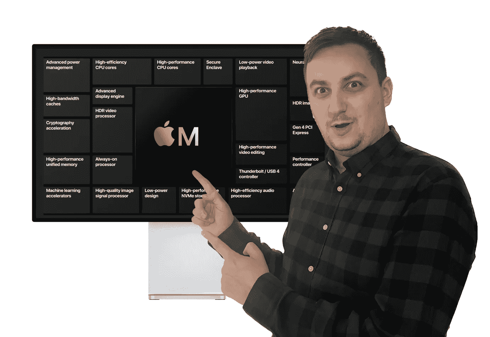

# 是什么让苹果芯片优于竞争对手？

> 原文：<https://medium.com/codex/what-makes-apple-silicon-better-than-the-competition-3bb2a7b4a0f2?source=collection_archive---------1----------------------->

## 这不仅仅是核心数量和时钟速度的问题。附加的其他计算单元也是必要的。

苹果芯片的未来——图片由雅各布·吉拉克提供

通过从英特尔处理器转向自己的苹果硅芯片，苹果已经启动了整个 Mac 类别。他们几乎在各个方面都有所改进。随着新时代的到来…