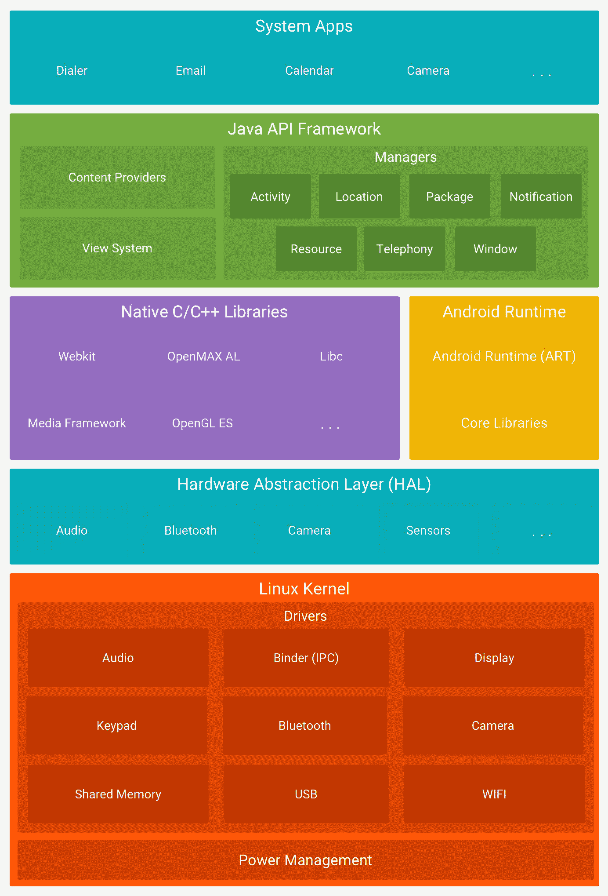

# TinyML 与普通 ML 相比有何独特之处？

> 原文：<https://medium.com/codex/what-makes-tinyml-unique-compared-to-regular-ml-419c455a757d?source=collection_archive---------8----------------------->

## 创建和部署 TinyML 模型带来的挑战和解决方案

照片由 [Unsplash](https://unsplash.com?utm_source=medium&utm_medium=referral) 上的 [Niclas Illg](https://unsplash.com/@nicklbaert?utm_source=medium&utm_medium=referral)

在[这篇](/codex/tinyml-is-the-most-underrated-field-in-machine-learning-and-this-is-why-7076aed78b4f)文章中，我们已经了解到 TinyML 是嵌入式系统和常规 ML 的交集。它基本上在嵌入式系统上实现了 ML。

这两个方面，嵌入式系统，机器学习，都让我们在 TinyML 上面临一些挑战。在这篇博文中，我们将详细探讨这些问题，并看看如何解决它们。

> TinyML 应用程序的独特之处是什么？当我们创建第一个 TinyML 应用程序时会面临哪些挑战？

TinyML 与普通 ML 相比有何独特之处？挑战和解决方案

# 嵌入式系统

因此，与任何系统一样，嵌入式系统就像一台普通的计算机。
它由硬件和软件等组件组成。这两点对于理解一个嵌入式系统，了解我们如何在其上部署 TinyML，或者在其上部署 TinyML 我们需要做哪些不同的事情，都是至关重要的。

# 五金器具

通常，对于任何类型的计算系统，硬件都由 3 个基本构件组成:

*   计算机:系统的“大脑”，你在那里进行处理
*   **内存:**暂时存储数据
*   **存储:**永久硬盘，断电时仍能记住您的数据

正如我们在[这篇](/codex/tinyml-is-the-most-underrated-field-in-machine-learning-and-this-is-why-7076aed78b4f)文章中已经了解到的，TinyML 运行在微控制器上，而不是像你笔记本电脑上那样的微处理器上。笔记本电脑上的微处理器与一系列不同的系统组件相连接。这只是一个更大难题的一部分。要拥有一个功能性的计算系统，你需要有一个单独的内存单元和一个单独的存储单元。而对于微控制器，它已经是集成的了。这意味着处理器、内存和存储器耦合在一起。这是一个整体。

还有另一个不同之处:微处理器是笔记本电脑或平板电脑等通用计算系统的核心，你可以在上面执行各种完全不同的任务。相比之下，微控制器是嵌入式系统的心脏，它通常是为固定功能的任务而设计的，如在 MP3 播放器上播放音乐或接听电话。因此，微控制器的功能通常都是预先设定好的。
加上，在功率、存储大小等方面也有很大的差异。我在[这个](/codex/tinyml-is-the-most-underrated-field-in-machine-learning-and-this-is-why-7076aed78b4f)帖子里详细提到过。

# 软件

在嵌入式系统的软件方面，我们也有两个区别 TinyML 和常规 ML 的主要区别，操作系统和代码可移植性。

## 操作系统

笔记本电脑、台式机或服务器的操作系统通常是 Microsoft Windows、Mac 或 Linux 操作系统。而智能手机，则是苹果 iOS 或者安卓。

那么，这些运行在大多数设备上的操作系统有什么好处呢？操作系统及其相关部分就像房子的地基。基础扎实的话，可以建底层。在第一层的顶部，您可以建造第一层、第二层等等。你有很大的灵活性，因为你有正确的基础。

安卓操作系统架构([来源](https://developer.android.com/guide/platform/images/android-stack_2x.png))

在这里我向你展示一个 Android 操作系统的平台架构。因为它已经有了合适的部分，所以您可以构建库的高级抽象并将它们堆叠在上面。
为什么这很重要？因为如果你提供了正确的抽象层次，那么你就可以让应用开发者能够写出非常有趣的应用。
现在，在嵌入式系统中，这是我认为世界有点分崩离析的地方，因为没有那么多操作系统可以说。
嵌入式系统不是通用系统，但通常设计用于执行一项任务。有适用于嵌入式设备的操作系统，如 FreeRTOS 和 Arm Mbed OS。但通常情况下，它们不会被安装，因为在嵌入式系统上添加任何类型的额外堆栈都会占用资源。在嵌入式设备上使用操作系统会占用几千字节的内存，这意味着留给应用程序的空间更少。

## 轻便

所有微处理器内部都有一个专门的单元来运行浮点算术运算，这意味着任何使用浮点数的代码都可以从一个系统移植到另一个系统。你不必担心你的代码是否会在不同的微处理器上运行，因为所有的微处理器都配备了这个单元。浮点数的这种通用代码可移植性对于嵌入式设备来说是不存在的。

这就提出了一个问题:如果平台可移植性较低，我们如何在这些差异巨大的嵌入式系统上统一启用 TinyML？因为为不同的设备修改和实现代码需要大量的时间和成本。这是一个严峻的挑战。

照片由 [Lucas Santos](https://unsplash.com/@_staticvoid?utm_source=medium&utm_medium=referral) 在 [Unsplash](https://unsplash.com?utm_source=medium&utm_medium=referral) 上拍摄

# 机器学习

现在，我们来看 TinyML 的另一半:机器学习。

## 模型尺寸

也许你听说过 Google 著名的 ML 网络 MobileNetV2，它是专门为运行在移动设备上而设计的。虽然它只有几兆字节，但它不能在嵌入式设备上使用，因为微控制器只有几千字节的内存。因此，我们的目标是缩小或压缩我们通常在常规设备上使用的 ML 模型，而不丧失其从根本上寻找数据模式的能力。有三种主要技术可以实现这一点:

## 1.修剪

有两种方法可以使用修剪来缩小网络:

*   **修剪突触:**去除神经元之间的连接
*   **修剪神经元:**从模型中移除神经元

这两种方法都减少了所需的计算量，从而缩小了网络的规模。

## 2.量化

量化意味着将值离散化为一个很小的值子集。
例如，int 从负 128 到 127，这允许表示 256 个值。因此，使用 int(8)而不是 float(32)可能会导致丢失一些本来会用浮点值表示的值。然而，一个浮点值需要四个字节来表示，而一个整型值只需要一个字节。这意味着该模型只需通过量化就能减少 4 倍。因此，这是一种非常有效的技术，我们将在即将到来的 TinyML 项目中经常使用这种技术。

## 3.知识的升华

这对于 TinyML 来说是更高级的技术。当你想象在学校发生的事情时，可以最好地描述知识的升华。一个教师，从多年的经验中知道很多，有很多信息，可以为学生提取关键信息，而不会丢失给定特定任务的金块。所以老师的关系网可能很大，而学生的关系网可能很小。

知识提取是通过只训练数据的大型模型，利用其更好的观察和学习模式的能力，然后通过训练它学习大型模型的软输出，将这样的知识提取到较小的模型中，该模型不能自己学习。

## 运行时级别

在运行时级别可能会遇到另一个差异。

对于常规的 ML 模型，我们将使用 TensorFlow 来完成所有任务，但是对于 TinyML，许多步骤将使用 TensorFlow lite 来完成。让我们来看看这两个系统之间的区别:

TensorFlow 与 TensorFlow Lite

1.  TensorFlow 的真正目标是一名试图找出如何实际构建机器学习算法的机器学习研究人员。TensorFlow Lite 专注于对使用机器学习算法并将其集成到提供最终用户服务的应用程序中感兴趣的应用程序开发人员。
2.  TensorFlow 必须进行分布式计算，这意味着它必须同时使用许多云 TPU 或 GPU 来尝试让机器学习算法学习它在数据中找到的模式。但是，我们不是在嵌入式设备上学习东西。我们只是在练习我们已经学过的东西。这是软件堆栈的简化。
3.  二进制大小，当你在大型数据中心
    用那些耦合在一起的大处理器运行时，你并不真正担心软件框架占用多少内存。
    但如果你在谈论把那个小小的 TensorFlow 框架放到一个嵌入式设备上，我们真的很担心它会消耗多少内存，因为你不希望它用完所有的空间。
4.  TensorFlow 中的权重是可变的，因为我们要学习很多东西。
    就像我们大脑中的神经元是可变的一样。但是一旦我们学会了，我们甚至不会去想它。我们只是很快地执行事情。这几乎就像肌肉记忆或肠道反应。这就是 TensorFlow lite 中权重固定的原因。
5.  网络的拓扑结构也是如此。拓扑定义了连接的外观。在 TensorFlow 中，因为你仍在学习寻找数据中的模式，它们在不断调整。但是，在 TensorFlow Lite 上，当我已经知道我要执行的任务时，我不需要任何灵活性。

好了，现在我们已经看到了 TensorFlow 和 TensorFlow Lite 之间的主要区别。现在，我们如何在 TinyML 项目中使用 TensorFlow？让我们来看看一个典型的管道:

机器学习管道:TensorFlow 和 TensorFlow Lite 中的 ML 步骤

第一步是训练模型。为此，使用张量流。现在，使用 TensorFlow Lite，这个大模型被转换成. tflite 文件中的精简内容。你拿着它，然后你可以把它部署到不同种类的嵌入式设备中。

如您所见，我们只在开始时使用 TensorFlow，转换、优化、部署和使用都是通过 TensorFlow Lite 完成的。

S. Tsuchiya 在 [Unsplash](https://unsplash.com?utm_source=medium&utm_medium=referral) 上拍摄的照片

# 摘要

好吧，这是相当多的信息。让我们快速总结一下:

TinyML 是独一无二的，因为我们需要:

*   编写特定的应用程序，因为微控制器是一个整体，通常没有操作系统
*   更仔细地检查我们的代码是否真的可以移植到不同的嵌入式设备上
*   使用剪枝、量化和知识提炼等高级技术来压缩模型的规模
*   使用 TensorFlow Lite 完成我们的大多数任务

我希望这篇博文能让你兴奋地学习更多关于 TinyML 的知识！欢迎在评论中告诉我，你对 TinyML 有哪些问题，你对这个新兴领域有什么特别感兴趣的！