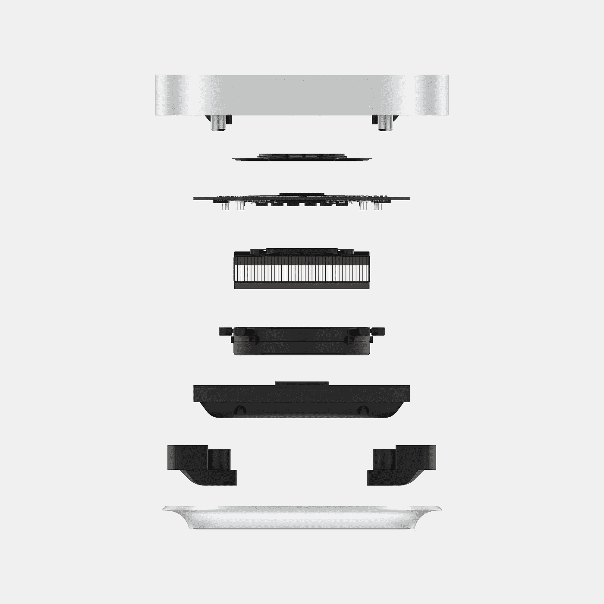

# 强大的 Mac mini 的下一步是什么？

> 原文：<https://medium.com/codex/what-next-for-the-mighty-mac-mini-8815484e070d?source=collection_archive---------7----------------------->

## 为这款惊艳的台式机做了大量规划

新款 M2 Mac mini 即将上市

仿佛就在昨天，我们看到了第一个苹果硅芯片——M1 系列，然而仅仅一年后，我们就在这里了，M2 的继任者突然成了人们谈论的话题。最近，伟大的苹果台式机遭到了真正的清洗。当然，上个月，内置 M1 Ultra 的全新 Mac 工作室亮相了。虽然我们在等着看大屏幕 iMac 的未来，如果有的话，以及 Mac Pro 的未来，但我认为我们可以期待 Mac mini 很快就会上市。更小、更实惠的台式机市场一如既往地健康，M2 Mac mini 的变体可能是答案。

## 模块化答案

模块化的 M2 Mac mini

虽然我完全理解 Mac Studio 或 mini 在可升级性*的意义上不是模块化的，但就外设而言，它们是模块化的。这间工作室即使装修简陋，也要花费 2000 英镑。别忘了，用那笔钱，你只能得到一台电脑。你仍然需要购买显示器、鼠标和键盘。24 英寸的 iMac 是苹果公司目前销售的唯一真正负担得起的机器。但是，如果你是那种喜欢自己选择屏幕、扬声器和键盘等的用户，那么你现在就被困住了。这是 M2 Mac mini 可能出击的地方。*

* [## 九台新的 M2 苹果电脑

### 和四种不同版本的 M2 芯片。是时候让我们看看了！

medium.com](/codex/nine-new-m2-macs-1415cfa37ac5)* 

## *Mac mini 及其未来*

**

*新款 M2 Mac mini 的外观*

*今年早些时候，有许多关于 Mac mini Pro 的报道。现在看来，这些传言中有许多实际上是关于 Mac 工作室的。但是，如前所述，那台机器很贵。苹果在他们的阵容中有一个缺口，即*可能会有两个 M2 Mac mini 选项。他们与工作室的目标从来不是低端，消费者的承受能力。它直接面向专业用户，价格也反映了这一点。但是，随着现有硬件的出现，Mac mini 可能会给那些没有 2000 多英镑购买台式机的人一个打击。这里的未来可能是两个版本的 Mac mini，一个采用 M2 芯片，一个采用 M2 Pro。虽然我看不到有 M2 Max 选项，因为我认为这将开始推动 Mac 工作室的价格。所有 Pro 芯片机都配有标准的 32 GB 统一内存，这显然是有成本的。但是有了 Pro 芯片，如果预算允许，你至少可以有*选择*升级到 32 GB。这将使购买更容易，对于那些经常推动现在提供的最大 16 GB 限制的人来说。**

* [## iPhone 15 泄露，手表&推特

### 苹果视图综述

medium.com](/codex/iphone-15-leaks-watches-twitter-883352275393)* 

## ***可用性***

**

*改进了 M2 Mac mini 上的 IO*

*M2 Pro Mac mini 的另一个好处是改进 IO 性能。我认为在那台机器上期望多达四个 Thunderbolt 端口是合理的。这意味着可以使用的外部显示器数量有了更多的选择，三个来自 Thunderbolt 端口，当然，如果需要，还可以从现有的 HDMI 端口增加一个。*

*负十六播客*

## ***设计***

**

*彩色 Mac mini 的？*

*这也是设计升级的好时机。我敢肯定，苹果将热衷于区分新的苹果硅动力机器和旧的，即将离任的英特尔模型。M2 的基本型号*可能会有颜色，因为它是一款消费级设备。这将完全符合他们的 iMac 系列和我们期待在 WWDC 发布的新款彩色 MacBook Air。有传言说有机玻璃顶部，如果是真的，这将是苹果硅 Mac mini 的另一个标志。**

## ***价格***

**

*M2 Mac mini 可能有一个有机玻璃顶？*

*基本款 M2 mini 可能会保持在 699 英镑，这使得它非常实惠，很容易在生态系统中购买。M2 Pro 型号可能从 999 英镑开始，然后随着你开始增加更多的内存和存储空间，价格可能会上升到 1599 英镑左右。这似乎涵盖了几乎所有的价格点和用户场景。当然，如果你说到重点，你决定你需要比 M2 Pro mini 所能提供的更大的动力，只需要多几百英镑，你就进入了 Mac Studio 的领域。*

## *有效性*

**

*期待 M2 Mac mini 在 WWDC 发布*

*如果你上周才问我这个问题，我几乎肯定会说新款 mini 不会在秋季之前上市。然而，随着上周来自马克·古尔曼的报道，这一切都改变了。他告诉我们(我在另一篇[博客](/codex/nine-new-m2-macs-1415cfa37ac5)中也写了相关内容)，9 台*MAC 电脑目前正在测试 M2 芯片。从那九个来看，似乎*两个*已经准备好发货*现在*。因此，现在的想法是，苹果最畅销的机器 M2 MacBook Air 和新的 M2 Mac mini 都将在 WWDC 展出，并立即上市。M2 Pro Mac mini 将是一款出色的开发者机器，非常适合 6 月份的发布会。我能看到的唯一阻碍夏季发行的因素，*可能是*中国正在进行的封锁，当然还有芯片短缺。**

## **你想要什么**

****

**M2 Mac mini 上会有一系列颜色吗？**

**如果你是 Mac mini 用户，你希望从下一代身上得到什么？更大的功率，更多的 IO，颜色？你认为这些机器的价位应该是多少？**

**你订阅媒体了吗？**

**我只是高端博客网站 Medium 的众多作者之一。这是如此好的价值，你可以在这里加入 https://medium.com/membership**

**[加入我的幕后邮件列表](https://www.talkingtechandaudio.com)**

**最初发表于 2022 年 4 月 19 日 https://www.talkingtechandaudio.com/blog**