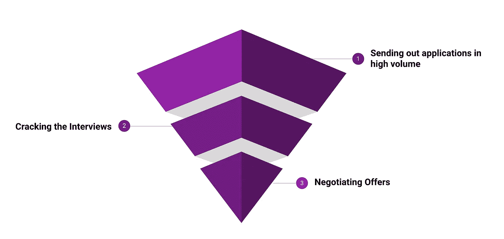
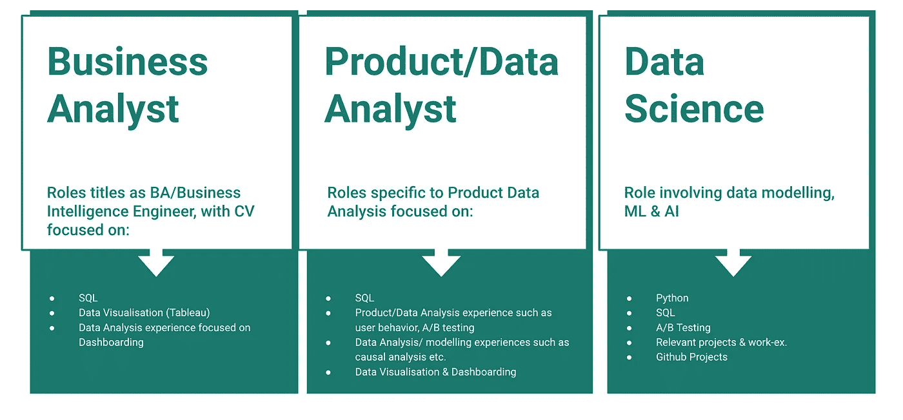
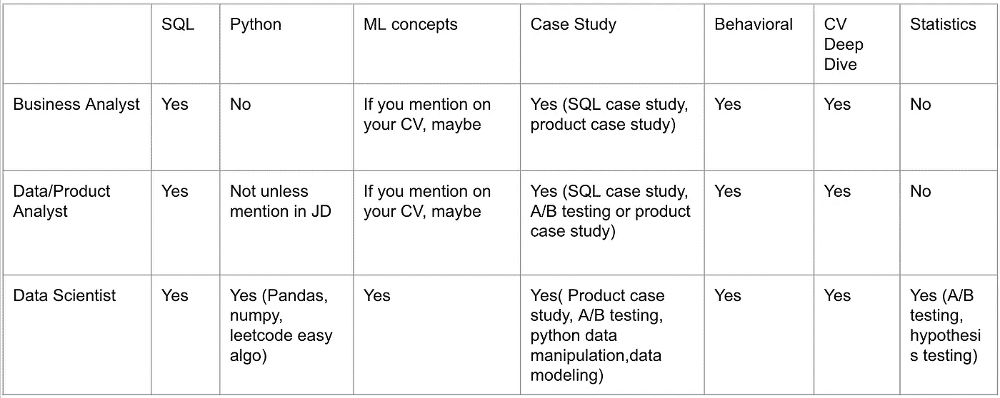
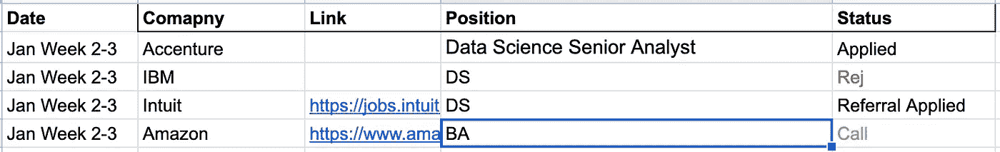
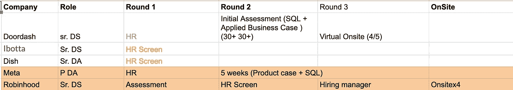

# 关于求职，没人告诉应届数据毕业生什么

> 原文：<https://medium.com/codex/what-no-one-tells-recent-data-graduates-about-job-applications-96e44a602022?source=collection_archive---------3----------------------->

事情是这样的。我从 2021 年 8 月开始申请工作，直到 2022 年 1 月我开始做以下事情，几乎没有得到任何回应。一旦我遵循了这些步骤，我就开始接到电话，面试也排起了长队。

理想情况下，这个博客可以是一个通用的求职方法，但是因为我是在分享我的经验，所以细节主要是关于数据相关的角色。然而，我觉得这种方法看起来非常相似，即使我不得不申请一个非数据的角色。

先说我的背景。我是一名工程师，在产品营销分析部门工作了大约 3 年。然后，我攻读商业分析硕士，重点是人工智能，并于 2021 年 12 月毕业。

因为我压缩了我的课程，在三个学期而不是四个学期毕业，在最后一个学期，我几乎不能集中精力找工作。尽管发出了申请，我几乎没有得到任何回应。所以毕业后，我申请了全职工作，我把这个过程分成几个部分，然后一个一个地克服它们，从而构建了我的方法。

我对待求职的过程就像我在之前的一份工作中处理优化销售漏斗的问题一样。

**求职漏斗**

**进场:天时地利人和**

要做到这一点，就要通过尽可能多的渠道发出尽可能多的申请。如果你发出 15 份申请，一周 6 天，一个月内你将发出 360 份申请。

我们的目标是简化申请流程，帮助您实现这一目标。然而，这必须与确保您能够优化应用程序的质量以及提高获得回调的转换率一起完成。

因此，需要关注的因素是要达到的工作申请数量，以及你的简历与你申请的工作职位的匹配程度。稍后将深入探讨如何更详细地处理一份简历。

**第一步:求职申请**

理想情况下，这应该是这个过程的第二步，因为你需要一份简历才能申请工作，然而，因为破解简历是一个迭代的过程，等待完美会击败申请数量，因为获得面试也是在正确的时间出现在正确的地方，你申请的越多，你在正确的时间出现的机会就越高。因此，建议是在完善简历的同时继续申请。

*多少个应用程序就够了？*

每天至少发送 15 封是一个不错的数字。

然而，通常情况下，15 个应用程序的瓶颈是“*为每个角色定制简历”的概念。我觉得这有点被误解了，所以我采取了不同的方法。让我们深入探讨一下。*

**第二步:简历**

优化我的简历的第一步是后退一步，确定我在简历中的优势，确定我非常适合的潜在机会，并专注于建立我的简历。

这个过程的这一部分是最重要的，因为它帮助我发现了三个机会，然后我决定专注于这三个机会。

为简历划分角色

上图提到了每个角色通常对候选人要求的技能，以及它们之间的区别。我是在通读了数百份工作描述并记录下他们所要求的技能和我所能提供的技能后，得出这个信息的。

这一点很重要，因为只有在这之后，我才继续从我的项目、技能和经验中挑选出最能体现我在各自工作中的专长的项目、技能和经验，从而为每个角色创建了三份不同的简历。在这之后，我几乎没有做任何改变，只是发出了相关简历的申请。

**第三步:冷外展**

此时，你的简历已经准备好发出去了，你已经在求职网站上申请工作，并从你的核心圈子里得到了尽可能多的推荐。然而，为了最大限度地利用“正确的地点，正确的时间”，你必须在同一时间出现在很多地方。所以仅仅在网站上申请是不够的。所以另一种方法是发送冷冰冰的电子邮件。

今天，有很多服务可以帮助你收集信息，比如电子邮件。因此，将它们与 LinkedIn 结合起来，你就可以找出那些积极招聘的人，获取他们的电子邮件，然后发送一封附有简短评论和你简历的电子邮件。我能够接到多个电话，甚至是我没有申请的亚马逊等公司的职位。

步骤:

*   写一封 4-5 行的电子邮件，附上你的电梯间推介，并附上简历
*   找出在 LinkedIn 上积极招聘的人
*   从网络抓取附件(如 Apollo.io)获取他们的电子邮件
*   设置一个自动 CRM，提供免费服务，如 apollo.io，一旦他们被添加到你的列表中，就会被发送出去

**第四步:面试**

现在，采访可以是一个完全不同的博客，因为它非常依赖于你关注的角色，就像我们已经讨论的 3 个潜在角色一样，这必须非常具体。

通常至少有 5-6 轮面试，下面是上面讨论的不同角色在面试中的期望。这将帮助你开始组织你的准备工作。

面试准备指南细分

我在谷歌上搜索了我大部分的准备工作，并且能够找到所有可能在面试中被问到的问题。所以可以肯定地说，互联网是最好的准备资源。

**第五步:维护一个 Excel 表格跟踪器**

最后但同样重要的是，跟踪你的进展。创建一个 excel 表格来跟踪你的漏斗将是最重要和最烦人的部分。因为你可以随时看到申请数量、电话数量和工作机会数量，所以当你感到最没有动力的时候，这是一个非常强大的动力。

一旦你开始接到电话，跟踪电话的流程也将有助于你了解你在这个过程中的不足和接下来的步骤。

示例呼叫跟踪器

基于此，你可以不断复习自己的薄弱环节，例如。在我的案例中，我在统计面试中苦苦挣扎，尽管我知道解决方案，但我无法用自信的答案来表达我的知识。所以我知道我的下一个重点领域应该是什么，直到我开始清理面试和获得聘用！

请在 Medium 上关注我的定期更新！