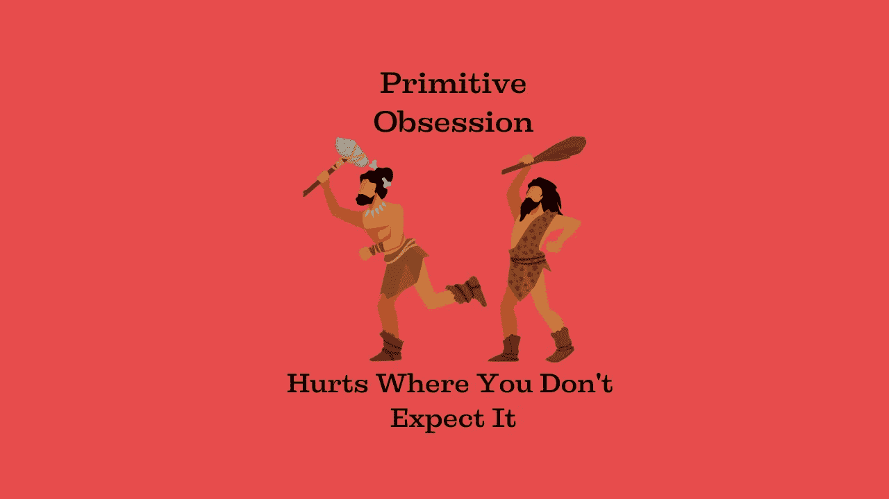

# 什么是原始执念，为什么你已经暗中破坏了你的代码

> 原文：<https://medium.com/codex/what-primitive-obsession-is-and-why-you-already-ruin-your-code-secretly-87120f8acaae?source=collection_archive---------3----------------------->

## 即使是高级开发人员使用这种技术也没有意识到

图片由[作者](http://www.arnoldcode.com)经由 Canva.com 制作

几乎在每一个代码库中，都有一个被发现的模式。这将使你的代码更难理解，你的领域更容易受到攻击。