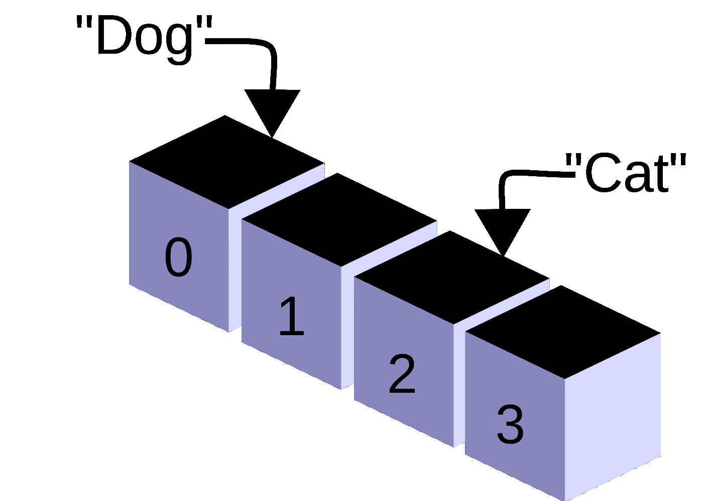

# 关于排序，程序员应该了解什么

> 原文：<https://medium.com/codex/what-programmers-should-understand-about-sorting-c1a277ff78ca?source=collection_archive---------9----------------------->

## 在编程时做出明智的决定。

图片鸣谢:[https://commons . wikimedia . org/wiki/File:CPT-programming-array . SVG](https://commons.wikimedia.org/wiki/File:CPT-programming-array.svg)

如果一个程序员在学校或野外呆了足够长的时间，他们可能会遇到需要排序的数据结构。他们应该知道可以使用的许多不同的排序算法。这些可能包括

*   选择排序