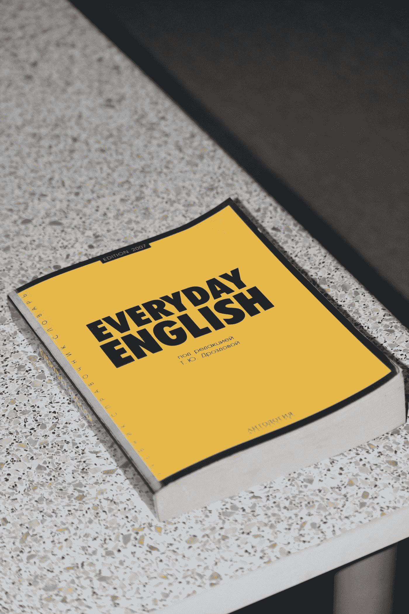

# 实际上应该学什么编程语言？

> 原文：<https://medium.com/codex/what-programming-language-should-i-actually-learn-972ceb7a49bd?source=collection_archive---------7----------------------->

## 选择要学习的编程语言

伊万·希洛夫在 [Unsplash](https://unsplash.com?utm_source=medium&utm_medium=referral) 上的照片

决定学习哪种编程语言可能是一项艰巨的任务。你应该学习 Python、C++、Swift、Java、Javascript、Go、R 或其他众多语言吗？你从哪里开始？

**了解什么是编程语言**