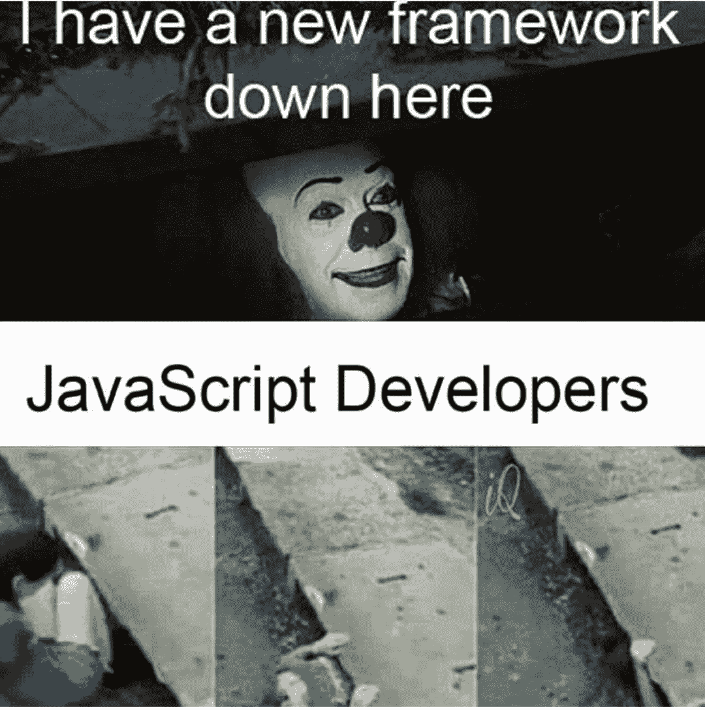
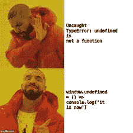

# 2021 学什么编程语言

> 原文：<https://medium.com/codex/what-programming-language-to-learn-in-2021-f0a97f0c4a23?source=collection_archive---------14----------------------->

## 这很复杂，但同时也很简单。

在我的书中，一门好的编程语言必须有一套特定的属性它应该是通用的、高性能的，并且在现实世界的场景中是可伸缩的，但是主流的选择或者在一些会议中的争论不应该是决定性的因素。

2021 年在疫情找到一份工作，取决于你所在的地区，对你来说可能很容易，也可能比以往任何时候都难。在大多数地方，远程招聘是一种常态，如果一家公司希望你掌握一种不是主流的语言，或者即使很难加入，并且学习曲线很陡，对你这个初学者来说可能会有问题。

另一个问题是，在普通学校教授的大多数技术水平都很低，或者没有任何真实世界的实际使用案例，至少在我上学的地方是这样。

所以，如果你打算花时间学习或润色一些实用的东西，为什么不努力去做一些几乎适合所有类型的用例、有一个繁荣的社区和真实世界的例子的东西呢？

如果你现在已经猜到了，我说的是 Javascript。

在 90 年代中期，Javascript 只是 web 编程语言，几乎每个人都在使用 PHP、enterprise java 或其他东西来构建他们的原始服务器。现在，创业公司的心态不同了，他们希望产品尽快推出，同时希望支持所有不同类型的平台，以扩大消费者受众。

Javascript 支持所有平台，

## 1.Web 开发:

在这里，如果你谈论前端，竞争是不存在的，当使用 Javascript 时，你也可以使用许多新奇的技术。甚至不存在第二个在 web 视图中呈现你的应用程序的机会。你有所有的技术，比如 web assembly，人们尝试 python，Flutter 2.0 支持所有平台，比如制作 Web 视图。所有这些东西都适合测试东西，但没有实际用途。即使你决定走这条路，社区也很不成熟，所以说，你可能会陷入困境。

对于它的 API 部分，游戏与之前提到的和 **Node.js** 相比非常不同，现在支持的基于 Chrome V8 引擎的服务器环境与文章前面提到的一些语言相比非常新，但是因为你可以在服务器上编写 Javascript，所以受欢迎程度增加了很多倍。除了一些非常简单的区别之外，应用于前端语法的相同概念极大地使它成为一种流行的技术并受到社区的喜爱。

## **2。移动开发:**

跨平台是一种趋势，我看到很多文章，人们声称 flutter 将杀死 Javascript 替代品 **React native** 。

我同意不同意社区每天都在变得强大，同时大多数公司负担不起移动开发团队来启动他们的业务，或者你作为一个想要启动自己的业务的人，你几乎没有选择，除非你是少数幸运的人，拥有某种类型的金钱植物或投资。如果我们遵循这样的理论，如果某项技术仅仅是抛出一个数字就能使速度提高 1000 倍，或者对开发人员非常友好，那么 PHP 应该早就寿终正寝了，因为发明者本人不喜欢技术的某些特征。

我见过一些公司同时使用 React 和 React native，并在他们的代码库中共享钩子和状态管理的主要部分，并轻松地只保留视图层，因为两者在这方面有所不同。

除此之外，你还可以使用 ionic 和 Angular 以及其他 JS 支持的方式来开发你的应用。

## **3。桌面应用开发:**

如果你不是 Javascript 世界的一部分，你可能会感到惊讶，你最喜欢的一些应用有 JS 的一部分，或者完全用 JS 完成。我最喜欢的编辑器是由**电子提供动力的。**WhatsApp 的桌面应用也在使用电子**。** Electron 使用 Chromium 和 Node.js，因此你可以用 HTML、CSS 和 JavaScript 构建你的应用。所以，如果你能开发一个网络应用，你也能开发一个桌面应用。

## **4。机器学习/人工智能:**

Javascript 社区缺乏这方面的优势，我们不得不求助于 python 或其他语言，现在 JavaScript 也可以做到这一点。你有一个强大的工具 **Tensorflow.js** 当然，它可能不像使用 python 处理 Tensorflow 那样健壮，但至少现在你已经有了一些更接近于实际上只使用某些工具和环境可能实现的东西。

# TL；速度三角形定位法(dead reckoning)

简而言之，你能想到的任何事情都可以用 Javascript 来完成，这为你在所有现实世界的商业中提供了大量的机会，并使你更容易找到工作。

当然，没有一种工具是完美的，它应该只是武器库中的一部分。你不应该依赖任何技术，应该回归基础，总是不断学习新的东西。Javascript 也有一些奇怪的问题，但是如果你有基本的动手实践，你会找到解决的方法。

不要限制自己，总是在寻找学习新的东西

快乐编码和学习…