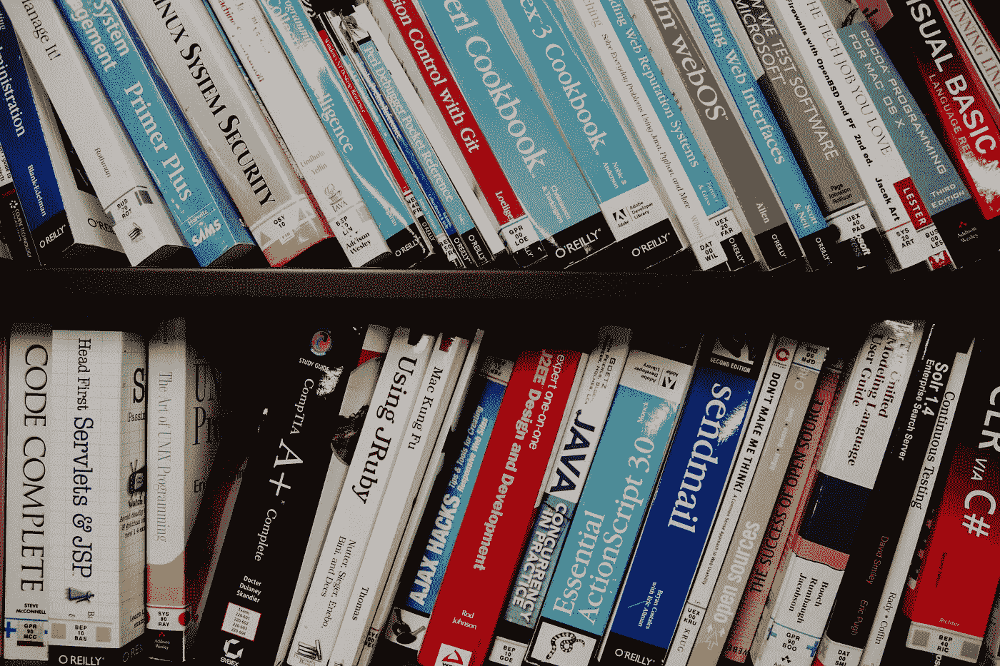

# 从什么编程语言开始

> 原文：<https://medium.com/codex/what-programming-language-to-start-with-dc0d76317d09?source=collection_archive---------16----------------------->

## 如何开始你的编程生活

在 [Unsplash](https://unsplash.com/) 上 [NeONBRAND](https://unsplash.com/@neonbrand) 拍摄的照片

很多程序员新手往往不知道从什么开始学习。首先，任何编程语言的知识都是必需的，所以在这篇文章中，我将告诉你如何选择第一种编程语言。

# 普遍选择

如果你没有任何偏好，最好的选择是 C++。尽管大多数程序员很少使用这种语言，但这种语言将是**开始分析性思考的最佳选择**。C++可以向您展示大多数编程语言中使用的原始数据类型，以及它们之间的转换，使用全局和局部变量和函数以及其他基本编程概念。

C++的另一个优点是不需要任何特殊的环境配置；你只需要下载 g++编译器，你就可以在任何文本编辑器中编写代码，并从控制台运行你的程序。

许多其他语言都继承了 C/C++的语法，因此，如果您熟悉 C/C++，那么开始用 Java、C#、JavaScript 等语言编程会很容易。

我必须承认 C++不是最容易开始的语言，但是如果你掌握了它，你就会很容易学会其他编程语言。例如，在 C++之后学习 Python 会非常容易，但在 Python 之后学习 C++会困难得多。

# 然而，这不是唯一的可能

如果你不打算从事嵌入式编程或其他与 C++相关的工作，我不建议你深入 C++。这种语言是一种很好的入门语言，但是在你熟悉了核心编程概念之后，你就可以轻松地用它来解决算法问题了，这是开始考虑你的进一步发展方向的好时机；要么是 Java 或 C#的后端，要么是 JavaScript 或 TypeScript 的前端，要么是 Python 的机器学习，要么是 Swift 或 Kotlin 的移动编程——下一个编程语言的选择应该取决于你接下来想做什么。如果你从一开始就知道你想在你的编程生涯中做什么，那么就没有必要花时间在 C++上，你可以马上投入到其他语言中去。

# 没有正确的答案

没有一种编程语言可以完美地解决任何问题，每种编程语言都适合某个特定的目标。其实，**不是语言本身重要，而是获得新知识新经验的过程**。

# 关于范例的更多信息

正如你所知或者还不知道的，有几种[编程范例](https://en.wikipedia.org/wiki/Programming_paradigm)。最受欢迎的是过程式、面向对象式和函数式。对于这些范例中的每一种，都有更适合或更不适合的语言。但是选择一种特定范式的语言并不意味着如果你用这种语言写作，你就用这种范式写作。我的意思是，有些语言叫做函数式语言；但是你也可以用这些语言编写命令式程序，这不是一个好的实践。所以语言不保证只使用一种范式，甚至还有混合范式的语言(比如混合了 OOP 和函数式编程的 Scala)，唯一重要的是*你如何*编写代码，而不是用哪种语言。

如果你不知道从什么范式开始学习，我会推荐以下顺序:过程化、面向对象、函数化。过程化是最直观的方法，可以帮助你学习编写程序。面向对象非常非常流行，使用非常频繁。这种范式反映了我们的现实世界，在现实世界中，一切都是具有自身属性的对象，可以接收特定的消息并对这些消息做出特定的反应。函数式编程是最难的，因为它的抽象层次非常高。函数式编程有利于优化和解决复杂问题。

谈到某些范例的第一语言，我推荐 C++用于过程化，Java 用于面向对象，Haskell 用于函数式。当然，也有其他语言，但这些是我认为最好的。

# 数据库

无论你打算在哪个编程领域写作，在你人生的某个时刻，你几乎肯定会开始与数据库打交道。没有它们，编程世界就无法存在。所以我建议也关注 SQL。当然，也有 NoSQL 数据库，但是 SQL 可以教你如何考虑一般的数据库。大概，**这是每个程序员都应该熟悉的东西**。

# 流行

你也可以在开始学习编程的那一刻查查什么语言最受欢迎。这可以告诉你什么是编程市场上最需要的，并据此做出选择。

# 摘要

最重要的是**编程应该是你的激情**。你选择什么语言并不重要，唯一重要的是你热爱你所做的事情。如果你做你喜欢的事情，那么你就可以很容易地利用它。记住不要在任何事情上限制自己。**对新事物保持开放**和**不要给自己设置任何边界**。

祝你学习顺利！✨