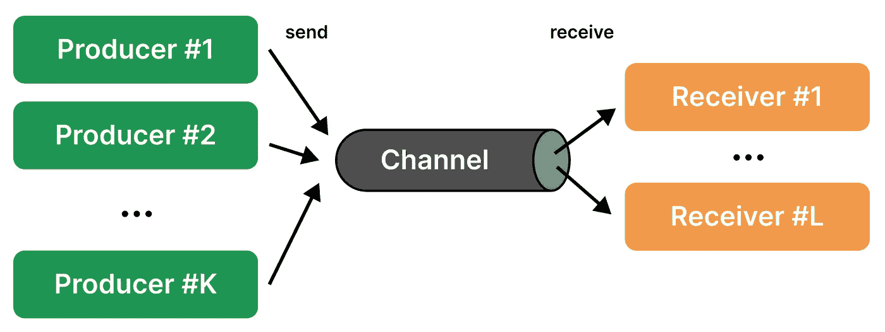
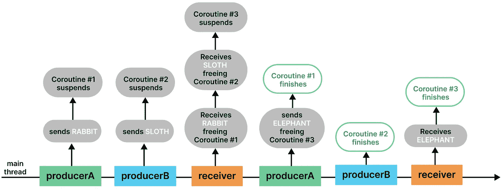
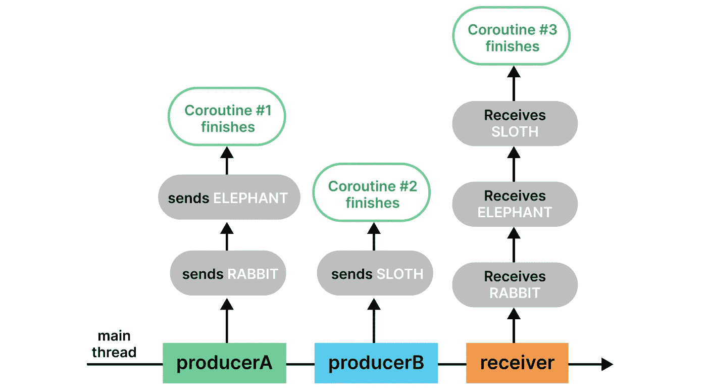
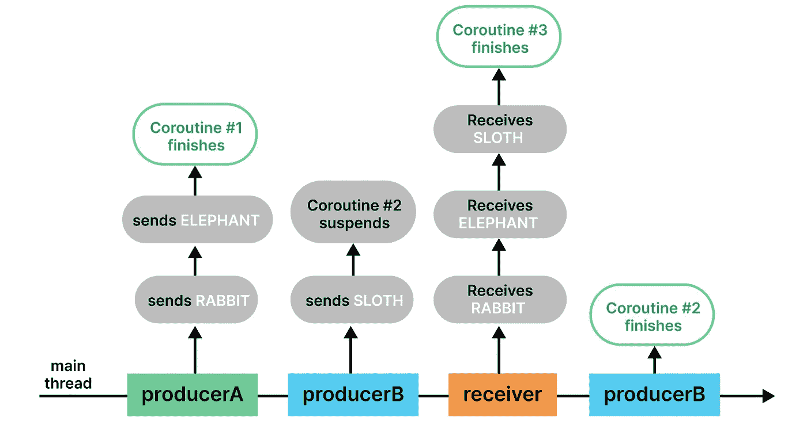
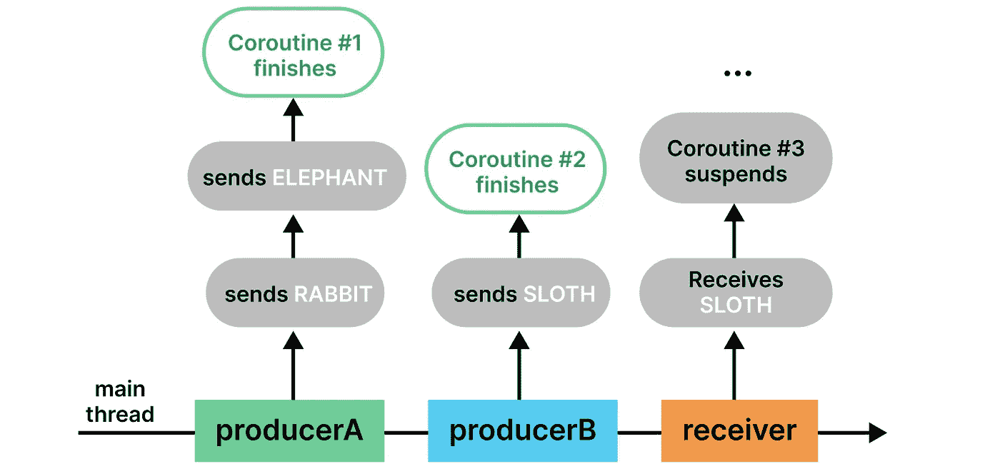

# 科特林的频道到底是什么？

> 原文：<https://medium.com/codex/what-really-are-channels-in-kotlin-3dccce4c5351?source=collection_archive---------2----------------------->

当许多其他编程语言完全依赖线程的概念时，Kotlin 利用[协程](https://kotlinlang.org/docs/coroutines-guide.html)提供了一套直观、不易出错且高效的工具来执行异步工作。毫不奇怪，Kotlin 应用程序经常使用许多需要相互通信的协程，通道为此提供了一个优雅的解决方案。本文通过深入有用的例子向您介绍了通道。我们开始吧！


图片由 [pixabay](https://pixabay.com/photos/craftsman-loom-craftsmanship-hands-1839920/) 提供

# 先决条件

本文假设您理解创建和使用*协程*的概念。如果你不知道，我建议你先看一下[文档](https://kotlinlang.org/docs/coroutines-guide.html)。

# 基本概念

从概念上讲，*通道*是通信路径，允许您将一系列值从一个*协程*传递到另一个协程。元素按照它们到达的顺序被处理，这是通道和[阻塞队列](https://docs.oracle.com/javase/7/docs/api/java/util/concurrent/BlockingQueue.html)的相似之处之一。简而言之，

> 一个协程，即**生产者**，可以*发送*一些数据给一个通道，而另一个协程，即**接收者**，可以*从它那里接收*这些数据。虽然一个通道可以有多个接收者，但是通过该通道发送的每个元素只被接收者处理一次。



图片由[作者](/@joaofoltran)

实际上，通道是使用通用的`Channel`接口实现的，允许它传输任何类型的数据。`Channel`还实现了`SendChannel`和`ReceiveChannel`接口，它们将公开的功能分开以避免错误。例如，只有*发送通道*可以发送元素并完全关闭通道，只有*接收通道*可以接收元素并检查通道是否为空。

为了使用这种封装，通道在生产者对象中使用时被转换为`SendChannel`，在接收者对象中使用时被转换为`ReceiveChannel`。

在进一步讨论之前，让我们看一个通过通道发送`Animals`的简单例子，让事情变得更具体。在本文的这个例子和其他例子中，为了清楚起见，我们显式地声明了变量，即使我们并不需要这样做。

正如预期的那样，`Animals.RABBIT`通过通道被发送，被接收，其值被打印在控制台中。

# 通道容量

在深入了解*频道*如何工作之前，了解不同类型的可用频道至关重要。简而言之，

> 在被正确接收之前，信道内部可以存储的元素数量是不同的。这个缓冲区的大小会影响`send`操作的执行，因为我们不能简单地将元素发送到一个已经满了的通道。

在幕后，我们可以使用 4 个容量选项来初始化通道。我们将在下面详细探讨它们。

# 无限频道

无限通道可以无限缓冲发送给它的元素。


图片作者[作者](/@joaofoltran)

基于上面的`Animals`例子，这意味着你可以调用任意多的`Animals`中的`send`，通道将存储这些元素，直到你决定开始调用`receiver.receive()`。换句话说，`send`操作永远不会被挂起。

> 请注意，在`SendChannel`接口的定义中，`*send*`是一个挂起函数，简单来说，这意味着它可以被暂停，稍后再恢复。尽管在无限制的通道中情况并非如此，但在我们将在下面分析的情况中，如果通道不能支持发送更多的元素，那么`send`可能会暂停。

即使无限通道有无限的缓冲区大小，如果没有可用的内存，并且您试图向它发送更多的元素，您最终会得到一个`OutOfMemoryException`。

# 缓冲通道

缓冲通道最多可以在内部缓冲在通道的构造函数中传递给它的元素数。


图片作者[作者](/@joaofoltran)

由于这个缓冲区限制，如果我们在通道已满时`send`一个元素，这个调用将被挂起，直到更多的空间被释放。例如，可以通过调用`receive`来释放缓冲区。

如果这个例子仍然有点抽象，不要担心，因为我们将在本文后面更详细地讨论这个暂停机制。

# 会合通道

集合信道是容量为 0 的缓冲信道。


图片作者[作者](/@joaofoltran)

这意味着`send`操作被暂停，直到相应的`receive`操作被调用。默认情况下，通道是集合通道，这意味着要初始化集合通道，只需调用不带参数的构造函数即可:

# 合并河道

合并的信道恰好缓冲一个元素，并且如果还没有接收到之前发送的元素，则依次覆盖它们。


图片作者[作者](/@joaofoltran)

例如，在上面的图像中，如果通道发送了蓝球，并且在它被接收之前，它发送了黄球，黄球覆盖了蓝球，这意味着对`receive`的调用现在获取了黄球。

在这种情况下，`send`操作永远不会被挂起，因为对它的后续调用将简单地覆盖未收到的值。

# 接受价值观呢？

我们已经讨论了不同的通道是如何发送值的，以及在什么情况下`send`操作会被挂起，现在我们将仔细看看通道是如何接收元素的。

注意`receive`也是一个挂起函数，正如在`ReceiveChannel`接口中声明的，这意味着它可以像`send`操作一样被挂起。简而言之，对于任何渠道类型:

> 如果通道不为空，调用`receive`检索元素，否则它暂停执行，直到通道中的元素可用。

为了巩固这些知识，我们来看一些例子。

# 兔子、大象和树懒

我们将在本文开头的`Animals`示例的基础上，探索每种通道类型在相同条件下的行为。

共享代码非常简单，我们初始化一个通道，启动一个发送`Animals.RABBIT`，然后发送`Animals.ELEPHANT`的协程。在另一个协程中，我们发送`Animals.SLOTH`，而在另一个协程中，我们接收所有三个`Animals`。以下部分解释了当`channel`是 4 种可能的通道类型中的每一种时的输出。

**会合。**在这种情况下，通道没有缓冲区，因此任何`send`操作将被暂停，直到相应的`receive`被调用。这正是我们通过下图观察到的。



图片作者[作者](/@joaofoltran)

1.  来自协程#1 的`producerA`发送`RABBIT`，但是被挂起，因为还没有相应的接收者；
2.  来自协程#2 的`producerB`发送`SLOTH`，但是由于同样的原因被挂起；
3.  在执行协程#3 时，接收并打印两个暂停值。并且协程#1 和#2 被释放，以此顺序。但是还没有接收第三个值，所以协程#3 也被挂起；
4.  来自协程#1 的`producerA`发送`ELEPHANT`但不挂起，因为已经有来自协程#3 的相应`receiver`挂起。事实上，由于通道不再是空的，协程#3 现在也是自由的；
5.  协程#1 继续完成执行，由于协程#2 中不再有操作，它也完成了。最后，协程#3 接收到`ELEPHANT`并完成执行。

> 注意，这里的“释放”意味着协程不再需要保持挂起，并且一旦当前协程和任何其他预先调度的协程完成执行，将被调度执行。请记住，我们是在单线程上操作的，因此在给定时刻只能执行一个协程。

输出显示以下内容:

```
RABBIT
SLOTH
coroutine 1 done
coroutine 2 done
ELEPHANT
coroutine 3 doneProcess finished with exit code 0
```

**无限制。**在这种情况下，通道的缓冲区大小不受任何值的限制，因此`send`操作不会暂停。您可以在下图中查看代码是如何执行的。



图片作者[作者](/@joaofoltran)

输出显示以下内容:

```
coroutine 1 done
coroutine 2 done
RABBIT
ELEPHANT
SLOTH
coroutine 3 doneProcess finished with exit code 0
```

现在快速说明一下。对于这个例子和下一个例子，我们将抽象出书面的解释，因为图表应该能够清楚地显示所有的步骤。如果你有任何问题，不要犹豫，在文章中留下评论！

**缓冲**(更具体地说，容量为 2 的缓冲器)。在这种情况下，当缓冲区容量为 2 并且我们试图发送一个额外的元素时，`send`操作被挂起。下图描述了执行流程的剩余部分。



图片作者[作者](/@joaofoltran)

输出显示以下内容:

```
coroutine 1 done
RABBIT
ELEPHANT
SLOTH
coroutine 3 done
coroutine 2 doneProcess finished with exit code 0
```

**混为一谈。**这是一个有趣的案例，因为接收器协程的完成实际上永远不会结束。由于合并通道的性质，`send`操作会相互覆盖，但是当实际的`receive`操作被调用时，通道中只包含一个元素，所以第二个`receive`调用被挂起，协程保持空闲，没有完成执行，如下图所示。



图片作者[作者](/@joaofoltran)

输出显示如下内容(注意，退出代码 0 没有显示，因为进程仍在运行):

```
coroutine 1 done
coroutine 2 done
SLOTH
```

感谢阅读！希望你喜欢读这篇文章，就像我喜欢写它一样。如果你喜欢这些内容，别忘了留下掌声，关注更多内容！